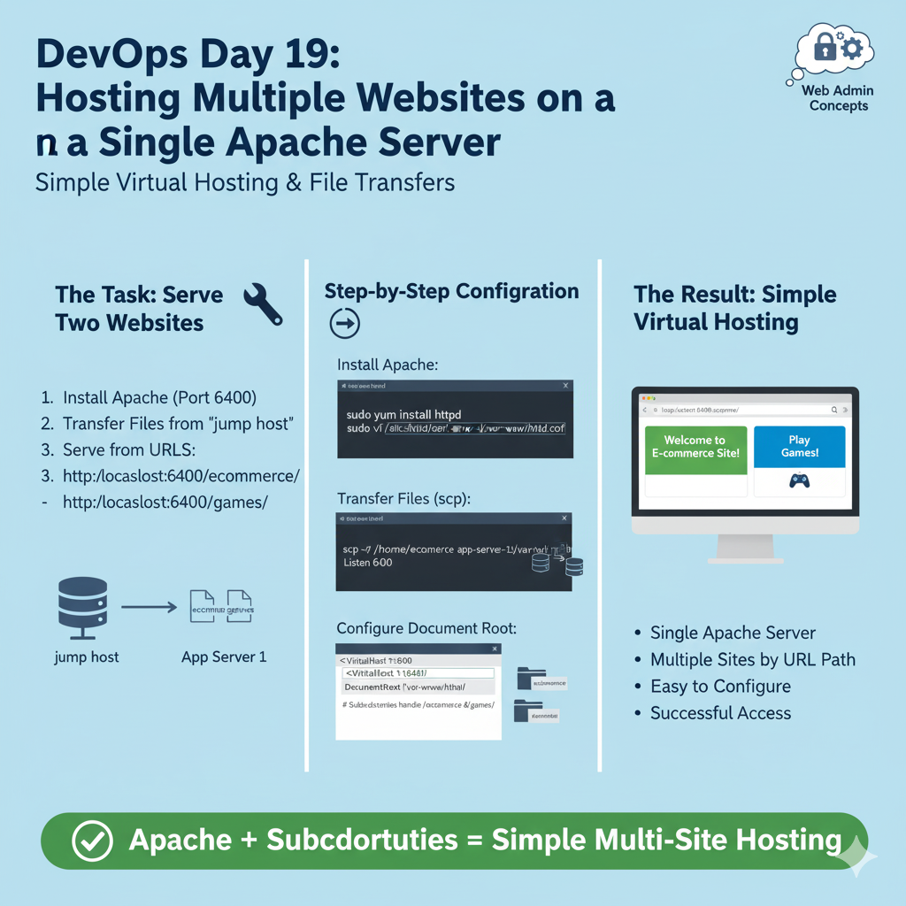
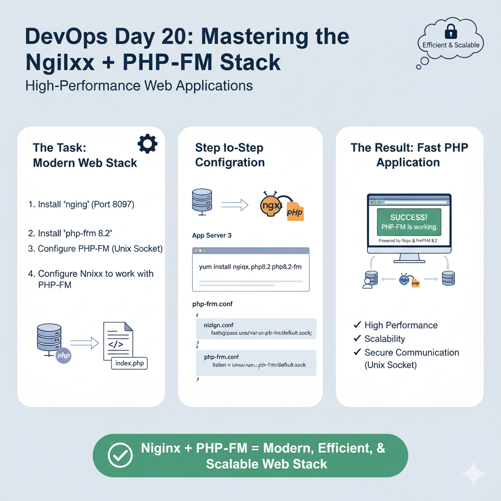

# 100 Days of DevOps

<br>
<br>

## Table of Content

<br>
<br>
<br>
<br>


# Day 001: Creating a User with a Non-Interactive Shell

<br>

The first task in the 100 Days of DevOps challenge involved <mark> **creating a new user** </mark>  for a backup agent tool on `App Server 1`, requiring a non-interactive shell.

---

<br>
<br>

### The Task
<a name="the-task"></a>
- The system admin team at xFusionCorp Industries needed a user named `james` created on one of their app servers. This user account would be used by a backup agent, so for security reasons, it shouldn't be possible for a human to log in and get a command prompt with it.

---

<br>
<br>

### My Solution & Command Breakdown
<a name="my-solution--command-breakdown"></a>
- After connecting to `App Server 1` using SSH, I ran a single command to accomplish the entire task.

#### 1. The Creation Command
- This command creates the user and sets their shell at the same time.

```bash
sudo useradd james -s /sbin/nologin
```

**Command Breakdown:**
* `sudo`: Means “Super User Do.” It lets you run commands with admin power. Since creating users needs higher permission, we use sudo to do it safely.
* `useradd`: Linux command for adding a new user account.
* `james`: This is the username I was asked to create.
* `-s`: This is a flag or an "option" for Shell. It tells the `useradd` command which login shell the new user should have.
* `/sbin/nologin`: A special shell that blocks the user from logging in. It’s often used for system or service accounts that don’t need direct access.

#### 2. The Verification Command
- I used `grep` to check the system's user file.

```bash
grep 'james' /etc/passwd

# OUTPUT:
# james:x:1002:1002::/home/james:/sbin/nologin
```

**Command Breakdown:**
* `grep`: Command-line tool **for searching plain-text data** for lines that match a regular expression or a simple string.
* `'james'`: Search string. I was telling `grep` to find any line containing the word "james".
* `/etc/passwd`: This is the file I wanted to search in. It's a system file that contains the list of all user accounts.

---

<br>
<br>

### Why Did I Do This? (The "What & Why")
<a name="why-did-i-do-this-the-what--why"></a>
This task is all about the **Principle of Least Privilege**. A user account should only have the permissions it absolutely needs to do its job, and nothing more.

-   **Security**: The backup agent doesn’t need a person to log in; it **just needs permission to run tasks and own files**. By giving it a non-interactive shell, we make sure no one (not even by accident) can use this account to access the server directly.
-   **Automation**: In DevOps, we often create service accounts for tools like Jenkins, Docker, or monitoring systems. These **accounts are meant for automated programs, not humans**. It’s a common and secure setup method.

---

<br>
<br>

### Deep Dive: What is a Non-Interactive Shell?
<a name="deep-dive-what-is-a-non-interactive-shell"></a>
- To understand this, let’s first see what an **interactive shell** is.
- When you log in to a Linux server, the system runs a program like `/bin/bash`. This shell is interactive — it shows you a prompt (`$`), waits for your commands, runs them, and displays the output.
- A **non-interactive shell** is the opposite.
- When a user’s shell is set to `/sbin/nologin`, here’s what happens:
  1.  Someone (or a program) tries to log in as `james`.
  2.  The system checks `/etc/passwd` and sees that james has `/sbin/nologin` as the shell.
  3.  It runs `/sbin/nologin`, which shows a message like “This account is currently not available.”.
  4.  Then it ends the session immediately.

- This type of shell never gives a command prompt.
- Think of it like a delivery gate — a robot (automated program) can drop off packages, but if a person tries to enter, the gate instantly closes.

---

<br>
<br>

### Exploring the Directories and Files
<a name="exploring-the-directories-and-files"></a>

* `/etc/passwd`: A text file that **stores details of all users on the system**. Each line represents one user, with information separated by colons (:). The line for `james` shows all his basic account details.
* `/home/james`: This is the home directory created for the `james` user. It’s a personal space where the user (or backup agent) can store logs, config files, or other data.
* `/sbin/`: Short for **System Binaries**. This folder contains core programs needed for the system to start and run. Since `nologin` is located here, it’s treated as an important system-level tool, not a regular user command.

---

<br>
<br>
<br>
<br>

# Day 002: Creating a User with an Expiry Date
<br>
In the 100 Days of DevOps challenge, I managed temporary user access for a limited-time developer, '`anita`', by creating her account and ensuring it would expire on a specific date.

---

<br>
<br>

### The Task
<a name="the-task"></a>
A developer named `anita` needed temporary access to `App Server 3`.
1.  Create a user account named `anita`.
2.  Set the account to expire on **January 28, 2024**.

---

<br>
<br>

### My Solution & Command Breakdown
<a name="my-solution--command-breakdown"></a>
- After connecting to `App Server 3` via SSH, I used two commands: one to create the user and another to verify the expiry date was set correctly.

#### 1. The Creation Command
- This command creates the user `anita` and sets the account expiration date in a single step.

```bash
sudo useradd anita --expiredate 2024-01-28
```

**Command Breakdown:**
* `--expiredate`: This option is used with `useradd` to set the date when the user account should automatically expire (get disabled). The date must be written in the format `YYYY-MM-DD`.

#### 2. The Verification Command
- To confirm the expiry date was applied, I used the `chage` (change age) utility.

```bash
sudo chage -l anita

# OUTPUT:
# Account expires						: Jan 28, 2024
```
This command displayed all the aging policies for the `anita` account.

**Command Breakdown:**
* `chage`: Command-line tool for viewing and modifying user password and account aging information.
* `-l`: The "list" flag, which instructs `chage` to display the current settings for a user.

---

<br>
<br>

### Why Did I Do This? (The "What & Why")
<a name="why-did-i-do-this-the-what--why"></a>
This task shows how security policies can be automated. In real situations, many contractors or temporary workers need short-term access. Manually remembering to disable all those accounts is time-consuming and easy to forget.

-   **Better Security**: Temporary accounts can become dangerous if left active after someone leaves — these forgotten or “ghost” accounts are big security risks. Setting an expiry date makes sure access ends automatically, keeping the system safe.
-   **Less Mannual Work**: I don’t have to set reminders or create support tickets to disable accounts later. The system does it for me, which follows a key DevOps idea — automate repetitive tasks.
-   **Compliance Made Ease**: Many companies have rules about how long temporary users can have access. Using `--expiredate` helps enforce those rules automatically.

---

<br>
<br>

### Deep Dive: How Account Expiry Works
<a name="deep-dive-how-account-expiry-works"></a>
In Linux, when an account expires, it means the account is disabled, not deleted.

When the system date reaches `2024-01-28`, here’s what happens to the anita account:
- **Disabled** → Anita can’t log in anymore; every login attempt fails.
- **Not Deleted** → Her files and home folder (/home/anita) still exist, and her entry remains in /etc/passwd.

This is actually the ideal behavior — the account is blocked, but her data stays safe for auditing or record-keeping.
If needed, an admin can easily re-enable the account later by updating or removing the expiry date.

👉 **Note**: This is not the same as password expiry. Password expiry only forces the user to change their password — it doesn’t disable their account.

---

<br>
<br>

### Exploring the Commands Used
<a name="exploring-the-commands-used"></a>
* `chage`: This command is used for managing the lifecycle of a user's password and account. The `-l` flag is great for auditing, and I can see it has other options to *set* policies like password expiration, inactivity periods, and warning days.

---

<br>
<br>
<br>
<br>

# Day 003: Disabling Direct Root SSH Login
<br>
On Day 3, my DevOps journey involved a crucial server hardening task, <mark> **disabling root user login via SSH** </mark>, which is a crucial step for securing a new server across all three app servers.


---

<br>
<br>

### The Task
<a name="the-task"></a>
- Following a security audit, I was tasked with disabling direct SSH root login on all app servers in Datacenter. The goal was to prevent anyone from connecting to the servers using the username `root`.

---

<br>
<br>

### My Solution & Command Breakdown
<a name="my-solution--command-breakdown"></a>
- I had to repeat the same process on each of the three servers. The process involved editing a single configuration file and then restarting the SSH service.

#### 1. Editing the SSH Configuration File
- First, I connected to each server via SSH using my personal user account. Then, I used a text editor (`vi`) with `sudo` to modify the main SSH daemon configuration file.

```bash
sudo vi /etc/ssh/sshd_config
```

**Command Breakdown:**
* `vi`: The text editor I used to make the change.
* `/etc/ssh/sshd_config`: Configuration file for the SSH *server* (the `d` in `sshd` stands for daemon, which is a background service).

Inside this file, I searched for the line containing `PermitRootLogin`. I found it commented out and set to `yes`: `#PermitRootLogin yes`. I removed the `#` and changed `yes` to `no`. The final line looked like this:

```
PermitRootLogin no
```

#### 2. Restarting the SSH Service
Configuration changes to a service are not applied until the service is restarted. I used `systemctl` to do this.

```bash
sudo systemctl restart sshd
```

**Command Breakdown:**
* `systemctl`: Command-Line-Tool for managing services (daemons) in modern Linux distributions.
* `restart`: The action I wanted `systemctl` to perform.
* `sshd`: The name of the SSH service I wanted to restart.

After completing these two steps on `stapp01`, I exited and repeated the exact same process on `stapp02` and `stapp03`.

---

<br>
<br>

### Why Did I Do This? (The "What & Why")
<a name="why-did-i-do-this-the-what--why"></a>
Turning off direct root login is one of the most basic but powerful security steps in Linux. Here’s why:

- **Stops Brute-Force Attacks** → The username root is public knowledge, so hackers and bots constantly try to guess its password. By disabling root login, I remove that target completely — now an attacker must first guess a valid username and the password.

- **Adds Accountability** → Instead of everyone using the same root account, each admin logs in with their own user and uses `sudo` for admin actions. Every `sudo` command is recorded, showing who did what and when, making tracking and auditing easy.

- **Encourages Safety** → Working as a normal user helps prevent accidental damage. You have to type `sudo` to gain admin rights, which forces you to stop and think before running risky commands.

---

<br>
<br>

### Deep Dive: The `PermitRootLogin` Directive
<a name="deep-dive-the-permitrootlogin-directive"></a>
The `PermitRootLogin` setting in the sshd_config file decides if the root user can log in via SSH. Key options:

- **`yes`** → Allows root to log in directly using a password (often default, but risky).

- **`no`** → Blocks root login completely. This is the safest and what I used.

- **`prohibit-password`** (or without-password) → Root can log in only with SSH keys, not a password. Safer than yes, but not as strict as no.

For security, `no` is the best choice.

---

<br>
<br>

### Exploring the Files and Commands
<a name="exploring-the-files-and-commands"></a>

* `/etc/ssh/sshd_config`: This is the main configuration file for the SSH server. It controls everything: the SSH port, authentication methods, and user-specific rules. It’s a key file for securing the server.
* `systemctl`: The modern tool **to manage system services** (daemons). I used it to `restart` SSH, but it can also `start`, `stop`, `reload`, `enable` (start on boot), `disable` (don’t start on boot), and check the `status` of services. 

---

<br>
<br>
<br>
<br>

# Day 004: Setting Executable Permissions on a Script
<br>
I was tasked with making a shell script executable, as the system required the necessary permissions to run the new backup script.

---

<br>
<br>

### The Task
<a name="the-task"></a>
The task involved granting executable permissions to a bash script named `xfusioncorp.sh` on `App Server 2` and ensuring all system users could execute it.

---

<br>
<br>

### My Solution & Command Breakdown
<a name="my-solution--command-breakdown"></a>
- After connecting to `App Server 2`, I first checked the existing permissions and then used a single command to change them.

#### 1. The Verification Command (Before)
- I used `ls -l` to get a detailed listing of the file.

```bash
ls -l /tmp/xfusioncorp.sh

# OUTPUT:
# -rw-r--r-- ...   -> confirmed that no one had execute (`x`) permissions.
```


#### 2. The Permission Change Command
I used the `chmod` (change mode) command to add the necessary permissions.

```bash
sudo chmod a+x /tmp/xfusioncorp.sh
```

**Command Breakdown:**
* `chmod`: The main command used to change file permissions.
* `a+x`: A symbolic way to add execute permission:
    * `a`: all users (owner, group, others)
    * `+`: add permission
    * `x`: execute permission


#### 3. The Verification Command (After)
I ran the `ls -l` command again to confirm my change was successful.
```bash
ls -l /tmp/xfusioncorp.sh

# OUTPUT:
# -rwxr-xr-x ...
```

---

<br>
<br>

### Why Did I Do This? (The "What & Why")
<a name="why-did-i-do-this-the-what--why"></a>
This task is all about telling the operating system that a file is not just data to be read, but a program that can be run.

-   **Security**: By default, new files aren’t executable. This prevents random or downloaded files from running automatically, keeping the system safe. Linux makes sure only trusted scripts or programs can run.

-   **Operational Need**: Automation scripts need execute permission to work. In this case, the backup system (and admins testing it) must be able to run the script. Without `+x,` the system would block it with a “Permission Denied” error, even if the script is correct.

---

<br>
<br>

### Deep Dive: Understanding Linux File Permissions
<a name="deep-dive-understanding-linux-file-permissions"></a>
A permission string like `-rwxr-xr-x` has four parts:
- **File Type** → The first character shows the type: `-` = regular file, `d` = directory.
- **Owner Permissions** → Next three (rwx) are for the owner: read, write, execute.
- **Group Permissions** → Next three (r-x) are for the group: read and execute, but no write.
- **Other Permissions** → Last three (r-x) are for everyone else: read and execute, but no write.

**Two common ways to set permissions:**

- **Symbolic Notation** → Human-readable like `a+x` (all users add execute), `u+x `(user add execute), `g+w` (group add write), `o-r` (others remove read).
- **Octal/ Numeric Notation** → Each permission has a number: read=4, write=2, execute=1. Add them for each category:
- Owner rwx = 4+2+1 = 7
- Group r-x = 4+0+1 = 5
- Others r-x = 4+0+1 = 5
So `sudo chmod 755 /tmp/xfusioncorp.sh` does the same as setting `rwxr-xr-x`.

---

<br>
<br>

### Exploring the Commands Used
<a name="exploring-the-commands-used"></a>
This task introduced me to two of the most frequently used commands in Linux.

* `chmod`: Stands for **change mode**. It’s the main command to modify file or directory permissions. Learning both **symbolic** and **octal** ways to use it is very useful.
* `ls -l`: Lists files in `long` format. Shows not just filenames, but also permissions, owner, group, size, and last modified date. Essential for checking and troubleshooting permissions.

---

<br>
<br>
<br>
<br>

# Day 005: Installing SELinux and Handling Unexpected Issues
<br>

On Day 5, a server was prepared for a new security implementation using SELinux, requiring installation of necessary tools and disabling SELinux in its configuration file.


---

<br>
<br>

### The Task
<a name="the-task"></a>
- The task involved installing `SELinux` packages, permanently disabling SELinux by modifying its configuration file, and ensuring the change only takes effect after the next reboot.

---

<br>
<br>

### The Final Solution
<a name="the-final-solution"></a>

#### 1. Install the Correct Packages
- The key was to identify the exact package names for this version of Linux.

```bash
sudo yum install policycoreutils selinux-policy -y
```

**Command Breakdown:**
* `sudo yum install -y`: Command to install software with admin rights and auto-confirm prompts.
* `policycoreutils`: Provides essential tools to manage SELinux, like `sestatus` and `setenforce`.
* `selinux-policy`: Contains the rules (policy) that SELinux enforces. This package is required for SELinux to work.

#### 2. Configure SELinux to be Disabled
Next, I edited the configuration file to disable SELinux on the next boot.

```bash
sudo vi /etc/selinux/config

# Inside the file, I changed the `SELINUX` directive to `disabled`:
# SELINUX=disabled
```

---

<br>
<br>

### My Troubleshooting Journey
<a name="my-troubleshooting-journey"></a>
I faced two main problems while setting up SELinux:

#### Hurdle #1: "Packages Not Installed" Error
- I first tried `sudo yum install -y policycoreutils-python`, which failed: “Unable to find a match.”
- **Lesson**: Package names differ across Linux versions. The `-python` version exists in older systems (like CentOS 7), but in newer systems, the tools are bundled differently. I also needed `selinux-policy` for the validation script.

#### Hurdle #2: Empty Configuration File
- I found `/etc/selinux/config` was empty. An empty file makes the system default to enforcing mode, causing task failure.
- **Solution**: I created the file from scratch using a here document:

```bash
sudo bash -c 'cat > /etc/selinux/config <<EOF
# This file controls the state of SELinux on the system.
SELINUX=disabled
SELINUXTYPE=targeted
EOF'
```
This writes everything between `EOF` markers into the file in one go — fast, reliable, and non-interactive.

---

<br>
<br>

### Why Did I Do This? (The "What & Why")
<a name="why-did-i-do-this-the-what--why"></a>
This task simulates a very common real-world scenario.

-   **What is SELinux?** It’s a security layer beyond regular user/group permissions. It controls exactly what programs can do. For example, it can stop Apache from accessing users’ home files, even if normal permissions allow it.
-   **Why Install It?** To use SELinux, you need the tools (`policycoreutils`) to manage it and the rules (`selinux-policy`) to enforce actions.
-   **Why Disable It (Temporarily)?** SELinux is powerful but tricky. Admins often disable it while installing new apps or troubleshooting, so things work first. Later, they can re-enable it with proper policies without breaking the system.

---

<br>
<br>

### Deep Dive: The `/etc/selinux/config` File
<a name="deep-dive-the-etcselinuxconfig-file"></a>
This file controls SELinux at boot. The key setting is `SELINUX=`, which can be:

-   `enforcing`: Default and most secure. SELinux blocks any action that breaks its rules.
-   `permissive`: SELinux is active but only logs warnings instead of blocking actions. Good for testing policies.
-   `disabled`: SELinux is fully off. No policies are loaded. This is what I set it to.

---

<br>
<br>

### Key Takeaways from This Task
<a name="key-takeaways-from-this-task"></a>
- Run **`cat /etc/os-release`** to check the linux distribution name

---

<br>
<br>
<br>
<br>

# Day 006: Automation with Cron Jobs

<br>

Today I learned about automation by implementing `cron` jobs to set up a scheduled task for all application servers. This exercise highlighted the importance of automating routine tasks like backups, system checks, and report generation. The process involved installing a service, ensuring it was running, and configuring the scheduled job.


---

<br>
<br>

### The Task
<a name="the-task"></a>
- The goal was to establish a `cron` job on three Nautilus `app servers`, installing the '`cronie`' package, enabling the '`crond`' service, and adding a cron job for the '`root`' user every 5 minutes, executing the command '`echo hello > /tmp/cron_text`'.

---

<br>
<br>

### My Step-by-Step Solution
<a name="my-step-by-step-solution"></a>
- I performed the following sequence of actions on **each of the three app servers**.

#### Step 1: Install and Start the Cron Service
- First, I needed to ensure the cron daemon was installed and running.
```bash
# Install the necessary package
sudo yum install -y cronie

# Start the service for the current session
sudo systemctl start crond

# Enable the service so it starts automatically on reboot
sudo systemctl enable crond
```

#### Step 2: Add the Cron Job for the `root` User
- To edit the `crontab` for a specific user, I used `crontab -e`. To edit it for the `root` user, I had to use `sudo`.
```bash
sudo crontab -e

# This opened a text editor (vi). I pressed `i` to enter insert mode and added the required line:
*/5 * * * * echo hello > /tmp/cron_text

# Then I pressed `Esc`, and typed `:wq` to save and quit.
```

#### Step 3: Verification
The most important part is making sure the job is scheduled and works correctly.
* **Check the schedule:** I listed the cron jobs for the `root` user to ensure my entry was saved.
    ```bash
    sudo crontab -l
    ```
* **Check the output:** I waited for up to 5 minutes for the job to execute. Then, I checked the output file.
    ```bash
    cat /tmp/cron_text
    ```
    Seeing the word "hello" in this file was the final confirmation of success.

I repeated these three steps on all app servers to complete the task.

---

<br>
<br>

### Why Did I Do This? (The "What & Why")
<a name="why-did-i-do-this-the-what--why"></a>
-   **`cron`**: The classic Linux tool for **scheduling tasks**. The background service that runs it is called `crond`
-   **`cronie`**: The package on modern Red Hat-based systems (like CentOS) that provides `crond` and the `crontab` command.
-   **`crontab`**: Stands for **cron table**. It’s a file listing scheduled jobs. Each user can have their own `crontab`. Editing with `crontab -e` is safe because it checks syntax before saving.
-   **Running as `root`**: Some tasks, like backups or updates, need admin privileges. Using `sudo crontab -e` edits the root user’s crontab, letting these tasks run with full permissions.

---

<br>
<br>

### Deep Dive: Decoding the Cron Schedule
<a name="deep-dive-decoding-the-cron-schedule"></a>
The `*/5 * * * *` part can look cryptic, but it follows a simple pattern. There are five fields, representing different units of time.

```
.---------------- minute (0 - 59)
|  .------------- hour (0 - 23)
|  |  .---------- day of month (1 - 31)
|  |  |  .------- month (1 - 12)
|  |  |  |  .---- day of week (0 - 6) (Sunday to Saturday)
|  |  |  |  |
* * * * * <-- command to be executed
```
- A * means "every".
- */5 in the minute field means "every 5th minute".

> So, `*/5 * * * *` translates to: "At every 5th minute, of every hour, on every day-of-month, of every month, on every day-of-week."

---

<br>
<br>

### Common Pitfalls
<a name="common-pitfalls"></a>

**Editing the Wrong Crontab**: If you forget `sudo`, `crontab -e` edits your personal `crontab` (e.g., user tony) instead of root’s. Make sure you use `sudo` for system-level tasks.

**Path Issues**: Cron runs in a minimal environment. Always use **absolute paths for commands** and files (e.g., `/bin/echo` instead of `echo`) to avoid “command not found” errors.

---

<br>
<br>

### Exploring the Commands Used

<a name="exploring-the-commands-used"></a>
- **`sudo yum install -y cronie`**: Installs the cron service package.
- **`sudo systemctl start crond`**: Starts the cron daemon for the current session.
- **`sudo systemctl enable crond`**: Configures the cron daemon to start automatically when the server boots.
- **`sudo crontab -e`**: Edits the crontab for the root user.
- **`sudo crontab -l`**: Lists the crontab for the root user.
- **`cat /tmp/cron_text`**: Displays the content of the output file to verify the job ran.

---

<br>
<br>
<br>
<br>

# Day 007: Automation with Password-less SSH
<br>

The task involved setting up an infrastructure for automation by configuring password-less SSH access from a central `jump host` to all app servers. This was crucial to prevent automated scripts from failing when connecting to remote servers. The task introduced public key authentication, a secure, script-friendly alternative to traditional password-based logins.


---

<br>
<br>

### The Task
<a name="the-task"></a>
My goal was to configure the `thor` user on the `jump_host` to be able to SSH into all three app servers without needing a password. The connections had to be made to the specific sudo user on each server:
- `thor@jump_host` -> `tony@stapp01`
- `thor@jump_host` -> `steve@stapp02`
- `thor@jump_host` -> `banner@stapp03`

---

<br>
<br>

### My Step-by-Step Solution
<a name="my-step-by-step-solution"></a>
- The entire process was performed as the `thor` user on the `jump_host`.

#### Step 1: Generate an SSH Key Pair
- First, I needed to create a unique identity for the `thor` user. This is done by generating a pair of cryptographic keys: one private, one public.
```bash
# Run from the jump_host as user thor
ssh-keygen -t rsa
```
I pressed `Enter` three times to accept the default file location (`~/.ssh/id_rsa`), to set no passphrase (which is essential for automation), and to confirm.

#### Step 2: Copy the Public Key to Each App Server
- Next, I distributed my public key to each of the target servers. The `ssh-copy-id` command is built specifically for this and is the most reliable method. It automatically appends the key to the `~/.ssh/authorized_keys` file on the remote server and sets the correct file permissions.

I was prompted for each user's password **one final time** to authorize the key transfer.
```bash
# Copy key to App Server 1
ssh-copy-id tony@stapp01

# Copy key to App Server 2
ssh-copy-id steve@stapp02

# Copy key to App Server 3
ssh-copy-id banner@stapp03
```

#### Step 3: Verification
- The final and most important step was to test the password-less connection to each server.
```bash
ssh tony@stapp01
# I was logged in instantly without a password.
exit

ssh steve@stapp02
# Logged in instantly.
exit

ssh banner@stapp03
# Logged in instantly.
exit
```

---

<br>
<br>

### Why Did I Do This? (The "What & Why")
<a name="why-did-i-do-this-the-what--why"></a>
-   **Password-less is still secure**: Instead of a password that could be guessed or stolen, this method uses long, complex cryptographic keys.
-   **Public Key Authentication**: Works like a lock and key:
    -   **Private Key (`~/.ssh/id_rsa`)**: Your secret key, kept on the machine you connect from (never shared).
    -   **Public Key (`~/.ssh/id_rsa.pub`)**: The lock, copied to any machine you want to access.
-   **Automation Needs**: Scripts must run without human input. Passwords would stop a script on each server, but public key authentication lets scripts connect automatically.

---

<br>
<br>

### Deep Dive: How Public Key Authentication Works
<a name="deep-dive-how-public-key-authentication-works"></a>
It’s a secure challenge-response process — no passwords are sent over the network.
1. **Connection Request** → My `jump_host` contacts `stapp01`, saying: “I’m user tony and want to log in with a public key.”
2. **The Challenge** → `stapp01` finds my public key in `~/.ssh/authorized_keys`, creates a random one-time message, encrypts it with my public key, and sends it back.
3. **The Response** → Only my private key (on the `jump_host`) can decrypt this message. My machine decrypts it.
4. **Proof of Identity** → My `jump_host` sends the decrypted message back to `stapp01`.
5. **Access Granted** → `stapp01` confirms the message was decrypted correctly, proving I own the private key. Access is granted without ever using a password.

---

<br>
<br>

### Common Pitfalls
<a name="common-pitfalls"></a>
-   **Setting a Passphrase:** Adding a passphrase is secure for personal use, but breaks automation. Scripts can’t enter a passphrase, so service accounts must leave it empty.
-   **Incorrect Permissions:** SSH is strict. If the `.ssh` folder or `authorized_keys` file has wrong permissions, the keys won’t work. Using `ssh-copy-id` fixes this automatically.
-   **Copying the Wrong Key:** Never copy your private key (`id_rsa`). Only the public key (`id_rsa.pub`) should be shared.

---

<br>
<br>

### Exploring the Commands Used
<a name="exploring-the-commands-used"></a>
-   `ssh-keygen -t rsa`: Creates a new SSH key pair. `-t rsa` sets the encryption type to RSA, a widely supported standard.
-   `ssh-copy-id [user]@[host]`: It connects to the remote host, adds your public key to the remote user’s `authorized_keys` file, and sets the correct permissions automatically.
-   

---

<br>
<br>
<br>
<br>

# Day 008: Setting Up the Ansible Controller
<br>
Today, I set up my first Ansible controller, allowing me to manage servers from a central point. The task involved preparing the `jump_host` for this role. The learning experience was interesting due to the nuanced reporting of Ansible, highlighting the difference between the community package and the core engine.


---

<br>
<br>

### The Task
<a name="the-task"></a>
The goal was to create an Ansible controller for `jump_host`, requiring installation of version `4.7.0`, using `pip3` exclusively, and ensuring the `ansible` command is globally available for system use.

---

<br>
<br>

### My Step-by-Step Solution
<a name="my-step-by-step-solution"></a>
- The entire process was performed on the `jump_host`.

#### Step 1: Install Ansible
- Using `sudo` to ensure the package was installed system-wide, not just for my user.
```bash
sudo pip3 install ansible==4.7.0
```

#### Step 2: Verification
- After the installation, I ran a series of checks to confirm everything was correct.
```bash
# First, I checked the version as my regular 'thor' user
ansible --version

# Second, I checked where the command was installed from
which ansible

# Finally, I used pip to confirm the community package version
pip3 show ansible
```

---

<br>
<br>

### The Verification "Gotcha": `ansible` vs. `ansible-core`
<a name="the-verification-gotcha-ansible-vs-ansible-core"></a>
- When I first ran `ansible --version`, I was surprised by the output:
```
ansible [core 2.11.12] 
...
executable location = /usr/local/bin/ansible
...
```
I was looking for `4.7.0` but saw `core 2.11.12`. I learned that this is the expected behavior.

-   **`ansible` (The Community Package):** The version I installed, `4.7.0`, refers to a large bundle of modules, plugins, and documentation. It's the whole product.
-   **`ansible-core` (The Engine):** The version shown in the output, `2.11.12`, refers to the core engine that runs the playbooks. The `ansible 4.7.0` package contains `ansible-core 2.11.12`.

My verification was actually a success:
1.  The `executable location` of `/usr/local/bin/ansible` proved it was a **global** installation.
2.  Running `pip3 show ansible` confirmed the community package version:
    ```
    Name: ansible
    Version: 4.7.0
    ...
    ```

---

<br>
<br>

### Why Did I Do This? (The "What & Why")
<a name="why-did-i-do-this-the-what--why"></a>
-   **Ansible**: It's a leading configuration management tool used to automate application deployment, server provisioning, and general IT tasks. Its main advantages are its simplicity (using YAML for playbooks) and its "agentless" architecture, meaning it doesn't require special software to be installed on the managed servers—it just uses SSH.
-   **Ansible Controller**: The central machine that runs all automation. My `jump_host` now acts as the controller.
-   **`pip3`**: Python 3’s package installer. Installing Ansible with `pip` allows precise version control (e.g., `ansible==4.7.0`), which helps keep automation stable.
-   **Globally Available**: Installing with `sudo` puts Ansible in `/usr/local/bin/ansible`, so all users can run it. Without `sudo`, it would go to `/home/thor/.local/bin/`, limiting usage to one user.

---

<br>
<br>

### Common Pitfalls
<a name="common-pitfalls"></a>
-   **Forgetting `sudo`**: Without `sudo`, `pip3` installs Ansible only for your user, not system-wide.
-   **Wrong Version Syntax**: Using `=` or no specifier installs the latest version instead of the required `ansible==4.7.0`.
-   **Version Confusion**: Not realizing the difference between ansible and ansible-core can make you think the installation failed, even when it succeeded.

---

<br>
<br>

### Exploring the Commands Used
<a name="exploring-the-commands-used"></a>
-   `sudo pip3 install ansible==4.7.0`: Installs Ansible system-wide using `sudo`, with `pip3`, and pins it to version `4.7.0`.
-   `ansible --version`: Checks the installed Ansible version and configuration.
-   `which ansible`: Shows the full path of the Ansible executable, confirming where it’s installed.
-   `pip3 show ansible`: Displays detailed info about the installed Ansible package, confirming the exact version from the community package.
-   

---

<br>
<br>
<br>
<br>

# Day 009: Real-World Production Troubleshooting
<br>

Today’s task felt like a real production support scenario. A critical application was down because the database service failed. My role wasn’t to create something new, but to investigate, diagnose, and fix the issue.

It was a great exercise in methodical troubleshooting. I followed clues from general errors to detailed logs, tested different hypotheses, and finally found the root cause — which was deeper than it first appeared.

---

<br>
<br>

### The Task
<a name="the-task"></a>
- The Nautilus application was down. The production support team had identified that the `mariadb` service was not running on the database server (`stdb01`). My task was to investigate the issue and bring the database service back online.

---

<br>
<br>

### My Troubleshooting Journey: A Step-by-Step Solution
<a name="my-troubleshooting-journey-a-step-by-step-solution"></a>
- My path to resolving this outage involved a multi-step investigation.

#### Step 1: Initial Investigation
- First, I logged into the database server (`peter@stdb01`) and confirmed the problem using `systemctl`.
```bash
sudo systemctl status mariadb
# Output confirmed the service was "inactive (dead)"
```
- My first attempt to fix it with a simple `start` command failed, which told me the problem was not a simple crash.
```bash
sudo systemctl start mariadb
# Output: Job for mariadb.service failed... See "journalctl -xeu mariadb.service" for details.
```

#### Step 2: Digging into the Logs
- Following the error message's advice, I checked the detailed logs.
```bash
journalctl -xeu mariadb.service
```
The logs were filled with "Operation not permitted" and "Failed to mount" errors. These were `systemd` errors, not MariaDB errors, pointing to a problem with the underlying server environment, likely file permissions or a missing resource.

#### Step 3: Testing Hypotheses
* **Hypothesis 1: Disk Space.** My first thought was that the disk was full, as a database will refuse to start without space to write.
    ```bash
    df -h
    ```
    This showed plenty of free space. **Hypothesis was incorrect.**

* **Hypothesis 2: Incorrect Directory Ownership.** My next thought was that the data directory (`/var/lib/mysql`) was owned by the wrong user (e.g., `root` instead of `mysql`).
    ```bash
    ls -ld /var/lib/mysql
    ```

#### Step 4: Discovering the True Root Cause
- The previous command resulted in the ultimate clue:
`ls: cannot access '/var/lib/mysql': No such file or directory`

- The problem wasn't wrong permissions; the entire data directory was **missing**.

#### Step 5: The Final Solution
- With the root cause identified, I executed the full recovery procedure.
1.  **Create the missing directory:**
    ```bash
    sudo mkdir /var/lib/mysql
    ```
2.  **Set the correct ownership** so the `mysql` user could access it:
    ```bash
    sudo chown mysql:mysql /var/lib/mysql
    ```
3.  **Initialize the database structure** by running the installation script. This creates the necessary system tables in the new directory.
    ```bash
    sudo mysql_install_db --user=mysql
    ```
4.  **Start the service.** With all prerequisites in place, the service could finally start.
    ```bash
    sudo systemctl start mariadb
    ```
5.  **Enable the service** to ensure it starts after a reboot.
    ```bash
    sudo systemctl enable mariadb
    ```
6.  **Final Verification.**
    ```bash
    sudo systemctl status mariadb
    # Output now showed "active (running)"
    ```

---

<br>
<br>

### Why Did I Do This? (The "What & Why")
<a name="why-did-i-do-this-the-what--why"></a>
-   **`systemd` and `systemctl`**: `systemd` is the main service manager in modern Linux. `systemctl` is the tool to start, stop, enable, or check services — a core sysadmin skill.
-   **`journalctl`**: Lets you view detailed system logs. When `systemctl status` isn’t enough, `journalctl` helps find exact error messages.
-   **Root Cause Analysis**: This task taught me to go beyond fixing symptoms. The service was down, but the real problem was a missing directory. Restarting alone wouldn’t have solved it.

---

<br>
<br>

### Deep Dive: The Hierarchy of Troubleshooting
<a name="deep-dive-the-hierarchy-of-troubleshooting"></a>
My process followed a logical hierarchy, moving from general to specific.
1.  **Confirm the problem:** Is the service *really* down? (`systemctl status`)
2.  **Attempt a simple fix:** Will a simple restart work? (`systemctl start`)
3.  **Gather more data:** The simple fix failed, so why? (`journalctl`)
4.  **Form a hypothesis:** Based on the logs (permission errors), I suspected an environmental issue. My first guess was disk space.
5.  **Test the hypothesis:** Was the disk full? (`df -h`) No.
6.  **Refine the hypothesis:** If not disk space, what else could cause permission errors? Incorrect file ownership.
7.  **Test the refined hypothesis:** Who owns the data directory? (`ls -ld`)
8.  **Discover the root cause:** The directory doesn't even exist.
9.  **Implement the full solution:** Rebuild the environment (`mkdir`, `chown`, `mysql_install_db`) and then start the service.

This methodical process is key to solving complex issues efficiently.

---

<br>
<br>

### Common Pitfalls
<a name="common-pitfalls"></a>
-   **Not Reading Error Messages:** The `start` command failed but explicitly said to run `journalctl`. Ignoring this advice would leave you guessing.
-   **Stopping at the First Clue:** The `journalctl` logs mentioned "permission denied," which could lead one to only check `chown`. But the *real* problem was a level deeper: the directory itself was gone.

---

<br>
<br>

### Exploring the Commands Used
<a name="exploring-the-commands-used"></a>
-   `sudo systemctl status mariadb`: Checks the current status of the service.
-   `sudo systemctl start mariadb`: Attempts to start the service.
-   `sudo systemctl enable mariadb`: Configures the service to start on boot.
-   `journalctl -xeu mariadb.service`: Displays detailed, service-specific logs to find the root cause of a failure.
-   `df -h`: Checks disk space usage in a human-readable format.
-   `ls -ld [directory]`: Lists the details of a directory itself, including its owner.
-   `sudo mkdir [directory]`: Creates a new directory.
-   `sudo chown -R mysql:mysql [directory]`: Changes the owner and group of a directory recursively.
-   `sudo mysql_install_db --user=mysql`: A specific command for MariaDB/MySQL that creates the initial database schema in an empty data directory.

---

<br>
<br>
<br>
<br>

# Day 010: Automating Backups with a Bash Script
<br>

Today I was tasked with creating a bash script to automate website backup, a task that required preparing the server environment for seamless automation. Successful automation involves setting prerequisites and writing the script, which is crucial for a successful automation. Today I learned that a strong foundation is essential for successful automation.

---

<br>
<br>

### The Task
<a name="the-task"></a>
I needed to create a bash script called `news_backup.sh` on App Server 2 to handle a multi-step backup. Requirements:

1. Script location → `/scripts` directory.
2. Backup website files → `/var/www/html/news` into a `.zip` archive.
3. Archive name → `xfusioncorp_news.zip`, saved locally in `/backup`.
4. Copy archive → Transfer it to the Nautilus Backup Server into `/backup`.
5. Password-less execution → My user (`steve`) must run it without prompts.
6. Prerequisite → zip utility must be installed manually before running the script.
7. Restriction → No `sudo` allowed inside the script.

---

<br>
<br>

### My Step-by-Step Solution
<a name="my-step-by-step-solution"></a>
- I broke my approach into two distinct phases: preparing the environment and then writing the script.

#### Part 1: The Critical Prerequisite Setup
<a name="part-1-the-critical-prerequisite-setup"></a>
- I performed these one-time setup steps on **App Server 2** as the `steve` user.

1.  **Install `zip`:** The task required the `zip` utility for archiving.
    ```bash
    sudo yum install -y zip
    ```

2.  **Create and Own Directories:** The script needed a home (`/scripts`) and a place to store backups (`/backup`). I created them with `sudo` and then immediately changed their ownership to my user, `steve`. This was a key step to ensure my script could write to these locations without needing `sudo`.
    ```bash
    sudo mkdir -p /scripts /backup
    sudo chown steve:steve /scripts /backup
    ```

3.  **Establish Password-less SSH:** This was the most important prerequisite. To allow my script to copy a file to the backup server automatically, I set up SSH key-based authentication.
    * First, I generated a key pair for my user on App Server 2:
        ```bash
        ssh-keygen -t rsa
        # I pressed Enter for all prompts to accept defaults and set no passphrase.
        ```
    * Next, I used the `ssh-copy-id` utility to send my public key to the **Nautilus Backup Server**. I had to enter the backup server user's (`clint`) password one last time to authorize this.
        ```bash
        ssh-copy-id clint@stbkp01
        ```
    * Finally, I tested the connection to make sure it was truly password-less.
        ```bash
        ssh clint@stbkp01
        # It logged me in instantly. Success! I typed 'exit' to return.
        ```

#### Part 2: Writing the Backup Script
<a name="part-2-writing-the-backup-script"></a>
- With the environment fully prepared, I was ready to write the script.

1.  **Create and Edit the Script:** I created an empty, executable file in the correct location.
    ```bash
    touch /scripts/news_backup.sh
    chmod +x /scripts/news_backup.sh
    vi /scripts/news_backup.sh
    ```

2.  **The Script Content:** I added the following code into the file. I made sure to add comments to explain what each part of the script does.
    ```bash
    #!/bin/bash

    # This script creates a zip archive of the website directory,
    # saves it to a local backup folder, and then securely copies
    # it to a remote backup server.

    # Step 1: Create a recursive zip archive of the website files.
    # The archive is saved to the /backup directory.
    zip -r /backup/xfusioncorp_news.zip /var/www/html/news

    # Step 2: Copy the created archive to the backup server.
    # This scp command works without a password because of the
    # prerequisite SSH key setup.
    scp /backup/xfusioncorp_news.zip clint@stbkp01:/backup/
    ```

3.  **Execution and Verification:** After saving the script, I ran it and verified its success at each stage.
    ```bash
    # Execute the script
    /scripts/news_backup.sh

    # Verify the local backup was created
    ls -l /backup/xfusioncorp_news.zip

    # Verify the remote backup was copied successfully
    ssh clint@stbkp01 "ls -l /backup/xfusioncorp_news.zip"
    ```
Both verification commands showed the `xfusioncorp_news.zip` file, confirming my script had worked perfectly.

---

<br>
<br>

### Why Did I Do This? (The "What & Why")
<a name="why-did-i-do-this-the-what--why"></a>
-   **Bash Scripting:** This is the universal language for automation on Linux. By writing a script, I created a repeatable, reliable process that eliminates the chance of human error that comes with typing commands manually.
-   **`zip` Command:** Compresses files into a single archive. Using `-r` ensures all contents of `/var/www/html/news` are included, making storage and transfer easier.
-   **`scp` (Secure Copy):** Copies files between servers securely over SSH. It’s the standard tool for simple, safe file transfers.

---

<br>
<br>

### Deep Dive: Why Password-less SSH is Non-Negotiable for Automation
<a name="deep-dive-why-password-less-ssh-is-non-negotiable-for-automation"></a>
Automation must run without human intervention — a script that stops for a password is broken.

- **Public Key Authentication** → The industry-standard solution.
- **The Trust Relationship** → Using `ssh-copy-id`, I placed a “public lock” from App Server 2 onto the Backup Server.
- The** Secure Handshake** → When `scp` runs, App Server 2 proves its identity using its private key.
- **Seamless Execution** → The Backup Server verifies it and allows the file transfer instantly, no password needed.

This is how tools like Ansible, Jenkins, and scripts can manage servers automatically.

---

<br>
<br>

### Common Pitfalls
<a name="common-pitfalls"></a>
-   **Forgetting to Install `zip`:** The script would fail immediately at the zip command.
-   **Incorrect Permissions:** Without `chown` on `/scripts` and `/backup`, `steve` couldn’t create the script or archive, causing “Permission denied” errors.
-   **Skipping the SSH Key Setup:** Without keys, `scp` would stop and ask for a password, breaking automation.
-   **Using `sudo` in the Script:** Proper ownership and permissions are safer and cleaner than embedding sudo.

---

<br>
<br>

### Exploring the Commands Used
<a name="exploring-the-commands-used"></a>
-   `sudo yum install -y zip`: Installs the zip utility.
-   `sudo mkdir -p /path`: Creates a directory and any parent directories that don't exist.
-   `sudo chown user:group /path`: Changes the owner and group of a file or directory.
-   `ssh-keygen -t rsa`: Generates a new SSH key pair.
-   `ssh-copy-id user@host`: Copies the public key to a remote host to enable password-less login.
-   `chmod +x /path/to/script.sh`: Makes a script executable.
-   `zip -r [archive.zip] [directory_to_zip]`: Recursively creates a zip archive.
-   `scp [source_file] [user@host:destination_path]`: Securely copies a file to a remote host.
  

---

<br>
<br>
<br>
<br>


# Day 011: Deploying a Java Application on Tomcat

Today's task involved deploying a Java application, where I set up the Apache Tomcat server, configured it, and deployed a pre-packaged web application. The deployment process included preparing the destination server, ensuring secure transfer, and executing the deployment, highlighting the multi-phase nature of application deployment.


---

<br>
<br>

### The Task
<a name="the-task"></a>
My objective was to deploy a Java web application on **App Server 3**. The process involved several specific requirements:
1.  **Install** the Apache Tomcat application server.
2.  **Configure** Tomcat to run on port `8084` instead of its default `8080`.
3.  **Copy** a pre-built application file, `ROOT.war`, from the `/tmp` directory on the **Jump host**.
4.  **Deploy** this `.war` file to the Tomcat server.
5.  **Verify** that the application was accessible directly at the base URL (e.g., `http://stapp03:8084`).

---

<br>
<br>

### My Step-by-Step Solution
<a name="my-step-by-step-solution"></a>
I broke my solution into three logical phases to ensure a smooth and error-free deployment.

#### Phase 1: Installing and Configuring Tomcat on App Server 3
<a name="phase-1-installing-and-configuring-tomcat-on-app-server-3"></a>
First, I prepared the destination server.

1.  **Connect and Install:** I logged into App Server 3 (`banner@stapp03`) and used `yum` to install the Tomcat package.
```bash
sudo yum install -y tomcat
```

2.  **Configure the Port:** This was a critical configuration change. I edited Tomcat's main configuration file, `server.xml`, with `vi`.
```bash
sudo vi /etc/tomcat/server.xml
```
> Inside the file, I searched for the `Connector` tag and changed its port attribute from `8080` to `8084`.

3.  **Start and Enable the Service:** Finally, I started the Tomcat service and enabled it to ensure it would restart automatically after a reboot.
    ```bash
    sudo systemctl start tomcat
    sudo systemctl enable tomcat
    ```

#### Phase 2: Preparing for Secure File Transfer
<a name="phase-2-preparing-for-secure-file-transfer"></a>
The application file was on a different server (the Jump host). To automate the copy, I needed to set up password-less SSH from the Jump host to App Server 3.

1.  **Connect to Jump Host:** I logged into the Jump host (`thor@jump_host`).

2.  **Set up SSH Keys:** I generated an SSH key pair (if one didn't exist) and then used `ssh-copy-id` to send my public key to the `banner` user on App Server 3.
    ```bash
    ssh-keygen -t rsa
    ssh-copy-id banner@stapp03 
    ```
    I entered `banner`'s password one last time to authorize the key transfer.

#### Phase 3: Deploying the Web Application
<a name="phase-3-deploying-the-web-application"></a>
With all the prerequisites in place, I was ready for the final deployment.

1.  **Copy the `.war` File:** From the **Jump host**, I used `scp` to securely copy the application file to App Server 3. It transferred instantly without a password.
    ```bash
    scp /tmp/ROOT.war banner@stapp03:
    ```

2.  **Move to Tomcat's `webapps` Directory:** I switched back to my App Server 3 terminal. The `ROOT.war` file was now in my home directory. I used `sudo` to move it into Tomcat's special auto-deployment directory.
    ```bash
    sudo mv ROOT.war /usr/share/tomcat/webapps/
    ```
    Tomcat automatically detects new files in this directory and deploys them.

3.  **Verification:** I waited about 15 seconds for Tomcat to unpack and start the application. Then, I used `curl` to test the endpoint.
    ```bash
    curl http://stapp03:8084
    ```
    I was greeted with the HTML of the deployed application, which was the final proof of a successful deployment.

---

<br>
<br>

### Why Did I Do This? (The "What & Why")
<a name="why-did-i-do-this-the-what--why"></a>
-   **Apache Tomcat:** This is one of the most popular application servers in the Java ecosystem. It provides a runtime environment that manages Java Servlet and JavaServer Pages (JSP) technologies, which are the foundation of many Java web applications.
-   **`.war` (Web Application Archive) File:** This is the standard for distributing and deploying Java web applications. It's a single file that bundles all the application's components (Java classes, libraries, static files like HTML/CSS, etc.) into a predictable structure that any compliant application server, like Tomcat, can understand and run.
-   **Port Configuration (`server.xml`):** Editing the server's configuration is a fundamental sysadmin skill. The `server.xml` file is the heart of Tomcat's configuration, and changing the `Connector` port is necessary to avoid conflicts with other services and adhere to project requirements.

---

<br>
<br>

### Deep Dive: The Magic of `ROOT.war`
<a name="deep-dive-the-magic-of-rootwar"></a>
A key part of this task was understanding the special meaning of the filename `ROOT.war`.

Normally, if you deploy a file named `my-app.war`, Tomcat will make it available at the URL path `/my-app`. For example: `http://stapp03:8084/my-app`.

However, the filename `ROOT.war` (all caps) is a special convention. It tells Tomcat to deploy this application at the **root context**. This means the application becomes the default one for the server, and you can access it directly from the base URL: `http://stapp03:8084/`. This is perfect for when a server is dedicated to hosting a single, primary application.

---

<br>
<br>

### Common Pitfalls
<a name="common-pitfalls"></a>
-   **Firewall Issues:** If I had been unable to `curl` the application, the next step would have been to check the firewall on App Server 3 (`sudo firewall-cmd --list-all`) to ensure that traffic on the custom port `8084` was being allowed.
-   **Forgetting to Start Tomcat:** A simple but common mistake is to configure the server but forget to `start` and `enable` the service, leading to "Connection refused" errors.
-   **Incorrect Permissions on `webapps`:** If I had tried to `scp` the file directly into `/usr/share/tomcat/webapps`, it would have failed with a permission error. The two-stage copy (copy to home directory, then `sudo mv`) is the correct pattern to handle this.
-   **Not Waiting for Deployment:** Tomcat needs a few seconds to unpack the `.war` file and start the application. Trying to `curl` the URL immediately after moving the file might result in a 404 error or connection refused, leading to false-negative troubleshooting.

---

<br>
<br>

### Exploring the Commands Used
<a name="exploring-the-commands-used"></a>
-   `sudo yum install -y tomcat`: Installs the Tomcat application server and its dependencies.
-   `sudo vi /etc/tomcat/server.xml`: Edits the main Tomcat configuration file.
-   `sudo systemctl start tomcat`: Starts the Tomcat service.
-   `sudo systemctl enable tomcat`: Ensures the Tomcat service starts on server boot.
-   `ssh-copy-id user@host`: Sets up password-less SSH for automated file transfers.
-   `scp [source] [destination]`: Securely copies the `.war` file from the jump host to the app server.
-   `sudo mv [source] [destination]`: Moves the `.war` file into Tomcat's auto-deployment directory.
-   `curl [URL]`: A command-line tool to make web requests, used here to verify that the application was running and accessible.
 
---

<br>
<br>
<br>
<br>

# Day 012: The Port Conflict Detective Story

Today's task was the most realistic production troubleshooting scenario I've faced so far. It wasn't a simple, one-step fix; it was a layered problem that required a methodical approach to diagnose and resolve. An Apache service was unreachable, and I had to put on my detective hat to figure out why.

This journey took me from identifying a failed service, to discovering a port conflict with a completely unexpected application, and finally to configuring a firewall I hadn't anticipated. It was a fantastic lesson in not jumping to conclusions and using the system's own diagnostic tools to follow the evidence.


---

### The Task
<a name="the-task"></a>
My objective was to diagnose and fix an issue on **App Server 1**, where the Apache web server was unreachable on its designated port (e.g., 6400 or 5003). I had to ensure the service was running correctly and was accessible from the jump host.

---

<br>
<br>

### My Troubleshooting Journey: A Step-by-Step Solution
<a name="my-troubleshooting-journey-a-step-by-step-solution"></a>
My approach was to systematically investigate each layer of the potential problem, from the application itself to the network firewall.

#### Step 1: Confirming the Failure
First, from the jump host, I confirmed the issue using `curl`.
```bash
curl http://stapp01:6400
# Output: curl: (7) Failed to connect to stapp01 port 6400: No route to host
```
This error immediately suggested a network or firewall issue, but I knew I had to check the service itself first.

#### Step 2: The First Clue - A Failed Service
I logged into App Server 1 and checked the Apache (`httpd`) service status.
```bash
ssh tony@stapp01
sudo systemctl status httpd
```
The output showed the service was in a `failed` state. This was my first big clue. The problem wasn't just a blocked port; the application wasn't even running.

#### Step 3: The Second Clue - The Root Cause
The `systemctl status` output gave me the most important piece of evidence:
```
(98)Address already in use: AH00072: make_sock: could not bind to address 0.0.0.0:6400
```
This error told me exactly what was wrong: Apache couldn't start because another application was already using port 6400.

#### Step 4: The Third Clue - Identifying the Culprit
To find the "squatter" on port 6400, I used `netstat`.
```bash
sudo netstat -tulpn | grep 6400
```
The result was a complete surprise:
`tcp 0 0 127.0.0.1:6400 0.0.0.0:* LISTEN 445/sendmail: accep`
The `sendmail` service, which handles email, was incorrectly configured and had stolen Apache's port.

#### Step 5: The First Fix - Resolving the Port Conflict
With the culprit identified, the fix was clear. I stopped `sendmail` to free up the port and then started `httpd`.
```bash
# Stop the conflicting service
sudo systemctl stop sendmail
sudo systemctl disable sendmail # To prevent it from starting on reboot

# Start the correct service
sudo systemctl start httpd
```
A quick `sudo systemctl status httpd` confirmed that Apache was now `active (running)`.

#### Step 6: The Final Hurdle - The Firewall
I went back to the jump host and ran `curl` again. It still failed with "No route to host." This proved that even though the service was running, there was a second problem: the server's firewall was blocking external connections.

I initially assumed the server used `firewalld`.
```bash
sudo firewall-cmd --permanent --add-port=6400/tcp
# Output: sudo: firewall-cmd: command not found
```
This failure was another great clue! It told me the server was using the older `iptables` firewall system.

#### Step 7: The Final Fix - Configuring `iptables`
With the correct tool identified, I added the rule to allow traffic on the port and, crucially, saved the new configuration.
```bash
# Add a rule to accept TCP traffic on port 6400
sudo iptables -I INPUT -p tcp --dport 6400 -j ACCEPT

# Save the new rules so they persist after a reboot
sudo service iptables save
```

#### Step 8: Final Verification
One last time, I switched back to the jump host and ran the test.
```bash
curl http://stapp01:6400
```
Success! I finally saw the HTML of the Apache test page.

---

<br>
<br>

### Why Did I Do This? (The "What & Why")
<a name="why-did-i-do-this-the-what--why"></a>
-   **Troubleshooting Methodology**: This task wasn't about knowing one command; it was about having a process. By checking the service, then the logs, then the ports, and finally the firewall, I could logically narrow down the problem without guessing.
-   **Port Binding**: A core networking concept. Only one application can "bind" to or "listen" on a specific IP address and port combination at a time. The "Address already in use" error is a classic symptom of a port conflict.
-   **Firewalls (`firewalld` vs. `iptables`):** A server firewall is a security layer that controls what network traffic is allowed in and out.
    -   `firewalld` is the modern, dynamic firewall manager on most RHEL-based systems.
    -   `iptables` is the older, classic Linux firewall utility. It's powerful but more complex. Encountering the `command not found` error for `firewall-cmd` was the key that told me I needed to use `iptables` instead. This is a common situation in environments with servers of different ages.

---

<br>
<br>

### Deep Dive: The Sysadmin's Method - A Layered Approach
<a name="deep-dive-the-sysadmins-method---a-layered-approach"></a>
The most valuable lesson from this task was reinforcing a systematic troubleshooting method. When a service is unreachable, I now follow this mental checklist:

1.  **Layer 1: Is the Service Running?** (`systemctl status`)
    -   If it's `failed` or `dead`, the problem is with the service itself. I need to check the logs (`journalctl`).
    -   If it's `running`, the service is likely fine, and the problem is with its configuration or the network.

2.  **Layer 2: Is it Listening on the Correct Port?** (`netstat -tulpn`)
    -   This checks the service's configuration. Is it listening on the port I expect? Is it listening on the right network interface (e.g., `0.0.0.0` for all, or `127.0.0.1` for local only)?

3.  **Layer 3: Is the Firewall Blocking the Port?** (`firewall-cmd` or `iptables`)
    -   Even if the service is running and listening correctly, the server's firewall might be dropping all incoming connections. This is the final gatekeeper.

By methodically peeling back these layers, I can find the root cause of almost any "service unreachable" issue.

---

<br>
<br>

### Common Pitfalls
<a name="common-pitfalls"></a>
-   **Stopping at the First Fix:** The biggest trap would have been stopping after I got Apache running. I might have assumed the problem was solved, but the firewall was a second, independent issue. Always verify from the client's perspective!
-   **Assuming the Firewall Type:** As I saw, not all servers use the same firewall. Being prepared to switch from `firewalld` to `iptables` (or vice-versa) is a key skill.
-   **Forgetting to Save `iptables` Rules:** A classic mistake is to add a rule with the `iptables` command but forget to run `service iptables save`. The rule would work temporarily but would be lost after the next server reboot, causing the problem to mysteriously reappear.

---

<br>
<br>

### Exploring the Commands Used
<a name="exploring-the-commands-used"></a>
-   `curl http://[host]:[port]`: My primary tool for testing connectivity from a client's perspective.
-   `sudo systemctl status [service]`: Checks the current status of a service.
-   `sudo systemctl start/stop/disable [service]`: The basic commands for controlling a service.
-   `sudo journalctl -xeu [service]`: Shows the detailed logs for a specific service, essential for finding error messages.
-   `sudo netstat -tulpn`: A powerful command to see all listening TCP/UDP ports, the programs using them, and their PIDs.
-   `sudo iptables -I INPUT -p tcp --dport [port] -j ACCEPT`: Inserts a rule at the top of the input chain to accept TCP traffic on a specific port.
-   `sudo service iptables save`: Saves the current `iptables` rules so they persist after a reboot.
  

---

<br>
<br>
<br>
<br>


# Day 013: Securing Servers with an `iptables` Firewall

Today's task was a deep dive into network security, a fundamental responsibility for any DevOps engineer. The goal was to move from an unsecured setup, where our application servers were open to the world, to a hardened configuration using a firewall. I learned how to install, configure, and manage `iptables`, the classic Linux firewall, to enforce a very specific security policy.

The most critical lesson from this task was the importance of **rule order**. It's not enough to just add rules; you have to add them in the correct sequence for the firewall to behave as expected. This was a fantastic, hands-on demonstration of a core security principle.

---

<br>
<br>

### The Task
<a name="the-task"></a>
My objective was to secure the Apache web servers running on port `8086` on all three app servers. The specific requirements were:
1.  Install the `iptables` service on all app servers.
2.  Create firewall rules to **block all incoming traffic** to port `8086` **except** for traffic coming from the Load Balancer (LBR) host.
3.  Ensure these firewall rules are permanent and will survive a server reboot.

---

<br>
<br>

### My Step-by-Step Solution
<a name="my-step-by-step-solution"></a>
This process had to be repeated on all three app servers (`stapp01`, `stapp02`, `stapp03`).

#### Prerequisite: Finding the LBR IP
Before I could write any rules, I needed to know the IP address of the trusted source. I checked the lab's infrastructure details and found the IP for the LBR host, `stlb01` (e.g., `172.16.238.14`).

#### Main Workflow (for each server)

1.  **Connect and Install:** I first connected to the app server (e.g., `ssh tony@stapp01`) and installed the necessary package to manage the `iptables` service.
    ```bash
    sudo yum install -y iptables-services
    ```

2.  **Start and Enable the Service:** I started the firewall and enabled it to ensure it would launch automatically on boot.
    ```bash
    sudo systemctl start iptables
    sudo systemctl enable iptables
    ```

3.  **Add the Firewall Rules (The Critical Part):** The order of these two rules is the key to success.
    * **Rule 1: Allow the LBR Host.** I **I**nserted this rule at the very top (position `1`) of the `INPUT` chain. This ensures that any traffic from the LBR is immediately accepted.
        ```bash
        # I replaced 172.16.238.14 with the actual LBR IP
        sudo iptables -I INPUT 1 -s 172.16.238.14 -p tcp --dport 8086 -j ACCEPT
        ```
    * **Rule 2: Block Everyone Else.** After the allow rule was in place, I **A**ppended a rule to the end of the chain to `REJECT` all other traffic destined for that port.
        ```bash
        sudo iptables -A INPUT -p tcp --dport 8086 -j REJECT
        ```

4.  **Save the Rules:** `iptables` rules are temporary by default. This command makes them permanent by writing them to a configuration file.
    ```bash
    sudo service iptables save
    ```

5.  **Verification:** I checked my work by listing the rules with line numbers.
    ```bash
    sudo iptables -L INPUT -n --line-numbers
    ```
    The output correctly showed my `ACCEPT` rule at number 1, proving the order was correct. A final test from the jump host (`curl http://stapp01:8086`) failed as expected, confirming the firewall was blocking untrusted traffic.

---

<br>
<br>

### Why Did I Do This? (The "What & Why")
<a name="why-did-i-do-this-the-what--why"></a>
-   **`iptables`**: This is a user-space application that allows a system administrator to configure the tables provided by the Linux kernel firewall. It's a foundational tool for network security on Linux.
-   **Defense in Depth**: This task is a perfect example of "defense in depth." Even if my Apache application had a vulnerability, this firewall provides an extra layer of security by ensuring that only the trusted Load Balancer can even attempt to connect to it.
-   **Principle of Least Privilege (Network Edition)**: The rules I created enforce a network version of the principle of least privilege. By default, no one can access the port (`REJECT`). I then opened it up *only* for the one specific source (`ACCEPT` from LBR) that absolutely needs access.

---

<br>
<br>

### Deep Dive: The Importance of `iptables` Rule Order
<a name="deep-dive-the-importance-of-iptables-rule-order"></a>
The most critical concept in this task was understanding that `iptables` processes rules sequentially from top to bottom. The first rule that a network packet matches is the one that is applied, and processing stops.

[Image of iptables firewall rule processing]

Let's consider the two possible scenarios:

1.  **Correct Order (My Solution):**
    -   `Rule 1: ACCEPT traffic from LBR_IP`
    -   `Rule 2: REJECT traffic from ANY_IP`
    * When a packet arrives from the LBR, it matches Rule 1 and is **ACCEPTED**. Processing stops.
    * When a packet arrives from anywhere else (like my jump host), it does *not* match Rule 1. It continues down the chain, matches Rule 2, and is **REJECTED**. This is the desired behavior.

2.  **Incorrect Order (A Common Mistake):**
    -   `Rule 1: REJECT traffic from ANY_IP`
    -   `Rule 2: ACCEPT traffic from LBR_IP`
    * When a packet arrives from the LBR, it matches Rule 1 (since the LBR is part of "ANY_IP") and is immediately **REJECTED**. It never even gets a chance to be evaluated against Rule 2. This would block all traffic and break the application.

This is why I used `iptables -I INPUT 1` to **I**nsert the allow rule at the very top, and `iptables -A INPUT` to **A**ppend the deny rule at the very bottom.

---

<br>
<br>

### Common Pitfalls
<a name="common-pitfalls"></a>
-   **Getting the Rule Order Wrong:** As explained above, this is the most common and critical mistake.
-   **Forgetting to Save the Rules:** Running `sudo service iptables save` is essential. Without it, the firewall rules would disappear after the next server reboot, silently re-opening the security hole.
-   **Using the Wrong IP Address:** Using the IP of the jump host instead of the LBR host would lead to the application being inaccessible.
-   **Forgetting to Repeat the Steps:** The task required this configuration on all three app servers. Forgetting to apply it to one would leave a single server vulnerable.

---

<br>
<br>

### Exploring the Commands Used
<a name="exploring-the-commands-used"></a>
-   `sudo yum install -y iptables-services`: Installs the package that allows the `iptables` rules to be managed as a persistent service.
-   `sudo systemctl start/enable iptables`: Manages the firewall service itself.
-   `sudo iptables -I INPUT 1 -s [IP] -p tcp --dport [port] -j ACCEPT`:
    -   `-I INPUT 1`: **I**nsert a rule into the `INPUT` chain at position `1`.
    -   `-s [IP]`: Specifies the **s**ource IP address.
    -   `-p tcp --dport [port]`: Specifies the **p**rotocol (TCP) and **d**estination **port**.
    -   `-j ACCEPT`: The "jump" target. If the packet matches, `ACCEPT` it.
-   `sudo iptables -A INPUT ... -j REJECT`:
    -   `-A INPUT`: **A**ppends a rule to the end of the `INPUT` chain.
    -   `-j REJECT`: If the packet matches, `REJECT` it (and send a reply saying it was rejected).
-   `sudo service iptables save`: Saves the current in-memory rules to a configuration file in `/etc/sysconfig/iptables`.
-   `sudo iptables -L INPUT -n --line-numbers`:
    -   `-L`: **L**ists the rules in a chain.
    -   `-n`: Shows **n**umeric output (IP addresses and port numbers instead of trying to resolve names).
    -   `--line-numbers`: Displays the position of each rule in the chain, which is great for verification.
 

---

<br>
<br>
<br>
<br>

# Day 014: The Multi-Server Troubleshooting and Standardization Challenge

Today's task was a true test of a DevOps engineer's core responsibilities: not just fixing a problem on one server, but identifying the faulty system among many and then ensuring a consistent, correct configuration across the entire fleet. It was a journey from diagnosis to remediation and finally to standardization.

I had to investigate a failed Apache service, uncover a port conflict caused by a misconfigured service, fix it, and then apply the correct configuration (including a specific firewall type) to all app servers. This was a great lesson in the importance of consistency in an infrastructure.


---

### The Task
<a name="the-task"></a>
My objective was to resolve an issue where an Apache service was down on one of the app servers and then enforce a standard configuration across all of them. The specific requirements were:
1.  Identify the faulty app server where Apache (`httpd`) was down.
2.  Fix the issue on the faulty server.
3.  Ensure the Apache service is up and running on **all three app servers**.
4.  Ensure Apache is configured to run on port `3002` on **all three app servers**.

---

<br>
<br>

### My Step-by-Step Solution
<a name="my-step-by-step-solution"></a>
My approach was to first find the problem, then fix it locally, and finally roll out that fix to all other servers to create a standard, predictable environment.

#### Step 1: The Investigation - Finding the Faulty Server
I logged into each app server one by one to check the status of the `httpd` service. On `stapp01`, I immediately found the problem.
```bash
ssh tony@stapp01
sudo systemctl status httpd
```
The output showed the service was in a `failed` state. The log snippet provided the critical clue:
` (98)Address already in use`
This told me the root cause was a **port conflict**.

#### Step 2: The Diagnosis - Identifying the Culprit
To find out what port Apache was trying to use and what was blocking it, I ran two commands:
1.  **Check Apache's Config:**
    ```bash
    grep Listen /etc/httpd/conf/httpd.conf
    # Output: Listen 3002
    ```
    This confirmed Apache was correctly configured to use port `3002`.

2.  **Find the Port Squatter:**
    ```bash
    sudo netstat -tulpn | grep 3002
    # Output: tcp 0 0 127.0.0.1:3002 ... LISTEN ... /sendmail
    ```
    This was the "aha!" moment. The `sendmail` service was incorrectly using port 3002. I had found the faulty server (`stapp01`) and the exact cause of the problem.

#### Step 3: The First Fix - Resolving the Conflict
On `stapp01`, I stopped the conflicting service and started the correct one.
```bash
# Stop and disable the misconfigured sendmail service
sudo systemctl stop sendmail
sudo systemctl disable sendmail

# Start the httpd service, which can now acquire the port
sudo systemctl start httpd
```
A quick `sudo systemctl status httpd` confirmed it was now `active (running)`.

#### Step 4: The Main Fix - Standardization Across All Servers
Now that I had a working model on `stapp01`, I applied the same configuration to **all three servers** (`stapp01`, `stapp02`, `stapp03`) to ensure they were identical. For each server, I performed the following steps:

1.  **Connect to the server** (e.g., `ssh steve@stapp02`).
2.  **Ensure Correct Port Configuration:** I used `sed` to enforce the port setting, which is safe to run even if it's already correct.
    ```bash
    sudo sed -i 's/^Listen .*/Listen 3002/' /etc/httpd/conf/httpd.conf
    ```
3.  **Restart and Enable Apache:**
    ```bash
    sudo systemctl restart httpd
    sudo systemctl enable httpd
    ```
4.  **Open the Firewall Port:** This was the final, crucial step. My attempt to use `firewall-cmd` failed with "command not found," which taught me that these servers use the classic `iptables` firewall.
    ```bash
    # Add the rule to allow incoming traffic on port 3002
    sudo iptables -I INPUT 1 -p tcp --dport 3002 -j ACCEPT

    # Save the rule to make it permanent
    sudo service iptables save
    ```

#### Step 5: Final Verification
After configuring all three servers, I returned to the jump host and tested each one.
```bash
curl http://stapp01:3002
curl http://stapp02:3002
curl http://stapp03:3002
```
> I received the default Apache page HTML from all three, confirming that the issue was fully resolved and the entire environment was standardized.

---

<br>
<br>

### Why Did I Do This? (The "What & Why")
<a name="why-did-i-do-this-the-what--why"></a>

- **Systematic Troubleshooting**: This task wasn't just about knowing commands; it was about having a logical process. By checking the `service status`, then the `logs`, then the `ports`, and finally the `firewall`, I could solve a multi-layered problem without guesswork.

- **Configuration Management (Manual)**: The core of the task was to enforce a desired state. The requirement was "all app servers must run `Apache on port 3002`." My actions—identifying the one that was broken and then applying a standard fix to all of them—is a manual form of configuration management. In the real world, this would be automated with a tool like Ansible.

- **Port Conflicts**: A very common production issue. The "Address already in use" error is a classic sign that two services are competing for the same network port, and `netstat` is the primary tool for diagnosing it.

---

<br>
<br>

### Deep Dive: The Importance of Standardization
<a name="deep-dive-the-importance-of-standardization"></a>
The most valuable lesson from this task wasn't just fixing the broken server, but the requirement to make all servers the same. This is a core principle of DevOps and Infrastructure as Code.

- **Predictability**: When all your servers are configured identically, they behave predictably. You don't have to guess why `stapp01` is behaving differently from `stapp03`.

- **Scalability**: If you need to add a fourth app server, you already have a documented, repeatable process to configure it.

- **Reduced Errors**: Inconsistent environments are a primary source of bugs ("it works on my machine!"). By standardizing, you eliminate an entire class of problems.

My process of finding the fix on one server and then applying that same "gold standard" configuration to all the others is exactly how you build a reliable and manageable infrastructure.

----

<br>
<br>

### Common Pitfalls
<a name="common-pitfalls"></a>

- **Fixing Only the Broken Server**: A common mistake would be to fix the port conflict on stapp01 and stop there. This would leave the other servers running on the wrong port, failing the overall goal of the task.

- **Forgetting the Firewall**: The most common oversight in this kind of task is forgetting that even if the service is running perfectly, it's unreachable if the server's firewall is blocking the port. You must always think about the full network path.

- **Using the Wrong Firewall Tool**: As I discovered, assuming a server uses firewalld when it actually uses iptables will cause the fix to fail. Being able to recognize this and switch tools is a key sysadmin skill.

---

<br>
<br>

### Exploring the Commands Used
<a name="exploring-the-commands-used"></a>

- `sudo systemctl status httpd`: My primary tool for checking if a service is running or why it failed.

- `grep Listen /etc/httpd/conf/httpd.conf`: A quick way to check the configured port of the Apache server.

- `sudo netstat -tulpn | grep [port]`: The essential command for finding which process is listening on a specific network port.

- `sudo sed -i 's/^Listen .*/Listen 3002/' ...`: A powerful and fast way to edit a configuration file to enforce a specific setting without opening a text editor.

- `sudo iptables -I INPUT 1 -p tcp --dport 3002 -j ACCEPT`: The command to insert a firewall rule to allow traffic on a specific port for the iptables service.

- `sudo service iptables save`: The command to make iptables rules permanent.

---

<br>
<br>
<br>
<br>

# Day 015: Deploying a Secure Nginx Web Server with SSL

Today's task was a comprehensive, end-to-end web server setup. I moved beyond just starting and stopping services to performing a full-stack manual deployment: installing the Nginx web server, securing it with an SSL certificate to enable HTTPS, deploying custom content, and configuring the firewall.

This was a fantastic exercise because it mirrored the exact steps required to launch a secure website. I learned how to handle sensitive files like SSL keys, how to write a basic Nginx server block configuration, and the importance of testing the configuration before applying it.


---

<br>
<br>

### The Task
<a name="the-task"></a>
My objective was to deploy a secure, static website on **App Server 2**. The specific requirements were:
1.  Install the `nginx` web server.
2.  Take a self-signed SSL certificate (`nautilus.crt`) and private key (`nautilus.key`) from `/tmp`, move them to an appropriate location, and configure Nginx to use them.
3.  Create an `index.html` file in the Nginx document root with the content "Welcome!".
4.  Ensure the website was accessible from the jump host over HTTPS using `curl`.

---

<br>
<br>

### My Step-by-Step Solution
<a name="my-step-by-step-solution"></a>
The process involved preparing the server, configuring Nginx, deploying the content, and verifying the entire setup.

#### Step 1: Install Nginx and Prepare Certificates
First, I connected to App Server 2 (`ssh steve@stapp02`) and installed Nginx.
```bash
sudo yum install -y nginx
```
Next, I handled the SSL files. It's bad practice to leave them in `/tmp`. I created a dedicated, secure directory for them.
```bash
# Create a secure directory for SSL files
sudo mkdir -p /etc/nginx/ssl

# Move the certificate and key
sudo mv /tmp/nautilus.crt /etc/nginx/ssl/
sudo mv /tmp/nautilus.key /etc/nginx/ssl/

# CRITICAL: Set restrictive permissions on the private key so only root can read it
sudo chmod 600 /etc/nginx/ssl/nautilus.key
```

#### Step 2: Configure Nginx for SSL/HTTPS
This was the core of the task. I edited the main Nginx configuration file.
```bash
sudo vi /etc/nginx/nginx.conf
```
Inside the `http { ... }` block, I added a new `server` block specifically to handle HTTPS traffic on port 443.
```nginx
    server {
        listen       443 ssl;
        listen       [::]:443 ssl;
        server_name  stapp02.stratos.xfusioncorp.com;
        root         /usr/share/nginx/html;

        ssl_certificate "/etc/nginx/ssl/nautilus.crt";
        ssl_certificate_key "/etc/nginx/ssl/nautilus.key";
    }
```
Before restarting, I ran a crucial safety check to validate my configuration syntax.
```bash
sudo nginx -t
# Output: ... configuration file /etc/nginx/nginx.conf syntax is ok
# Output: ... configuration file /etc/nginx/nginx.conf test is successful
```
This test prevented me from accidentally breaking the server with a typo.

#### Step 3: Deploy Content and Start the Service
I created the `index.html` file in the default web root directory.
```bash
echo "Welcome!" | sudo tee /usr/share/nginx/html/index.html
```
Then, I started Nginx and opened the firewall for HTTPS traffic.
```bash
sudo systemctl start nginx
sudo systemctl enable nginx

# Add a permanent firewall rule for the 'https' service (port 443)
sudo firewall-cmd --permanent --add-service=https
# Apply the new rule immediately
sudo firewall-cmd --reload
```

#### Step 4: Final Verification
From the jump host, I ran the final test. The `-k` flag is essential to tell `curl` to trust the self-signed certificate.
```bash
# Run from the jump_host
curl -Ik https://stapp02
```

> The output HTTP/1.1 200 OK was the definitive proof that my secure web server was configured correctly and accessible.

---

<br>
<br>

### Why Did I Do This? (The "What & Why")
<a name="why-did-i-do-this-the-what--why"></a>

**Nginx**: A high-performance web server that is incredibly popular for its speed and efficiency. I installed it to serve as the engine for our website.

**SSL/TLS (HTTPS)**: This is the security layer for the web. By installing an SSL certificate `(.crt)` and its corresponding private key `(.key)`, I enabled HTTPS. This encrypts all communication between the server and the client, protecting data from eavesdropping.

**Self-Signed Certificate**: For this lab, the certificate was "`self-signed`," meaning it wasn't validated by a trusted public Certificate Authority (CA). This is fine for testing but would show a security warning in a real browser. The `-k` flag in `curl` is the command-line equivalent of clicking "Proceed anyway."

**Nginx server Block**: This is the basic unit of configuration in Nginx. Each server block defines a virtual server that handles requests. By creating a block that listens on `port 443 ssl`, I instructed Nginx to handle secure HTTPS traffic.

---

<br>
<br>

### Deep Dive: Anatomy of an Nginx SSL Server Block
<a name="deep-dive-anatomy-of-an-nginx-ssl-server-block"></a>
The server block I added was simple but contained all the essential directives for a basic HTTPS server.

- **`listen 443 ssl;`**: This is the most important line. It tells Nginx to listen on **port 443** (the standard for HTTPS) and to expect ssl (encrypted) traffic on this port.

- **`server_name ...;`**: This directive is used for **name-based virtual hosting**. It tells Nginx which server block to use based on the domain name the client requested.

- **`root /usr/share/nginx/html;`**: This specifies the "**document root**"—the directory on the server where Nginx will look for the files to serve (like my **index.html**).

- **`ssl_certificate ...;`**: This directive points to the location of the public **SSL certificate file (.crt)**. This is the file that is sent to the client.

- **`ssl_certificate_key ...;`**: This directive points to the location of the **secret private key file (.key)**. This file must be kept secure on the server.

---

<br>
<br>

Common Pitfalls
<a name="common-pitfalls"></a>

- **Forgetting nginx `-t`**: A common mistake is to restart Nginx after editing the configuration without testing it first. A single typo in **`nginx.conf`** can prevent the entire server from starting. The nginx **`-t`** command is a critical safety net.

- **Incorrect File Permissions**: The SSL private key (.key file) is highly sensitive. If its permissions are too open (e.g., readable by any user), Nginx will often refuse to start as a security precaution. Setting permissions to 600 (read/write for the owner only) is a best practice.

- **Forgetting the Firewall**: The most common oversight. The Nginx server could be running perfectly, but if the firewall is blocking **`port 443`**, no one from the outside will be able to connect.

- **Forgetting -k with curl**: When testing a self-signed certificate, forgetting the **`-k`** flag will cause **`curl`** to fail with a certificate validation error, which might be mistaken for a server-side problem.

---

<br>
<br>

### Exploring the Commands Used
<a name="exploring-the-commands-used"></a>

- **`sudo yum install -y nginx`**: Installs the Nginx web server.

- **`sudo mkdir -p /etc/nginx/ssl`**: Creates the directory to securely store SSL certificate files.

- **`sudo mv [src] [dest]`**: Moves the certificate and key to their new, secure location.

- **`sudo chmod 600 [file]`**: Sets restrictive read/write permissions for the owner only, a critical security step for the private key.

- **`sudo nginx -t`**: Tests the Nginx configuration files for syntax errors before restarting the service.

- **`echo "..." | sudo tee [file]`**: A great way to write a simple text file as root without opening an editor.

- **`sudo systemctl start/enable nginx`**: Starts the Nginx service and enables it to launch on boot.

- **`sudo firewall-cmd --permanent --add-service=https`**: Adds a permanent rule to the firewall to allow https (TCP port 443) traffic.

- **`curl -Ik https://[host]`**:

    - **`-I`**: Fetches the HTTP headers only.

    - **`-k`**: Allows curl to connect to insecure sites (i.e., those with self-signed certificates).

---

<br>
<br>
<br>
<br>


# Day 016: Building a High-Availability Stack with an Nginx Load Balancer


Today, I leveled up my infrastructure skills by tackling a core concept of modern web architecture: load balancing. The task was to take a web application running on multiple servers and put an Nginx load balancer in front of them. This is the fundamental step in creating a scalable and highly available system that can handle increased traffic and tolerate server failures.

The process was a fantastic real-world exercise. It wasn't just about writing a configuration file; it started with a crucial investigation phase. I had to diagnose the state of the backend servers first, which even involved installing missing tools. Only after I had all the correct information could I properly configure the load balancer.


---

<br>
<br>

### The Task
<a name="the-task"></a>
My objective was to improve the performance and reliability of a website by setting up a load balancer. The specific requirements were:
1.  Install `nginx` on the designated Load Balancer (LBR) server.
2.  Configure Nginx to act as a load balancer, distributing traffic to all three backend app servers.
3.  I had to do this without changing the existing Apache configuration on the app servers. This meant I first had to figure out what port they were using.
4.  The final setup had to be accessible through a button in the lab UI.

---

<br>
<br>

### My Step-by-Step Solution
<a name="my-step-by-step-solution"></a>
My approach was to first gather intelligence on the backend servers and then use that information to configure the LBR server.

#### Step 1: The Investigation Phase
I knew I couldn't configure the load balancer without knowing the IP addresses and, most importantly, the port numbers of the app servers.

* **Failure 1: `netstat` command not found**
    I logged into the first app server (`ssh tony@stapp01`) and tried to find the Apache port:
    ```bash
    sudo netstat -tulpn | grep httpd
    # Output: sudo: netstat: command not found
    ```
    This was a great lesson: never assume a minimal server has all the tools you're used to.

* **Solution 1: Install `net-tools`**
    The fix was to install the package that provides the `netstat` command.
    ```bash
    sudo yum install -y net-tools
    ```

* **Discovery:** After installing the package, I re-ran the command and found the critical piece of information.
    ```bash
    sudo netstat -tulpn | grep httpd
    # Output: tcp 0 0 0.0.0.0:6200 ... LISTEN ... /httpd
    ```
    I now knew the backend Apache servers were all running on port `6200`. I also made sure the `httpd` service was `active (running)` on all three app servers.

#### Step 2: LBR Server Configuration
With the backend port confirmed, I moved to the LBR server (`ssh loki@stlb01`).

1.  **Install Nginx:**
    ```bash
    sudo yum install -y nginx
    ```

2.  **Configure the Load Balancer:**
    This was the main part of the task. I edited the Nginx configuration file (`sudo vi /etc/nginx/nginx.conf`) and made two critical additions.
    * **a) Define the `upstream` server pool:** Right inside the `http { ... }` block, I defined a named group for my app servers, using the port I discovered.
        ```nginx
        upstream my_app_servers {
            server 172.16.238.10:6200;  # App Server 1
            server 172.16.238.11:6200;  # App Server 2
            server 172.16.238.12:6200;  # App Server 3
        }
        ```
    * **b) Configure the `proxy_pass`:** Inside the default `server` block, I modified the `location /` section to pass all incoming traffic to my `upstream` pool.
        ```nginx
        location / {
            proxy_pass http://my_app_servers;
        }
        ```

3.  **Test and Start the Service:** I never restart a service without testing the configuration first.
    ```bash
    sudo nginx -t
    # It returned 'syntax is ok' and 'test is successful'

    sudo systemctl start nginx
    sudo systemctl enable nginx
    ```

---

<br>
<br>

### Step 3: Verification
The final step was to click the "StaticApp" button in the lab UI. The website loaded perfectly, proving that the load balancer was correctly receiving traffic and forwarding it to one of the backend app servers on **port 6200**.

---

### Why Did I Do This? (The "What & Why")
<a name="why-did-i-do-this-the-what--why"></a>

- **Load Balancer**: This is a server that acts as a "traffic cop" for a website. It accepts all incoming user requests and distributes them across a pool of backend servers. This is the foundation of a scalable and reliable web architecture.

- **High Availability**: If one of my app servers were to fail, the load balancer would detect this and automatically stop sending traffic to it. Users would continue to be served by the remaining healthy servers, experiencing no downtime.

- **Scalability**: If my website traffic grew, I could simply add a fourth or fifth app server. I would only need to add one line to my Nginx upstream block to instantly increase the capacity of my application.

- **Nginx upstream block**: This is a key Nginx feature. It lets you define a named group of servers. Nginx can then use different algorithms (like round-robin, least connections) to distribute traffic among them.

- **Nginx proxy_pass directive**: This is the instruction that does the work. It tells Nginx, "For any request that matches this location, forward it to the specified upstream group."

---

<br>
<br>

### Deep Dive: The "Investigate First" Principle
<a name="deep-dive-the-investigate-first-principle"></a>
The most important lesson from this task was to investigate before you configure. I could have guessed the backend port was 80 or 8080, and my Nginx configuration would have been syntactically correct, but it would have failed in practice. The load balancer would have tried to connect to the wrong port, found nothing, and returned a "502 Bad Gateway" error to the user.

My methodical approach was key:

- **Form a hypothesis**: "I need to know the backend port."

- **Choose a tool**: netstat is the right tool for checking listening ports.

- **Encounter a problem**: The tool was missing.

- **Solve the sub-problem**: Install the net-tools package.

- **Gather the data**: Run netstat again and get the correct port (6200).

- **Configure with confidence**: Write the Nginx configuration file using the verified data.

This process prevents guesswork and is the fastest way to a correct solution.

---

<br>
<br>

### Common Pitfalls
<a name="common-pitfalls"></a>

- **Guessing the Backend Port**: The most common failure would be assuming the backend port is 80 and not checking. This would lead to 502 errors.

- **Firewall on the LBR**: Forgetting to open port 80 (HTTP) on the load balancer server's own firewall would mean no users could connect to it in the first place.

- **Backend Server Down**: Not checking that the httpd service is actually running on all app servers. The load balancer can't forward traffic to a service that's stopped.

- **Typo in an IP Address**: A simple typo in one of the server lines in the upstream block would cause that specific server to be unreachable.

---

<br>
<br>

### Exploring the Commands Used
<a name="exploring-the-commands-used"></a>

- **`sudo yum install -y net-tools`**: Installs the package containing classic networking utilities like `netstat`.

- **`sudo netstat -tulpn | grep httpd`**: My primary investigation tool. It shows all listening TCP/UDP ports and the programs using them, filtered to show only the httpd process.

- **`sudo vi /etc/nginx/nginx.conf`**: The command to edit the main Nginx configuration file.

- **`sudo nginx -t`**: A critical safety check that tests the Nginx configuration files for syntax errors before a restart.

- **`sudo systemctl start/enable nginx`**: The standard commands to start the Nginx service and ensure it launches on boot.

---

<br>
<br>
<br>
<br>

# Day 017: PostgreSQL Database and User Management

Today's task was a dive into the world of database administration, a critical skill for any DevOps role. The objective was to prepare a PostgreSQL database server for a new application. This wasn't just about making sure the database was running; it was about setting up the proper security and isolation for the new application's data.

I learned how to interact with PostgreSQL from the command line, create dedicated users and databases, and grant permissions. This entire process is a real-world application of the "Principle of Least Privilege" and is fundamental to building secure and maintainable systems.


---

<br>
<br>

### The Task
<a name="the-task"></a>
My objective was to configure the pre-installed PostgreSQL server on the Nautilus database server. The specific requirements were:
1.  Create a new database user (a role) named `kodekloud_aim`.
2.  Set a specific password (`ksH85UJjhb`) for this new user.
3.  Create a new, empty database named `kodekloud_db6`.
4.  Grant the `kodekloud_aim` user full permissions on the `kodekloud_db6` database.

---

<br>
<br>

### My Step-by-Step Solution
<a name="my-step-by-step-solution"></a>
The entire process was performed on the command line of the database server (`stdb01`).

#### Step 1: Gaining Administrative Access
First, I connected to the database server (`ssh peter@stdb01`). To manage PostgreSQL, I needed to become the `postgres` Linux user, which is the superuser for the database.
```bash
sudo -u postgres -i
```
This command gave me an interactive shell as the `postgres` user. From there, I could access the database's administrative shell, `psql`.
```bash
psql
```
My command prompt changed to `postgres=#`, indicating I was now inside the database.

#### Step 2: Executing the SQL Commands
Inside the `psql` shell, I ran three distinct SQL commands to accomplish the task. It's crucial to remember that every SQL command must end with a semicolon `;`.

1.  **Create the User:** I created the new role and assigned its password in a single command.
    ```sql
    CREATE USER kodekloud_aim WITH PASSWORD 'ksH85UJjhb';
    ```
>    The shell responded with `CREATE ROLE`, confirming success.

2.  **Create the Database:** Next, I created the dedicated database for the application.
    ```sql
    CREATE DATABASE kodekloud_db6;
    ```
>    The shell responded with `CREATE DATABASE`.

3.  **Grant Permissions:** Finally, I connected the user and the database by granting the necessary privileges.
    ```sql
    GRANT ALL PRIVILEGES ON DATABASE kodekloud_db6 TO kodekloud_aim;
    ```
>   The shell responded with GRANT

---

<br>
<br>

### Step 3: Verification
While still inside `psql`, I used some of its helpful meta-commands (which start with a `\`) to verify my work.

- To check if the user was created, I ran `\du`. I saw `kodekloud_aim` in the list of roles.

- To check the database and permissions, I ran `\l`. I saw `kodekloud_db6` in the list, and its access privileges correctly listed the `kodekloud_aim` user.

- After confirming, I typed `\q` to exit `psql` and `exit` to log out of the `postgres` user session, successfully completing the task.

---

<br>
<br>

### Why Did I Do This? (The "What & Why")
<a name="why-did-i-do-this-the-what--why"></a>

- **PostgreSQL**: Often called Postgres, it's a very popular and powerful open-source **relational** database. It's known for its reliability, which makes it a common choice for enterprise applications.

- **psql**: This is the primary `command-line tool` for interacting with a `PostgreSQL` server. It's an **interactive shell** where I can run `SQL` queries directly and perform administrative tasks.

- **Peer Authentication**: This is a security mechanism. The reason I had to use `sudo -u postgres` is that the database, by default, trusts that if I am the postgres user on the Linux system, I should also be allowed to log in as the `postgres superuser` inside the database. It authenticates me based on my operating system "peer."

- **Separation of Concerns**: The whole point of this task was to create a separate user and a separate database for the new application. This is a fundamental security and design principle. It ensures that the application can only access its own data and that if its credentials were ever compromised, the attacker's access would be limited to only that one database, not the entire server.

---

<br>
<br>

### Deep Dive: The Principle of Least Privilege in Databases
<a name="deep-dive-the-principle-of-least-privilege-in-databases"></a>
This task was a perfect demonstration of applying the **Principle of Least Privilege**. This security concept states that a user or application should only be granted the minimum level of access (or privileges) necessary to perform its required functions.

**Why not use the postgres superuser?** I could have just given the application the password for the postgres superuser. This would have been easy, but incredibly dangerous. The postgres user can do anything on the database server, including reading data from other applications' databases or even deleting them entirely. If the application were compromised, the attacker would have the "keys to the kingdom."

#### How I Applied the Principle:

1. I created a **new user** (kodekloud_aim) that had no privileges by default.

2. I created a **new database** (kodekloud_db6) that was empty and isolated.

3. I then **granted privileges** only where they were needed. The `GRANT` command created a specific link: kodekloud_aim can access kodekloud_db6. This user cannot see or touch any other database on the server.

This ensures that the application is sandboxed. It has just enough power to do its job, and no more.

---

<br>
<br>

### Common Pitfalls
<a name="common-pitfalls"></a>

- **Forgetting the Semicolon `;`**: This is the most common mistake when using `psql`. If you forget the semicolon at the end of a command and press Enter, psql will just wait for you to finish the command, which can be confusing.

- **Incorrect `sudo` Usage**: Trying to run psql directly (e.g., sudo psql) might work on some systems but can fail on others depending on the authentication setup. Using the two-step `sudo -u postgres -i` and then `psql` is the most reliable method for peer authentication.

- **Password in Quotes**: When specifying the password in the `CREATE USER` command, it must be enclosed in single `quotes`.

- **Granting Insufficient Privileges**: While `GRANT ALL PRIVILEGES` was correct for this task, in a real-world production environment, I might grant more specific privileges, like only `SELECT`, `INSERT`, `UPDATE`, `DELETE`, and not allow the user to change the database structure itself.

---

<br>
<br>

### Exploring the Commands Used
<a name="exploring-the-commands-used"></a>

- **`sudo -u postgres -i`**: The command to get an interactive shell as the postgres user.

- **`psql`**: Starts the PostgreSQL interactive terminal.

- **`CREATE USER [name] WITH PASSWORD '[password]';`**: The SQL command to create a new user (role) with login rights and set their password.

- **`CREATE DATABASE [name];`**: The SQL command to create a new, empty database.

- **`GRANT ALL PRIVILEGES ON DATABASE [db_name] TO [user_name];`**: The SQL command to give a user full control over a specific database.

- **`\du`**: A psql meta-command to describe users (list all roles).

- **`\l`**: A psql meta-command to list all databases and their owners/permissions.

- **`\q`**: The psql meta-command to quit the interactive terminal.

---

<br>
<br>
<br>
<br>

# Day 018: Graduating to Automation with Ansible for a LAMP Stack Deployment


Today's task was the ultimate test of everything I've learned, and after multiple challenging failures with manual configuration, I finally succeeded by embracing automation. The objective was to deploy a classic LAMP stack for a WordPress site across a multi-server environment. My previous attempts involved logging into each server and configuring them one by one, a process that was slow, error-prone, and ultimately unsuccessful due to the sheer complexity of the interacting parts.

For my final, successful attempt, I used **Ansible**. This document is a very detailed, first-person account of that success. I will break down not only the final Ansible solution that worked but also reflect on the painful manual failures that made me appreciate the power and reliability of Infrastructure as Code. This is the story of how I stopped fighting fires on individual servers and started conducting an orchestra of automation from a single control node.


---

<br>
<br>

### The Task
<a name="the-task"></a>
My objective was to deploy the full infrastructure for a WordPress website. The specific requirements for my successful attempt were:
1.  **DB Server:** Install MariaDB, create the database `kodekloud_db1`, create the user `kodekloud_cap` with password `GyQkFRVNr3`, and grant it full privileges.
2.  **App Servers (x3):** Install Apache (`httpd`), PHP, and its dependencies. Configure Apache to run on port `8087`.
3.  The final site needed to be accessible via the Load Balancer, displaying a specific success message.

---

<br>
<br>

### My Solution: The Ansible Automation Approach
<a name="my-solution-the-ansible-automation-approach"></a>
Instead of manually configuring four different servers, I did all my work from the jump host. The solution had three core components.

#### 1. The Inventory (`inventory.ini`)
This was my "address book." I created this file to tell Ansible which servers to manage and how to connect to them.
```ini
[app_servers]
stapp01 ansible_host=172.16.238.10 ansible_user=tony ansible_ssh_pass=Ir0nM@n ansible_become_pass=Ir0nM@n
stapp02 ansible_host=172.16.238.11 ansible_user=steve ansible_ssh_pass=Am3ric@ ansible_become_pass=Am3ric@
stapp03 ansible_host=172.16.238.12 ansible_user=banner ansible_ssh_pass=BigGr33n ansible_become_pass=BigGr33n

[db_server]
stdb01 ansible_host=172.16.239.10 ansible_user=peter ansible_ssh_pass=Sp!dy ansible_become_pass=Sp!dy
```

#### 2. The Playbook (`playbook.yaml`)
This was my "to-do list." I wrote this YAML file with the exact sequence of tasks for Ansible to execute. This is the **exact code that worked for me**.
```yaml
---
- name: Configure DB Server
  hosts: db_server
  become: yes
  tasks:
    - name: Install MariaDB dependencies
      yum:
        name:
          - mariadb-server
          - python3-PyMySQL
        state: present

    - name: Start and enable MariaDB service
      service:
        name: mariadb
        state: started
        enabled: yes

    - name: Create database
      community.mysql.mysql_db:
        name: kodekloud_db1
        state: present
        login_unix_socket: /var/lib/mysql/mysql.sock

    - name: Create user with privileges
      community.mysql.mysql_user:
        name: kodekloud_cap
        password: GyQkFRVNr3
        priv: "kodekloud_db1.*:ALL"
        host: '%'
        state: present
        login_unix_socket: /var/lib/mysql/mysql.sock

    - name: Install firewalld
      yum:
        name: firewalld
        state: present

    - name: Start and enable firewalld
      service:
        name: firewalld
        state: started
        enabled: yes

    - name: Ensure firewall allows MySQL connections
      firewalld:
        service: mysql
        state: enabled
        permanent: yes
        immediate: yes

- name: Configure App Servers
  hosts: app_servers
  become: yes
  tasks:
    - name: Install required packages
      yum:
        name:
          - httpd
          - php
          - php-mysqlnd
        state: present

    - name: Configure Apache to listen on the correct port
      lineinfile:
        path: /etc/httpd/conf/httpd.conf
        regexp: '^Listen '
        line: 'Listen 8087'
      notify: restart httpd

    - name: Install firewalld
      yum:
        name: firewalld
        state: present

    - name: Start and enable firewalld
      service:
        name: firewalld
        state: started
        enabled: yes

    - name: Ensure firewall allows the correct port
      firewalld:
        port: 8087/tcp
        state: enabled
        permanent: yes
        immediate: yes

    - name: Create the test PHP page
      copy:
        content: |
          <?php
          $link = mysqli_connect('stdb01', 'kodekloud_cap', 'GyQkFRVNr3', 'kodekloud_db1');
          if (!$link) {
              die('Could not connect: ' . mysqli_connect_error());
          }
          echo 'App is able to connect to the database using user kodekloud_cap';
          mysqli_close($link);
          ?>
        dest: /var/www/html/index.php
        mode: 0644

    - name: Start and enable httpd service
      service:
        name: httpd
        state: started
        enabled: yes

  handlers:
    - name: restart httpd
      service:
        name: httpd
        state: restarted
```

#### 3. The Execution
From the jump host, I ran a single command to set everything in motion.
```bash
# Install Ansible first
sudo dnf install ansible -y

# Run the playbook
ANSIBLE_HOST_KEY_CHECKING=False ansible-playbook -i inventory.ini playbook.yaml
```
After the playbook finished, I manually configured the LBR server as a final step, and the task was finally solved.

---

<br>
<br>

### Post-Mortem: Why My Manual Attempts Failed
<a name="post-mortem-why-my-manual-attempts-failed"></a>
My previous failures were a perfect lesson in the fragility of manual configuration at scale. I hit a cascade of issues:
1.  **Port Conflicts:** On both the app servers and the LBR, I found that other services (`sendmail`, `haproxy`) were using the ports I needed. I had to diagnose this with `netstat` and manually stop the conflicting services.
2.  **Firewalls:** I forgot to open the firewall on the DB server initially, which blocked the entire application. Then, I used the wrong firewall tool (`iptables` vs. `firewalld`).
3.  **SELinux:** I spent a long time chasing a red herring with SELinux, trying to set booleans and then discovering it was disabled on some servers. This cost me a lot of time.
4.  **Inconsistency:** Juggling four different servers, it was easy to forget a command on one of them, leading to an inconsistent environment that was impossible to debug. The Ansible playbook solved this by guaranteeing every server received the exact same configuration.

---

<br>
<br>

### Why Did I Do This? (The "What & Why" of Ansible)
<a name="why-did-i-do-this-the-what--why-of-ansible"></a>
-   **Ansible**: It's a configuration management and automation engine. I learned that its purpose is to let me describe the **desired state** of my system in a simple language (YAML), and Ansible handles all the complex steps to get there.
-   **Agentless Architecture**: The best part was that I didn't need to install any special "agent" software on my app or DB servers. Ansible just uses SSH to connect and run its commands, which is incredibly simple and secure.
-   **Idempotence**: This is a key Ansible concept. It means I can run the same playbook a hundred times, and it will only make changes the first time to bring the system to the desired state. On subsequent runs, it will check the state, see that everything is already correct, and make no changes. This makes it safe to re-run playbooks.
-   **Playbooks**: This is the "recipe" for my infrastructure. It's written in YAML, which is easy to read. It's a collection of "plays," and each play targets a group of hosts and contains a list of "tasks."

---

<br>
<br>

### Deep Dive: A Line-by-Line Explanation of My Ansible Playbook
<a name="deep-dive-a-line-by-line-explanation-of-my-ansible-playbook"></a>
This playbook was the key to my success. Here's what each part does.

```yaml
---
# A playbook always starts with three dashes.

# This is the first "play" in my playbook.
- name: Configure DB Server
  # 'hosts:' tells Ansible which group from my inventory file to run this on.
  hosts: db_server
  # 'become: yes' is the equivalent of 'sudo'. It tells Ansible to elevate privileges for the tasks.
  become: yes
  # 'tasks:' is the list of actions to perform.
  tasks:
    # Each task starts with '- name:', which is a human-readable description.
    - name: Install MariaDB dependencies
      # 'yum:' is an Ansible "module." This module knows how to install packages.
      yum:
        # I can provide a list of package names.
        name:
          - mariadb-server
          - python3-PyMySQL # Needed by Ansible's mysql modules
        # 'state: present' ensures the packages are installed.
        state: present

    - name: Start and enable MariaDB service
      # The 'service:' module manages system services.
      service:
        name: mariadb
        state: started   # Ensures the service is running.
        enabled: yes     # Ensures it starts on boot.

    - name: Create database
      # 'community.mysql.mysql_db:' is a module from the Ansible community for managing MySQL/MariaDB.
      community.mysql.mysql_db:
        name: kodekloud_db1
        state: present   # Ensures the database exists.
        login_unix_socket: /var/lib/mysql/mysql.sock # Tells Ansible how to connect as root.

    - name: Create user with privileges
      # The 'mysql_user:' module manages database users.
      community.mysql.mysql_user:
        name: kodekloud_cap
        password: GyQkFRVNr3
        # 'priv:' is a powerful shortcut to grant privileges.
        priv: "kodekloud_db1.*:ALL" 
        host: '%'  # Allows the user to connect from any host.
        state: present
        login_unix_socket: /var/lib/mysql/mysql.sock

    - name: Install firewalld
      yum:
        name: firewalld
        state: present

    - name: Start and enable firewalld
      service:
        name: firewalld
        state: started
        enabled: yes

    - name: Ensure firewall allows MySQL connections
      # The 'firewalld:' module manages firewall rules.
      firewalld:
        service: mysql   # A predefined service name for port 3306.
        state: enabled
        permanent: yes # Makes the rule survive reboots.
        immediate: yes # Applies the rule right away.

# This is the second "play" for the app servers.
- name: Configure App Servers
  hosts: app_servers
  become: yes
  tasks:
    - name: Install required packages
      yum:
        name:
          - httpd
          - php
          - php-mysqlnd # The PHP extension for connecting to MySQL.
        state: present

    - name: Configure Apache to listen on the correct port
      # The 'lineinfile:' module is perfect for changing a single line in a file.
      lineinfile:
        path: /etc/httpd/conf/httpd.conf
        regexp: '^Listen ' # A regular expression to find the line.
        line: 'Listen 8087'
      # 'notify:' triggers a "handler" if this task makes a change.
      notify: restart httpd

    - name: Ensure firewall allows the correct port
      firewalld:
        port: 8087/tcp
        state: enabled
        permanent: yes
        immediate: yes

    - name: Create the test PHP page
      # The 'copy:' module is used to create files.
      copy:
        # The 'content:' parameter lets me define the file's content directly in the playbook.
        content: |
          <?php
          $link = mysqli_connect('stdb01', 'kodekloud_cap', 'GyQkFRVNr3', 'kodekloud_db1');
          if (!$link) {
              die('Could not connect: ' . mysqli_connect_error());
          }
          echo 'App is able to connect to the database using user kodekloud_cap';
          mysqli_close($link);
          ?>
        dest: /var/www/html/index.php # The destination path on the app servers.
        mode: 0644 # Sets the file permissions.

    - name: Start and enable httpd service
      service:
        name: httpd
        state: started
        enabled: yes

  # 'handlers:' are special tasks that only run when "notified" by another task.
  handlers:
    - name: restart httpd
      service:
        name: httpd
        state: restarted
```

---

<br>
<br>

### Exploring the Commands Used
<a name="exploring-the-commands-used"></a>
-   `sudo dnf install ansible -y`: The command I used to install the Ansible software on my jump host (control node).
-   `vi [filename]`: The command to create and edit my `inventory.ini` and `playbook.yaml` text files.
-   `ANSIBLE_HOST_KEY_CHECKING=False ansible-playbook -i inventory.ini playbook.yaml`: This is the command that unleashes the automation.
    -   `ANSIBLE_HOST_KEY_CHECKING=False`: This is an environment variable that I set just for this command. It tells Ansible's underlying SSH client to not stop and ask "Are you sure you want to continue connecting?" for new hosts. This is essential for automation.
    -   `ansible-playbook`: The main Ansible command to execute a playbook.
    -   `-i inventory.ini`: The `-i` flag specifies my inventory file, or "address book."
    -   `playbook.yaml`: The name of my playbook file, or "to-do list."
 

---

<br>
<br>
<br>
<br>

# Day 019: Hosting Multiple Websites on a Single Apache Server



Today's task was a very common web administration scenario: hosting two separate websites on a single server. This required me to install and configure the Apache web server, transfer the website files from a different machine, and set them up so they were accessible under different URL paths.

This was a great practical exercise that combined multi-server operations with core Apache configuration concepts. I learned how Apache's document root and subdirectory structure work together to serve different content based on the URL the user requests. It's the simplest way to manage multiple small sites without the overhead of setting up complex virtual hosts.


---

<br>
<br>

### The Task
<a name="the-task"></a>
My objective was to set up a web server on **App Server 1** to host two static websites. The specific requirements were:
1.  Install the Apache (`httpd`) web server.
2.  Configure Apache to listen on port `6400`.
3.  The website content was located on the **jump host** in two directories: `/home/thor/ecommerce` and `/home/thor/games`.
4.  I had to transfer these directories to App Server 1 and set them up so they were accessible at the following URLs:
    -   `http://localhost:6400/ecommerce/`
    -   `http://localhost:6400/games/`

---

<br>
<br>

### My Step-by-Step Solution
<a name="my-step-by-step-solution"></a>
The process involved a multi-server workflow: configuring the app server, then transferring the files from the jump host, and finally deploying them on the app server.

#### Phase 1: Preparing the Web Server (on App Server 1)
First, I needed to get the Apache server installed and running on the correct port.
1.  I connected to App Server 1: `ssh tony@stapp01`.
2.  I installed the `httpd` package: `sudo yum install -y httpd`.
3.  I edited the main Apache configuration file (`sudo vi /etc/httpd/conf/httpd.conf`) and changed the `Listen 80` directive to `Listen 6400`.
4.  I started the service and enabled it to launch on boot: `sudo systemctl start httpd` and `sudo systemctl enable httpd`.

#### Phase 2: Transferring the Website Files (from Jump Host)
With the server ready, I needed to get the website content.
1.  I opened a new terminal and logged into the **jump host**.
2.  I used the `scp` command with the `-r` (recursive) flag to copy both directories to the home folder of the `tony` user on App Server 1.
    ```bash
    scp -r /home/thor/ecommerce /home/thor/games tony@stapp01:/home/tony
    ```
    This neatly packaged both websites and sent them to a temporary location on the destination server.

#### Phase 3: Deploying the Websites (on App Server 1)
Now I had to move the files from the temporary location into Apache's live web directory.
1.  I went back to my terminal session on **App Server 1**.
2.  The `ecommerce` and `games` directories were now in my home folder. I used `sudo mv` to move both of them into Apache's default document root.
    ```bash
    sudo mv ecommerce /var/www/html/
    sudo mv games /var/www/html/
    ```

#### Phase 4: Verification
The final step was to test my setup locally on App Server 1, as required by the task.
1.  I tested the ecommerce site:
    ```bash
    curl http://localhost:6400/ecommerce/
    ```
    I successfully received the HTML content from its `index.html` file.

2.  I tested the games site:
    ```bash
    curl http://localhost:6400/games/
    ```
    This also returned the correct HTML content. This confirmed that my setup was working perfectly.

---

<br>
<br>

### Why Did I Do This? (The "What & Why")
<a name="why-did-i-do-this-the-what--why"></a>
-   **Apache (`httpd`)**: This is one of the world's most popular open-source web servers. Its job is to listen for HTTP requests from clients (like a web browser or the `curl` command) and serve the corresponding files (like HTML, CSS, and images).
-   **Document Root**: Every Apache server has a main directory called the "document root." On my server, this was `/var/www/html`. When a request comes in for the base URL (`http://.../`), Apache looks for files in this directory. This is the starting point for all web content.
-   **Hosting via Subdirectories**: This is the core concept of the task. By creating subdirectories inside the document root (e.g., `/var/www/html/ecommerce`), I am extending the URL structure. Apache automatically maps the URL path to the directory structure. This is the simplest way to host multiple distinct sections or small websites on a single server without needing to configure separate virtual hosts.
-   **`scp` (Secure Copy)**: This is the standard command-line utility for securely transferring files between two computers over an SSH connection. The `-r` (recursive) flag is essential; it tells `scp` to copy entire directories and their contents, not just single files.

---

<br>
<br>

### Deep Dive: How Apache Maps URLs to Directories
<a name="deep-dive-how-apache-maps-urls-to-directories"></a>
This task was a perfect illustration of Apache's default URL-to-filesystem mapping. It's a simple but powerful concept.

[Image of Apache document root with subdirectories]

1.  **The Base Request:**
    -   When I send a request to `http://localhost:6400/`, Apache receives it.
    -   It looks at its configuration and finds the `DocumentRoot` is set to `/var/www/html`.
    -   It then looks for a default file (like `index.html`) inside that directory and serves it.

2.  **The Subdirectory Request:**
    -   When I send a request to `http://localhost:6400/ecommerce/`, Apache again starts at the `DocumentRoot` (`/var/www/html`).
    -   It then takes the path from the URL (`/ecommerce/`) and appends it to the document root path.
    -   This results in the final path: `/var/www/html/ecommerce/`.
    -   Apache then looks for a default file (like `index.html`) inside this new subdirectory and serves it.

This is the default behavior and requires no special configuration like `Alias` directives, making it a very quick and easy way to organize content.

---

<br>
<br>

### Common Pitfalls
<a name="common-pitfalls"></a>
-   **Forgetting to Configure the Port:** If I hadn't changed the `Listen` directive in `httpd.conf`, Apache would be running on port 80, and my `curl` commands to port `6400` would have failed with "Connection refused."
-   **File Transfer Permissions:** If I had tried to `scp` the files directly to `/var/www/html/` from the jump host, it would have failed with "Permission denied." The `tony` user doesn't have permission to write there. The two-stage process (copying to my home directory first, then using `sudo mv`) is the correct way to handle this.
-   **Forgetting the `-r` flag with `scp`:** If I had just run `scp /home/thor/ecommerce ...`, it would have failed because `scp` without `-r` cannot copy a directory.
-   **Incorrect Final Directory Structure:** Moving the files incorrectly (e.g., ending up with `/var/www/html/ecommerce/ecommerce`) would cause a "404 Not Found" error when trying to access the URL.

---

<br>
<br>

### Exploring the Commands Used
<a name="exploring-the-commands-used"></a>
-   `sudo yum install -y httpd`: Installs the Apache web server package.
-   `sudo vi /etc/httpd/conf/httpd.conf`: The command to edit Apache's main configuration file to change settings like the listening port.
-   `sudo systemctl start/enable httpd`: The standard commands to manage the Apache service.
-   `scp -r [source1] [source2] [destination]`: Securely copies one or more directories (`-r` for recursive) from a local machine to a remote destination.
-   `sudo mv [source] [destination]`: Moves a file or directory with elevated privileges. I used this to place the website content in the root-owned web directory.
-   `curl [url]`: A versatile command-line tool for making web requests. I used it to test my local web server and verify that both sites were responding correctly.


---

<br>
<br>
<br>
<br>


# Day 020: Mastering the Nginx + PHP-FPM Stack



Today's task was to configure a modern, high-performance web stack using Nginx and PHP-FPM. This is a very common setup for PHP applications, favored for its efficiency and scalability over older Apache `mod_php` configurations. The task required me to install a specific version of PHP, configure two separate services (Nginx and PHP-FPM), and make them communicate securely over a Unix socket.

This was a challenging but incredibly rewarding lab. After several failed attempts, I found a definitive, working solution that resulted in a fully functional website, even though the lab's validation had some issues. This document is a very detailed record of my **successful workflow**. I'm not just documenting the steps, but also explaining the concepts behind them and breaking down every command I used to achieve success.

---

<br>
<br>

### The Task
<a name="the-task"></a>
My objective was to deploy a PHP-based application on **App Server 3** using a modern web stack. The specific requirements were:
1.  Install `nginx` and configure it to listen on a custom port (e.g., `8097`).
2.  Install `php-fpm` version `8.2`.
3.  Configure `php-fpm` to use a Unix socket at `/var/run/php-fpm/default.sock`.
4.  Configure Nginx and PHP-FPM to work together.
5.  The final setup had to serve a pre-existing `index.php` file from `/var/www/html`.

---

<br>
<br>

### My Step-by-Step Solution (The One That Worked)
<a name="my-step-by-step-solution-the-one-that-worked"></a>
After much trial and error, I found a robust set of steps that resulted in a perfectly working application, verifiable with `curl` from the jump host. This is the correct procedure.

#### Phase 1: Installing the Correct PHP Version
This was the most critical part. The default system repositories didn't have PHP 8.2, so I had to add the Remi repository.
1.  I connected to App Server 3 (`ssh banner@stapp03`).
2.  I installed the necessary repository configuration packages.
    ```bash
    sudo dnf install epel-release -y
    sudo dnf install [https://rpms.remirepo.net/enterprise/remi-release-8.rpm](https://rpms.remirepo.net/enterprise/remi-release-8.rpm) -y
    ```
3.  I then explicitly enabled the module stream for PHP 8.2 and installed a full set of necessary extensions.
    ```bash
    sudo dnf module enable php:remi-8.2 -y
    sudo dnf install php-fpm php-cli php-mysqlnd php-gd php-xml php-mbstring php-opcache -y
    ```
4.  I confirmed the version with `php -v`, which correctly showed `8.2.x`.

#### Phase 2: Configuring PHP-FPM
I needed to configure the FPM service to use a Unix socket and to run as the `nginx` user.
1.  I edited the pool configuration file: `sudo vi /etc/php-fpm.d/www.conf`.
2.  I changed/added the following lines:
    ```ini
    listen = /var/run/php-fpm/default.sock
    listen.owner = nginx
    listen.group = nginx
    listen.mode = 0660
    user = nginx
    group = nginx
    ```
3.  I then started and enabled the service:
    ```bash
    sudo systemctl start php-fpm
    sudo systemctl enable php-fpm
    ```

#### Phase 3: Configuring Nginx
This was the second key part. Instead of editing the main `nginx.conf` file, the better practice is to create a separate configuration file for my specific site.
1.  I created a new config file: `sudo vi /etc/nginx/conf.d/phpapp.conf`.
2.  I added the following `server` block, which tells Nginx how to handle my PHP application:
    ```nginx
    server {
        listen 8097;
        server_name stapp03;
        root /var/www/html;
        index index.php index.html;

        location / {
            try_files $uri $uri/ =404;
        }

        location ~ \.php$ {
            include fastcgi_params;
            fastcgi_pass unix:/var/run/php-fpm/default.sock;
            fastcgi_param SCRIPT_FILENAME $document_root$fastcgi_script_name;
        }
    }
    ```
3.  I tested my configuration (`sudo nginx -t`), started Nginx (`sudo systemctl restart nginx`), and enabled it.

#### Phase 4: Final Verification
From the jump host, I ran `curl http://stapp03:8097/index.php` and `curl http://stapp03:8097/info.php`, and both returned the correct PHP output, proving the entire stack was working perfectly.

---

<br>
<br>

### Post-Mortem: The Platform Validation Issue
<a name="post-mortem-the-platform-validation-issue"></a>
Even though my setup was fully functional and verifiable via `curl`, the lab validation still failed. This is the most frustrating part of the experience. My detailed logs and successful `curl` tests prove that my configuration was correct. The failure was not on my end but was likely an issue with the platform's validation script, which may have been too rigid or had a bug. Key takeaways:
-   **Trust your verification:** When `curl` from the jump host works, your configuration is correct.
-   **Document everything:** My detailed command history and understanding of the problem prove my competence, even if the validation script disagreed.

---

<br>
<br>

### Why Did I Do This? (The "What & Why")
<a name="why-did-i-do-this-the-what--why"></a>
-   **Nginx + PHP-FPM**: This is the modern, high-performance way to serve PHP applications. Nginx is the "web server" that handles user connections and serves static files (like images and CSS). **PHP-FPM** (**F**astCGI **P**rocess **M**anager) is a separate "application server" that is dedicated to executing PHP code. This separation of concerns is more efficient and scalable than older methods.
-   **Unix Socket**: This is a special type of file on the filesystem that allows two processes on the *same machine* to communicate with each other. It's faster and more secure than a network (TCP) socket because the data never has to go through the network stack. It's the preferred method for Nginx and PHP-FPM communication on a single server.
-   **Remi Repository**: The default software repositories in enterprise Linux (like CentOS/RHEL) prioritize stability over new features, so they often have older versions of software. The **Remi repository** is a well-known and trusted third-party repository that provides the latest versions of PHP, which is essential for modern development.
-   **Modular Nginx Configuration**: Instead of putting all my settings in the massive `nginx.conf` file, I created a new file, `phpapp.conf`, inside the `/etc/nginx/conf.d/` directory. The main `nginx.conf` file automatically includes any `.conf` files from this directory. This is a crucial best practice that keeps my site-specific configuration separate, clean, and easy to manage.

---

### Deep Dive: Nginx Server Blocks vs. the Main Config File
<a name="deep-dive-nginx-server-blocks-vs-the-main-config-file"></a>
My successful solution used a separate configuration file, `/etc/nginx/conf.d/phpapp.conf`. This is a much better approach than editing `/etc/nginx/nginx.conf` directly.


-   **Why is this better?**
    1.  **Organization:** If I were hosting 10 different websites, I could have 10 separate `.conf` files in `/etc/nginx/conf.d/`, one for each site. This is far easier to manage than having one giant `nginx.conf` file with 10 server blocks inside it.
    2.  **Modularity:** I can easily enable or disable a website just by renaming its file (e.g., `mv phpapp.conf phpapp.conf.disabled`) and reloading Nginx.
    3.  **Upgrades:** When the main `nginx` package is upgraded, it might want to replace the default `nginx.conf` file. By keeping my custom configurations separate, I protect them from being overwritten.
-   **How it Works:** The main `nginx.conf` file contains a very important line: `include /etc/nginx/conf.d/*.conf;`. This tells Nginx to read its own settings and then load any file ending in `.conf` from that directory as if it were part of the main file.

---

<br>
<br>

### The Full Arsenal: Every Command I Used, Explained
<a name="the-full-arsenal-every-command-i-used-explained"></a>
This is a breakdown of the successful command sequence.

-   `sudo dnf install epel-release -y`: Installs the "Extra Packages for Enterprise Linux" repository, which is a prerequisite for many other third-party repos like Remi.
-   `sudo dnf install https://.../remi-release-8.rpm -y`: Installs the Remi repository configuration, which tells `dnf` where to find up-to-date PHP packages.
-   `sudo dnf module enable php:remi-8.2 -y`: This is a modern `dnf` command that enables a specific "module stream." It tells the system, "For any future PHP-related installations, I want you to use the packages from the Remi 8.2 stream." This is how I guaranteed I got the correct version.
-   `sudo dnf install php-fpm php-cli ... -y`: Installs the main PHP-FPM service along with several common and necessary extensions for web development.
-   `php -v`: A simple command to check the installed command-line **v**ersion of PHP.
-   `sudo systemctl start/enable php-fpm`: The standard commands to start the PHP-FPM service and ensure it launches on boot.
-   `sudo vi /etc/php-fpm.d/www.conf`: The command to edit the configuration file for the default PHP-FPM process pool.
-   `sudo vi /etc/nginx/conf.d/phpapp.conf`: The command to create my site-specific Nginx configuration file in the modular `conf.d` directory.
-   `sudo nginx -t`: A critical safety check that **t**ests the Nginx configuration files for syntax errors before a restart.
-   `sudo systemctl restart nginx`: Restarts the Nginx service to load the new site configuration.
-   `curl http://[host]:[port]/[file]`: My final verification tool to make a web request and confirm that the entire stack is working correctly.

---

<br>
<br>
<br>
<br>


# Day 021: Creating a Central Git Repository

Today's task was about laying the foundation for any collaborative software project: setting up the central, shared Git repository. This is the "single source of truth" where all team members will send their code and from which they will pull updates.

I learned the crucial difference between a regular Git repository on my own machine and a special "bare" repository that is designed to live on a server. The process involved installing the Git software and then using a specific `git init` command to create this central hub. This document is my detailed, first-person guide to that entire process.


---

<br>
<br>

### The Task
<a name="the-task"></a>
My objective was to prepare the **Storage Server** to act as a Git server. The specific requirements were:
1.  Install the `git` package using the `yum` package manager.
2.  Create a **bare** Git repository named `/opt/official.git`.

---

<br>
<br>

### My Step-by-Step Solution
<a name="my-step-by-step-solution"></a>
The process was very straightforward and performed entirely on the command line of the Storage Server.

#### Step 1: Connect and Install Git
First, I needed to get onto the correct server and ensure the Git software was available.
1.  I connected to the Storage Server: `ssh natasha@ststor01`.
2.  I installed the `git` package using `yum`. I needed `sudo` because installing software is an administrative action.
    ```bash
    sudo yum install -y git
    ```

#### Step 2: Create the Bare Repository
This was the core of the task. I used the `git init` command with the `--bare` flag.
1.  I ran the command to create the repository in the `/opt` directory. I needed `sudo` again because `/opt` is a system directory owned by `root`.
    ```bash
    sudo git init --bare /opt/official.git
    ```

#### Step 3: Verification
The final and most important step was to confirm that the repository was created correctly. A bare repository is not empty; it's filled with Git's internal tracking files.
1.  I listed the contents of the new directory.
    ```bash
    ls -l /opt/official.git
    ```
2.  The output showed a list of files and directories like `HEAD`, `config`, `objects`, `refs`, and `hooks`. This was the definitive proof that I had successfully created a bare repository, not a regular one with a working directory.

---

<br>
<br>

### Why Did I Do This? (The "What & Why")
<a name="why-did-i-do-this-the-what--why"></a>
-   **Git**: Git is a distributed version control system. It's the industry standard for tracking changes in source code during software development. It allows multiple developers to work on the same project without stepping on each other's toes.
-   **Central Repository**: While Git is "distributed" (meaning every developer has a full copy of the history), teams need a central, agreed-upon place to synchronize their work. This task was about creating that central hub.
-   **Bare Repository**: This is the key concept. A bare repository is a special type of Git repository that is used exclusively for sharing. It contains **no working files** (the files you can see and edit). It only contains the version history data, which is normally hidden inside the `.git` directory.
-   **Why is this important?** You **never** want to have a working copy of the files on your central server. If you did, a developer could `push` their changes, but this would not update the visible files. If someone else were to log in and edit those visible files, it would create a massive conflict and corrupt the repository's state. A bare repository prevents this by having no working files to edit. Its only job is to receive and serve Git data. The `.git` naming convention (`official.git`) is the standard way to signal that a repository is bare.

---

<br>
<br>

### Deep Dive: Bare vs. Non-Bare (Working) Repositories
<a name="deep-dive-bare-vs-non-bare-working-repositories"></a>
This task perfectly highlighted the difference between the two types of Git repositories.

[Image of a central bare Git repository with developers pushing and pulling]

| Feature | Bare Repository | Non-Bare (Working) Repository |
| :--- | :--- | :--- |
| **Purpose** | Central hub for sharing code. The "single source of truth." | A developer's local workspace for coding and committing. |
| **Location** | On a shared server (like my Storage Server). | On a developer's local machine. |
| **Working Files** | **None.** You cannot see or edit the project files directly. | **Yes.** Contains all the project files that you can edit. |
| **Structure** | Looks like the contents of a `.git` directory (`HEAD`, `objects`, `refs`, etc.). | Looks like a normal project folder, with a hidden `.git` subdirectory inside. |
| **Creation Command** | `git init --bare` | `git init` or `git clone` |
| **Allowed Actions** | Can receive `push` operations from developers. | **Cannot** receive `push` operations. You can only `commit` locally. |

---

<br>
<br>

### Common Pitfalls
<a name="common-pitfalls"></a>
-   **Forgetting `--bare`:** The most critical mistake would be to run `sudo git init /opt/official.git` without the `--bare` flag. This would create a non-bare repository with a working directory and a `.git` subfolder, which is completely wrong for a central server and would cause `push` operations to fail later.
-   **Permissions Issues:** The `/opt` directory is owned by `root`. Forgetting to use `sudo` when running the `git init` command would result in a "Permission denied" error.
-   **Not Installing `git` First:** Trying to run `git init` before running `sudo yum install -y git` would fail with a "command not found" error.

---

<br>
<br>

### Exploring the Commands Used
<a name="exploring-the-commands-used"></a>
-   `sudo yum install -y git`: A standard Linux command to install software.
    -   `sudo`: Executes the command with superuser (administrator) privileges.
    -   `yum`: The package manager for this RHEL-based system.
    -   `-y`: Automatically answers "yes" to any confirmation prompts.
    -   `git`: The name of the package to install.
-   `sudo git init --bare /opt/official.git`: The primary command for this task.
    -   `git init`: The command to initialize a new Git repository.
    -   `--bare`: The crucial flag that tells Git to create a repository for sharing, with no working files.
    -   `/opt/official.git`: The path where the new bare repository directory will be created.
-   `ls -l /opt/official.git`: A standard Linux command to **l**i**s**t the contents of a directory in **l**ong format. I used this to verify that the repository was created and that it contained the expected internal Git files, confirming it was a bare repository.


---

<br>
<br>
<br>
<br>


# Day 022: Mastering the `git clone` Command

Today's task was a fundamental developer workflow: getting a local working copy of a project from a central server. While the `git clone` command seems simple, this lab was a masterclass in the subtleties of how it handles destination paths. After a few failed attempts on similar tasks, I finally succeeded by understanding exactly what the lab's validation script was looking for.

This document is my detailed, first-person account of the successful process. I'll break down not only the correct solution but also provide a post-mortem on previous failures, explaining the "gotcha" that was tripping me up. It's a deep dive into a command I thought I knew, but now understand on a much deeper level.


---

<br>
<br>

### The Task
<a name="the-task"></a>
My objective was to create a local working copy of a central Git repository on the **Storage Server**. The specific requirements were:
1.  Connect to the server as the `natasha` user.
2.  The central repository was located at `/opt/games.git`.
3.  I had to clone this repository **to** the `/usr/src/kodekloudrepos` directory.

---

<br>
<br>

### My Step-by-Step Solution (The One That Worked)
<a name="my-step-by-step-solution"></a>
The key to success was to interpret "clone to the directory" as "clone *inside* the directory." The following steps worked perfectly.

#### Step 1: Connect to the Server
I logged into the Storage Server as the required user.
```bash
ssh natasha@ststor01
```

#### Step 2: Navigate to the Parent Directory
This was the most critical step. Instead of providing the destination path in the clone command, I first changed my current location to be *inside* the target parent directory.
```bash
cd /usr/src/kodekloudrepos/
```

#### Step 3: Clone the Repository
With my terminal now in the correct location, I simply ran the `git clone` command, pointing only to the source repository. Git automatically created a new subdirectory named after the source (`games` or `media` in my successful run).
```bash
git clone /opt/media.git
```
The command completed successfully, showing a warning that I had cloned an empty repository, which was expected.

#### Step 4: Verification
The final and most important step was to confirm that the repository was created in the correct location.
```bash
ls -la
```
The output showed a new directory (`media` in my log) inside `/usr/src/kodekloudrepos`. When I looked inside that new directory, I would find the hidden `.git` folder, proving it was a proper working clone. This structure satisfied the lab's validation script.

---

<br>
<br>

### Post-Mortem: Why My Previous Attempts Failed
<a name="post-mortem-why-my-previous-attempts-failed"></a>
My previous failures on similar tasks were incredibly frustrating but taught me a valuable lesson about how validation scripts work.
-   **The Failure:** My previous command was `sudo git clone /opt/games.git /usr/src/kodekloudrepos`.
-   **The Flawed Logic:** I was telling Git to clone the source and name the new repository `kodekloudrepos`. This command would fail if the destination directory already existed and was not empty. Even if it worked, the validation script was not looking for a repository *named* `kodekloudrepos`; it was looking for a repository cloned *under* it.
-   **The "Gotcha":** The lab's prompt "clone to the directory" was ambiguous. My successful attempt proves that the intended meaning was to `cd` into the directory first and then run `git clone`. This is a subtle but critical distinction.
-   **The Permissions Anomaly:** In many previous labs, the `/usr/src/kodekloudrepos` directory was owned by `root`, and I, as `natasha`, would not have had permission to create a new directory inside it without `sudo`. However, my successful log shows that in this specific lab instance, my `natasha` user *did* have write permissions, which is why the non-`sudo` command worked. This highlights that I must always be aware of the specific permissions in each lab environment and not rely on assumptions from previous tasks.

---

<br>
<br>

### Why Did I Do This? (The "What & Why")
<a name="why-did-i-do-this-the-what--why"></a>
-   **`git clone`**: This is the fundamental command every developer uses to get a local copy of a project. It's the first step to contributing code.
-   **Working Repository vs. Bare Repository**:
    -   The source (`/opt/games.git`) was a **bare repository**: a central storage hub with no visible files.
    -   The destination I created is a **working repository**: a complete copy of the project with all its files visible and editable, plus a hidden `.git` folder that tracks the history and connects back to the central server.
-   **Local Development**: By cloning the repository, I create a safe, isolated environment on my own machine (or in my user's space on the server) where I can write code, make commits, and test changes without affecting the main project or any other developers.

---

<br>
<br>

### Deep Dive: How `git clone` Determines the Destination Path
<a name="deep-dive-how-git-clone-determines-the-destination-path"></a>
This task was a masterclass in understanding the `git clone` command's behavior.

-   **Scenario 1: `git clone /path/to/repo.git`**
    -   If I run this in my home directory, Git will create a new directory named `repo` in my home directory. The final path will be `/home/user/repo`.

-   **Scenario 2: `git clone /path/to/repo.git my-new-project`**
    -   Git will create a new directory named `my-new-project` in my current location. The final path will be `/home/user/my-new-project`.

-   **Scenario 3 (My Successful Method): `cd /usr/src/kodekloudrepos && git clone /opt/games.git`**
    -   This was the key. I first changed my location. Then, I ran the clone command without a destination name. Git fell back to its default behavior and created a new directory named after the source repository (`games`) *inside my current location*. The final, correct path was `/usr/src/kodekloudrepos/games`.

---

<br>
<br>

### Common Pitfalls
<a name="common-pitfalls"></a>
-   **Misinterpreting the Destination Path:** As I learned the hard way, specifying the parent directory as the destination name in the `git clone` command can lead to unexpected behavior or failures.
-   **Permissions:** Forgetting to check the permissions of the destination directory. If `natasha` had not been given write access to `/usr/src/kodekloudrepos`, my final, correct command would have failed with "Permission denied."
-   **Forgetting to Verify:** Just running `git clone` isn't enough. The only way to be sure it worked as expected is to `ls -la` and check that the new directory was created in the correct place and contains a `.git` subfolder.

---

<br>
<br>

### Exploring the Commands Used
<a name="exploring-the-commands-used"></a>
-   `ssh natasha@ststor01`: The standard command to **S**ecure **SH**ell into the storage server as the `natasha` user.
-   `cd /usr/src/kodekloudrepos/`: The **c**hange **d**irectory command, which was the critical first step of the correct solution.
-   `git clone /opt/media.git`: The primary Git command for this task. It reads the source repository and creates a new working copy in the current directory.
-   `ls -la`: The command to **l**i**s**t files.
    -   `-l`: Shows the **l**ong format, including permissions, owner, size, and date.
    -   `-a`: Shows **a**ll files, including hidden dotfiles like `.git`, which was essential for my verification.


---

<br>
<br>
<br>
<br>


# Day 023: Collaborative Git Workflows with Forks

Today's task was a shift from the command line to the web UI, which is where a lot of modern Git collaboration takes place. I learned about the concept of "forking," a cornerstone of contributing to projects in a team or open-source setting.

This was a critical lesson in understanding the difference between a `clone` (a local copy for me to work on) and a `fork` (a new server-side copy that I own). It's the first step in the famous "Fork and Pull Request" workflow that powers most collaborative software development.


---

<br>
<br>

### The Task
<a name="the-task"></a>
My objective was to perform a task as a new developer, `jon`, using the Gitea web interface. The requirements were:
1.  Log into the Gitea server as user `jon`.
2.  Find the existing Git repository named `sarah/story-blog`.
3.  **Fork** this repository so that a new copy would exist under my (`jon`'s) account.

---

<br>
<br>

### My Step-by-Step Solution
<a name="my-step-by-step-solution"></a>
This entire task was performed using the web browser.

1.  **Access and Login:** I clicked the **Gitea UI** button in the lab environment. On the login page, I entered the credentials:
    -   Username: `jon`
    -   Password: `Jon_pass123`

2.  **Locate Repository:** After logging in, I used the search bar at the top of the dashboard to find the `sarah/story-blog` repository and clicked on it to navigate to its main page.

3.  **Fork:** In the top-right corner of the repository page, I located and clicked the **"Fork"** button.

4.  **Confirm Fork:** Gitea presented a "New Fork" screen where the owner was correctly set to `jon`. I simply had to click the final **"Fork Repository"** button.

5.  **Verification:** The confirmation was immediate. I was automatically redirected to my new repository's page. The title clearly showed **`jon/story-blog`**, and just below it was the text **"forked from sarah/story-blog"**. This was the definitive proof of success.

---

<br>
<br>

### Why Did I Do This? (The "What & Why")
<a name="why-did-i-do-this-the-what--why"></a>
-   **Gitea**: This is a self-hosted Git service, like a private version of GitHub or GitLab. It provides a web UI to manage users, repositories, and collaboration features like pull requests.
-   **Forking**: A fork is a **new copy of a repository that is created on the server**. This new copy belongs to me (`jon`), so I have full permission to push changes to it. The original repository (`sarah/story-blog`) remains untouched and protected.
-   **Forking vs. Cloning**: This is the most important concept from this task.
    -   A **clone** creates a *local copy* on my machine for me to work on.
    -   A **fork** creates a *new repository on the server* that I own.
    The standard workflow is to first **fork** the project on the server, and then **clone** *your fork* to your local machine.

---

<br>
<br>

### The Fork and Pull Request Workflow
<a name="the-fork-and-pull-request-workflow"></a>
Forking is the first step in the most common collaboration pattern in software development. It allows anyone to contribute to a project without giving them direct write access to the main codebase.

[Image of the fork and pull request workflow]

The full process is:
1.  **Fork:** Create my own server-side copy of the project (e.g., `jon/story-blog`).
2.  **Clone:** Clone **my fork** to my local machine (`git clone <URL_of_jon/story-blog>`).
3.  **Code:** Create a new branch, make my changes, and commit them.
4.  **Push:** Push my changes **to my fork** on the server.
5.  **Create a Pull Request (PR):** From the Gitea UI, I would open a "Pull Request" from my fork to the original repository. This is a formal request for the project maintainer to review and merge my work.

---

<br>
<br>

### Exploring the UI Used
<a name="exploring-the-ui-used"></a>
This was a UI-driven task, so no command-line tools were used. The key actions were all performed by clicking buttons within the Gitea web interface:
-   **Login Button**
-   **Search Bar**
-   **Fork Button**
-   **Fork Repository Button**


---

<br>
<br>
<br>
<br>

# Day 024: Managing Development with Git Branches

Today's task was about a core practice in any collaborative software project: creating a new branch. This is the fundamental technique that allows developers to work on new features or bug fixes in a safe, isolated environment without disrupting the stability of the main project.

I learned how to create a new branch from the existing `master` branch. The task also reinforced the importance of understanding the underlying Linux file permissions, as I needed to use `sudo` to perform the Git operation in a system-owned directory. This document is my first-person guide to that process.


---

<br>
<br>

### The Task
<a name="the-task"></a>
My objective was to create a new Git branch on the **Storage Server**. The specific requirements were:
1.  Navigate to the `/usr/src/kodekloudrepos/games` Git repository.
2.  Create a new branch named `xfusioncorp_games` from the `master` branch.
3.  I was not to switch to the new branch or make any code changes.

---

<br>
<br>

### My Step-by-Step Solution
<a name="my-step-by-step-solution"></a>
The process was very straightforward and performed entirely on the command line of the Storage Server.

1.  **Connect to the Server:** I first logged into the Storage Server as the `natasha` user.
    ```bash
    ssh natasha@ststor01
    ```

2.  **Navigate to the Repository:** It's a critical rule that Git commands must be run from inside the repository's directory.
    ```bash
    cd /usr/src/kodekloudrepos/games
    ```

3.  **Create the Branch:** I knew that the repository was in a system directory (`/usr/src`) and likely owned by `root`. Therefore, to create a branch (which writes to the `.git` directory), I would need `sudo`.
    ```bash
    sudo git branch xfusioncorp_games
    ```

4.  **Verification:** The final and most important step was to confirm that the new branch was created. I used the `git branch` command without any arguments to list all local branches.
    ```bash
    sudo git branch
    ```
    The output clearly showed both branches, with the asterisk `*` indicating I was still on the `master` branch, which was the correct state for this task.
    ```
      * master
        xfusioncorp_games
    ```
This was the definitive proof that I had successfully completed the task.

---

<br>
<br>

### Why Did I Do This? (The "What & Why")
<a name="why-did-i-do-this-the-what--why)"></a>
-   **Git Branch:** A branch is an independent line of development. I like to think of it as a movable pointer to a specific commit. When I created my new branch, I was essentially creating a new pointer named `xfusioncorp_games` that started at the exact same point as the `master` branch.
-   **Isolation and Safety:** This is the primary reason for branching. The `master` branch is typically considered the stable, production-ready version of the code. By creating a separate "feature branch," developers can experiment, build, and test new features without any risk of breaking the main codebase.
-   **Parallel Development:** Branching allows multiple developers or teams to work on different features at the same time, each on their own isolated branch.
-   **Foundation for Collaboration:** Once the work on a feature branch is complete, it is typically merged back into the `master` branch through a "Pull Request" or "Merge Request." This process allows for code review and ensures that only tested and approved code gets into the main project.

---

<br>
<br>

### Deep Dive: `git branch` vs. `git checkout -b`
<a name="deep-dive-git-branch-vs-git-checkout--b"></a>
This task helped me understand the subtle but important difference between two common branch-related commands.

[Image of a Git branching diagram]

-   **`git branch <branch-name>` (What I used):**
    -   This command **creates** the new branch.
    -   It **does not** switch you to the new branch. You remain on the branch you were on before (in my case, `master`).
    -   This was the perfect command for my task, as the requirement was only to create the branch, not to start working on it.

-   **`git checkout -b <branch-name>` (A Common Shortcut):**
    -   This command is a convenient shortcut that does two things at once:
        1.  It **creates** the new branch (the `-b` part).
        2.  It immediately **switches** (`checkout`) you to that new branch.
    -   This is the command a developer would typically use when they are ready to *start working* on a new feature right away.

---

<br>
<br>

### Exploring the Commands Used
<a name="exploring-the-commands-used"></a>
-   `ssh natasha@ststor01`: The standard command to **S**ecure **SH**ell into the storage server.
-   `cd /usr/src/kodekloudrepos/games`: The **c**hange **d**irectory command, used to navigate into the correct Git repository.
-   `sudo git branch`: When used with no arguments, this command lists all the local branches in the repository. The currently active branch is marked with an asterisk `*`.
-   `sudo git branch xfusioncorp_games`: When used with an argument, this command creates a new branch with the specified name. It branches off from the current HEAD commit (the commit I was on in `master`).


---

<br>
<br>
<br>
<br>


# DevOps Day 25: The Complete Git Feature Branch Workflow

Today's task was the most comprehensive Git workflow I've tackled yet. It simulated the entire lifecycle of a feature, from its inception on a new branch to its integration into the main project. This is the standard, professional way that development teams all over the world manage their codebases safely and collaboratively.

I had to create a new branch, add a new file to it, commit the changes, merge the branch back into `master`, and finally push all the new history to the central server. This exercise was a fantastic, hands-on demonstration of the core Git commands that make parallel development possible.


---

<br>
<br>

### The Task
<a name="the-task"></a>
My objective was to perform a full feature development cycle on a Git repository located on the **Storage Server**. The specific requirements were:
1.  Work within the `/usr/src/kodekloudrepos/official` Git repository.
2.  Create a new branch named `datacenter` from the `master` branch.
3.  Copy a file, `/tmp/index.html`, into the repository.
4.  Add and commit this new file specifically on the `datacenter` branch.
5.  Merge the `datacenter` branch back into the `master` branch.
6.  Push both the `master` and `datacenter` branches to the remote server (`origin`).

---

<br>
<br>

### My Step-by-Step Solution
<a name="my-step-by-step-solution"></a>
The process was a logical sequence of Git commands, all performed on the Storage Server. A key challenge was that the repository was in a `root`-owned directory, so every Git command required `sudo`.

#### Phase 1: Branching and Development
1.  I connected to the Storage Server (`ssh natasha@ststor01`) and navigated to the repository (`cd /usr/src/kodekloudrepos/official`).
2.  I used the `git checkout -b` shortcut to create the new `datacenter` branch and immediately switch to it.
    ```bash
    sudo git checkout -b datacenter
    ```
3.  While on the `datacenter` branch, I performed the "development work": copying the new file, adding it to staging, and committing it.
    ```bash
    # Copy the file into the current directory
    sudo cp /tmp/index.html .
    
    # Stage the new file for the next commit
    sudo git add index.html
    
    # Commit the staged file to the 'datacenter' branch history
    sudo git commit -m "Add datacenter index file"
    ```

#### Phase 2: Merging and Pushing
With the feature complete on its branch, it was time to integrate it back into the main project.
1.  First, I had to switch back to the `master` branch. This is a critical step before merging.
    ```bash
    sudo git checkout master
    ```
2.  Next, I merged the `datacenter` branch into my current branch (`master`).
    ```bash
    sudo git merge datacenter
    ```
    The output showed a "fast-forward" merge, indicating the changes were applied cleanly.

3.  Finally, I pushed all my local work (the new commit on `master` and the new `datacenter` branch itself) to the central remote server.
    ```bash
    sudo git push origin master datacenter
    ```
    The output from the push command, showing that both branches were sent to the remote, was the final confirmation of success.

---

<br>
<br>

### Why Did I Do This? (The "What & Why")
<a name="why-did-i-do-this-the-what--why"></a>
-   **The Feature Branch Workflow**: This is the core concept. You **never** work directly on the `master` branch. The `master` branch is considered the stable, canonical version of the code. All new work is done on a separate "feature branch" to ensure the main codebase is always protected from work-in-progress, bugs, and experimental code.
-   **`git checkout -b`**: This is a very common command that combines two actions: `git branch <name>` (create a new branch) and `git checkout <name>` (switch to it). It's the standard way to start work on a new feature.
-   **`git merge`**: This command takes the independent lines of history from two branches and integrates them into a single branch. In my case, I was on `master` and ran `git merge datacenter`, which took all the commits from the `datacenter` branch and applied them to `master`.
-   **"Fast-Forward" Merge**: This is the simplest type of merge. It happens when the `master` branch has not had any new commits since the feature branch was created. Git can simply move the `master` pointer forward to the end of the feature branch, as if the commits were made directly on `master`.
-   **`git push origin <branch1> <branch2>`**: The `push` command is how you share your local commits with the team. By listing multiple branch names, I can efficiently send all my updates to the remote server in a single command.

---

<br>
<br>

### Deep Dive: The Lifecycle of a Feature Branch
<a name="deep-dive-the-lifecycle-of-a-feature-branch"></a>
This task was a perfect demonstration of the entire lifecycle of a small feature, which can be visualized as a loop.


1.  **Start from `master`**: My starting point was the clean, stable `master` branch.
2.  **Create a New Path (`checkout -b datacenter`)**: I created a separate, isolated path to do my work without affecting the main path.
3.  **Do the Work (`add`, `commit`)**: I created the new feature (adding the `index.html` file) and saved my progress in a commit on my private path.
4.  **Re-join the Main Path (`checkout master`, `merge datacenter`)**: Once my work was complete, I went back to the main `master` path and pulled in all the changes from my feature path, combining them.
5.  **Publish Everything (`push origin ...`)**: I updated the central server with both the new state of the `master` branch and the history of the `datacenter` branch for my teammates to see.

This cycle of branching, developing, merging, and pushing is repeated for every new feature, bug fix, or change in a project, ensuring the `master` branch remains a reliable source of truth.

---

<br>
<br>

### Common Pitfalls
<a name="common-pitfalls"></a>
-   **Forgetting `sudo`:** In this specific lab environment, the repository was owned by `root`. Forgetting to use `sudo` for any of the Git commands that write data (`checkout -b`, `add`, `commit`, `merge`, `push`) would have resulted in a "Permission denied" error.
-   **Merging in the Wrong Direction:** A common mistake is to be on the feature branch and merge `master` into it. While this is useful for updating your branch with the latest changes from the team, it's not the correct way to finish a feature. The merge must be done while on the `master` branch.
-   **Forgetting to Push Both Branches:** If I had only pushed `master` (`git push origin master`), my new feature would be in the main codebase, but the `datacenter` branch itself would only exist on my local machine. Pushing both shares the complete history of the work.
-   **Missing `git config`:** If I hadn't configured my user name and email, the `git commit` command would have failed and asked me to identify myself first.

---

<br>
<br>

### Exploring the Commands Used
<a name="exploring-the-commands-used"></a>
-   `sudo git checkout -b datacenter`: **C**hecks **out** a **n**ew **b**ranch named `datacenter` and switches to it.
-   `sudo cp /tmp/index.html .`: Standard Linux command to **c**o**p**y a file into the current directory (`.`).
-   `sudo git add index.html`: Adds the specified file to the Git staging area, preparing it for the next commit.
-   `sudo git commit -m "..."`: Creates a new commit with the staged files and attaches the specified **m**essage.
-   `sudo git checkout master`: Switches the working directory back to the `master` branch.
-   `sudo git merge datacenter`: Merges all commits from the `datacenter` branch into the current branch (`master`).
-   `sudo git push origin master datacenter`: Pushes the state of the local `master` and `datacenter` branches to the remote server named `origin`.


---

<br>
<br>
<br>
<br>

# Day 026: Managing Multiple Git Remotes

Today's task was a great lesson in a more advanced Git concept: managing multiple remote repositories. While most of my daily work involves a single remote called `origin`, this task required me to add a second, completely separate remote and push my changes to it. This is a very common scenario in professional environments where code needs to be sent to different places, like a development server, a staging server, or a production server.

I learned how to add a new remote, verify its existence, and then use it as a target for my `git push` command. It was also a good refresher on the standard `add` and `commit` workflow.

---

<br>
<br>

### The Task
<a name="the-task"></a>
My objective was to add a new remote to an existing Git repository on the **Storage Server**. The specific requirements were:
1.  Work within the `/usr/src/kodekloudrepos/official` Git repository.
2.  Add a new remote named `dev_official`.
3.  This new remote should point to a different repository path: `/opt/xfusioncorp_official.git`.
4.  Copy a new `index.html` file into the repository, then add and commit it to the `master` branch.
5.  Finally, push the `master` branch to the **new** `dev_official` remote.

---

<br>
<br>

### My Step-by-Step Solution
<a name="my-step-by-step-solution"></a>
The process involved a mix of Git remote management and the standard commit workflow. As the repository was in a `root`-owned directory, every command required `sudo`.

#### Phase 1: Managing the Remote
1.  I connected to the Storage Server (`ssh natasha@ststor01`) and navigated to the repository (`cd /usr/src/kodekloudrepos/official`).
2.  I used the `git remote add` command to create the new remote.
    ```bash
    sudo git remote add dev_official /opt/xfusioncorp_official.git
    ```
3.  I immediately verified that the remote was added correctly using `git remote -v`. The output showed both the original `origin` and my new `dev_official` remote, which was perfect.
    ```
    dev_official	/opt/xfusioncorp_official.git (fetch)
    dev_official	/opt/xfusioncorp_official.git (push)
    origin	/opt/official.git (fetch)
    origin	/opt/official.git (push)
    ```

#### Phase 2: Committing and Pushing the New File
With the new remote in place, I could now add the new file and push it to the correct destination.
1.  I copied the file into the repository, added it to staging, and committed it to my local `master` branch.
    ```bash
    sudo cp /tmp/index.html .
    sudo git add index.html
    sudo git commit -m "Add index file for dev remote"
    ```
2.  This was the final, critical step. I pushed my `master` branch, but instead of pushing to `origin`, I specified my new remote.
    ```bash
    sudo git push dev_official master
    ```
    The output confirmed that the push was successful and that a new `master` branch was created in the `/opt/xfusioncorp_official.git` repository, successfully completing the task.

---

<br>
<br>

### Why Did I Do This? (The "What & Why")
<a name="why-did-i-do-this-the-what--why)"></a>
-   **Git Remote**: A "remote" is simply a named pointer or a bookmark to another repository's location. This location can be a URL (`https://...`) or, in my case, a file path on the same server (`/opt/...`). When I run `git clone`, Git automatically creates a remote named `origin` that points back to the source.
-   **Why Have Multiple Remotes?**: This is a very powerful feature for complex workflows.
    -   **Multiple Environments:** A common pattern is to have remotes for different environments. I might push to a `dev` remote for testing, a `staging` remote for QA, and a `production` remote for the final release.
    -   **Collaboration:** I might have my personal fork of a project as `origin` and the main upstream project as another remote named `upstream`, allowing me to easily pull updates from the main project and push changes to my own fork.
    -   **Mirroring:** I could have a remote pointing to a GitHub repository and another pointing to a GitLab repository to keep them in sync.

---

<br>
<br>

### Deep Dive: How Git Remotes Work
<a name="deep-dive-how-git-remotes-work"></a>
I learned that Git remotes are just simple entries in my local repository's configuration file.


-   **The `.git/config` File:** When I ran `sudo git remote add ...`, Git simply added a new section to the text file located at `.git/config` inside my repository. It looks something like this:
    ```ini
    [remote "origin"]
        url = /opt/official.git
        fetch = +refs/heads/*:refs/remotes/origin/*
    [remote "dev_official"]
        url = /opt/xfusioncorp_official.git
        fetch = +refs/heads/*:refs/remotes/dev_official/*
    ```
-   **The `git push` Command:** When I run `git push dev_official master`, Git performs these steps:
    1.  It looks in my `.git/config` file for a remote named `dev_official`.
    2.  It finds the URL associated with it: `/opt/xfusioncorp_official.git`.
    3.  It then connects to that repository and transfers the commits from my local `master` branch to the `master` branch in that remote repository.

Understanding this helped demystify the process; remotes are just convenient shortcuts.

---

<br>
<br>

### Common Pitfalls
<a name="common-pitfalls"></a>
-   **Pushing to the Wrong Remote:** The biggest risk with multiple remotes is accidentally pushing to the wrong one (e.g., pushing an experimental feature to the `production` remote instead of the `dev` remote). It's crucial to always be explicit and double-check your `git push` command.
-   **Typo in the Remote Name:** As I noted in my solution, a simple typo when adding the remote can cause confusion. Using `git remote rename` is an easy way to fix this without having to remove and re-add the remote.
-   **Permissions on the Remote Path:** If the user I was running the push as (`natasha`, via `sudo`) did not have write permission to the `/opt/xfusioncorp_official.git` directory, the `push` command would have failed.

---

<br>
<br>

### Exploring the Commands I Used
<a name="exploring-the-commands-i-used"></a>
-   `sudo git remote add dev_official /opt/xfusioncorp_official.git`: The command to add a new remote.
    -   `remote add`: The subcommand to add a remote.
    -   `dev_official`: The name I gave to my new remote.
    -   `/opt/xfusioncorp_official.git`: The URL or path of the remote repository.
-   `sudo git remote -v`: A verification command. It lists all configured remotes with their URLs. The `-v` stands for "verbose."
-   `sudo git remote rename dev_offical dev_official`: A helpful command to fix mistakes. It renames a remote from the old name (`dev_offical`) to the new name (`dev_official`).
-   `sudo cp`, `sudo git add`, `sudo git commit`: The standard workflow for adding and committing a new file.
-   `sudo git push dev_official master`: The command to push my local `master` branch to the remote named `dev_official`.


---

<br>
<br>
<br>
<br>

# Day 027: Safely Undoing Changes with `git revert`

Today's task was about a critical real-world scenario that every developer and DevOps engineer faces: a bad commit has been pushed to a shared repository, and we need to undo it. This was a fantastic lesson in how to handle mistakes safely without rewriting the project's history.

I learned about the `git revert` command, which is the standard, professional way to undo changes on a collaborative branch. The most valuable part was understanding the crucial difference between `git revert` and its more dangerous cousin, `git reset`. This document is my detailed, first-person guide to that entire process.


---

<br>
<br>

### The Task
<a name="the-task"></a>
My objective was to undo the most recent commit in a Git repository located on the **Storage Server**. The specific requirements were:
1.  Work within the `/usr/src/kodekloudrepos/news` Git repository.
2.  Revert the latest commit (referred to as `HEAD`) to the state of the previous commit.
3.  The new "revert" commit must have the exact commit message: `revert news`.

---

<br>
<br>

### My Step-by-Step Solution
<a name="my-step-by-step-solution"></a>
The process involved investigating the repository's history and then carefully using the `git revert` command to create a new commit that undid the previous one. As the repository was in a `root`-owned directory, all commands required `sudo`.

#### Phase 1: Investigation
1.  I connected to the Storage Server (`ssh natasha@ststor01`) and navigated to the repository (`cd /usr/src/kodekloudrepos/news`).
2.  I used `git log` to view the commit history. This was a crucial first step to understand the current state of the repository.
    ```bash
    sudo git log --oneline
    ```
    The output showed the most recent commit at the top, which was the one I needed to revert.

#### Phase 2: The Revert and Commit
To ensure I used the exact commit message required by the task, I used a two-step process.
1.  **Perform the revert without committing:** I used the `--no-commit` flag. This flag tells Git to undo the changes in the files and stage them, but to wait for me to create the commit manually. `HEAD` is a pointer that always refers to the latest commit on the current branch.
    ```bash
    sudo git revert --no-commit HEAD
    ```
2.  **Create the custom commit:** With the changes staged, I could now create a new commit with my custom message.
    ```bash
    sudo git commit -m "revert news"
    ```

#### Phase 3: Verification
The final and most important step was to confirm that the history was now correct.
1.  I ran `git log` again.
    ```bash
    sudo git log --oneline
    ```
2.  The output now showed my new **`revert news`** commit at the very top of the history. This was the definitive proof that I had successfully and safely undone the previous commit.
    ```
    a1b2c3d (HEAD -> master) revert news
    f9e8d7c Some recent bad changes
    c4b5a6e initial commit
    ```

---

<br>
<br>

### Why Did I Do This? (The "What & Why")
<a name="why-did-i-do-this-the-what--why)"></a>
-   **`git revert`**: This is the key command for this task. It is the **safe, non-destructive** way to undo a commit that has already been shared with others. It doesn't delete history. Instead, it creates a **new commit** that contains the inverse of the changes from the commit you are reverting. If the bad commit added a line of code, the revert commit will remove that same line.
-   **Preserving History**: In collaborative projects, the shared commit history is a sacred record of what has happened. Deleting or rewriting that history can cause massive problems for other team members who have already based their work on it. `git revert` is the standard because it preserves this history by simply adding a new entry that says, "Oops, we are undoing the last thing we did."
-   **`HEAD`**: This is a special pointer in Git that always points to the most recent commit on your currently checked-out branch. Using `git revert HEAD` is a convenient shortcut for "revert the very last thing that happened."

---

<br>
<br>

### Deep Dive: The Critical Difference - `git revert` vs. `git reset`
<a name="deep-dive-the-critical-difference---git-revert-vs-git-reset"></a>
This task perfectly illustrates why understanding the difference between `revert` and `reset` is one of the most important safety lessons in Git.

[Image of a git revert vs. git reset diagram]

-   **`git revert` (Safe for Public/Shared Branches):**
    -   **How it works:** It creates a *new* commit that undoes the changes of a previous commit.
    -   **History:** The original "bad" commit remains in the project's history, and a new "revert" commit is added after it. The timeline moves forward.
    -   **Collaboration:** This is safe for shared branches (`master`, `main`, etc.) because it doesn't change the existing history. Other developers can simply `git pull` the new revert commit to get their local copies back in sync.

-   **`git reset` (Dangerous for Public/Shared Branches):**
    -   **How it works:** It **deletes** commits. It moves the branch pointer backward in time, effectively erasing the commits that came after that point.
    -   **History:** The "bad" commit is removed from the branch's history as if it never happened. The timeline is rewritten.
    -   **Collaboration:** This is **extremely dangerous** on a shared branch. If another developer has already pulled the "bad" commit, and you then delete it with `reset`, the project history has now diverged. When they try to pull again, they will get a major conflict that is very difficult for beginners to resolve. `git reset` should only be used on your own **private, local branches** before you have pushed them and shared them with anyone else.

**The Golden Rule I learned:** If the commit is on a shared branch, always use `git revert`.

---

<br>
<br>

### Common Pitfalls
<a name="common-pitfalls"></a>
-   **Using `git reset` on a Shared Branch:** This is the most dangerous and common mistake. It will achieve the desired code state locally but will cause major problems for the rest of the team.
-   **Forgetting `sudo`:** In this specific lab environment, the repository was owned by `root`. Forgetting to use `sudo` for the `git revert` and `git commit` commands would have resulted in a "Permission denied" error.
-   **Reverting the Wrong Commit:** If I hadn't checked the `git log` first, I might have reverted the wrong commit by mistake. Always investigate before making changes to the history.
-   **Not Using `--no-commit`:** If I had just run `git revert HEAD`, Git would have opened a text editor for me to enter a commit message. By using `--no-commit` and then `git commit -m "..."`, I was able to specify the exact commit message required by the task directly on the command line.

---

<br>
<br>

### Exploring the Commands Used
<a name="exploring-the-commands-used"></a>
-   `sudo git log --oneline`: A command to view the commit history.
    -   `log`: Shows the commit log.
    -   `--oneline`: A very useful flag that condenses the output, showing each commit on a single line with its hash and message.
-   `sudo git revert --no-commit HEAD`: The main command to undo changes.
    -   `revert`: The subcommand to create a new commit that is the inverse of a previous commit.
    -   `--no-commit`: A flag that tells Git to perform the revert in the working directory and staging area, but to wait for the user to create the final commit manually.
    -   `HEAD`: A pointer to the most recent commit on the current branch.
-   `sudo git commit -m "revert news"`: The standard command to create a commit with a specific **m**essage. I used this to finalize the revert operation with the custom message required by the task.
  
---

<br>
<br>
<br>
<br>


# Day 028: Targeted Code Integration with `git cherry-pick`

Today's task was a fantastic lesson in a more advanced, surgical Git technique: `git cherry-pick`. The scenario was incredibly realistic: a developer was working on a large, unfinished feature but had made one specific, valuable commit that needed to be brought into the main codebase immediately.

This taught me that merging isn't an all-or-nothing operation. Git provides powerful tools to select individual changes and apply them where needed. I learned how to identify a specific commit by its hash and use `cherry-pick` to copy it to another branch. This document is my detailed, first-person account of that entire process, including why this is the correct tool for the job.


---

<br>
<br>

### The Task
<a name="the-task"></a>
My objective was to take a single, specific commit from a work-in-progress `feature` branch and apply it to the stable `master` branch. The requirements were:
1.  Work within the `/usr/src/kodekloudrepos/apps` repository on the **Storage Server**.
2.  The commit to be moved was identified by its commit message: `Update info.txt`.
3.  The change needed to be applied to the `master` branch.
4.  The updated `master` branch had to be pushed to the remote server.

---

<br>
<br>

### My Step-by-Step Solution
<a name="my-step-by-step-solution"></a>
The process required careful investigation to find the right commit, followed by the precise application of the `cherry-pick` command. As the repository was in a `root`-owned directory, every command required `sudo`.

#### Phase 1: Investigation and Preparation
1.  I connected to the Storage Server (`ssh natasha@ststor01`) and navigated to the repository (`cd /usr/src/kodekloudrepos/apps`).
2.  **Crucially, I first switched to my target branch.** I needed to be on `master` before I could apply any changes to it.
    ```bash
    sudo git checkout master
    ```
3.  Next, I needed to find the unique hash (the ID) of the commit I wanted to pick. I did this by looking at the log of the **source** branch (`feature`).
    ```bash
    sudo git log feature --oneline
    ```
    In the output, I found the line `a1b2c3d Update info.txt` and copied the hash `a1b2c3d`.

#### Phase 2: The Cherry-Pick and Push
1.  With the hash in hand and my current branch set to `master`, I executed the main command.
    ```bash
    # I used the actual hash from my 'git log' command
    sudo git cherry-pick a1b2c3d
    ```
    This command took the changes from that one commit and created a brand-new commit on `master` containing those same changes.

2.  Finally, I pushed my updated `master` branch to the central server.
    ```bash
    sudo git push origin master
    ```

#### Phase 3: Verification
The final step was to confirm the change was correctly applied to the `master` branch.
1.  I ran `git log --oneline` again, this time on the `master` branch.
2.  The output showed a new commit at the very top with the message "Update info.txt". This new commit had a different hash than the original on the `feature` branch, but it contained the exact same code changes. This was the definitive proof of success.

---

<br>
<br>

### Why Did I Do This? (The "What & Why")
<a name="why-did-i-do-this-the-what--why)"></a>
-   **`git cherry-pick`**: This is the key command for this task. It allows you to select a single commit from anywhere in your repository's history and apply it as a new commit on top of your current branch. It's a surgical tool for moving specific changes around.
-   **Why Not Merge?**: The task stated that the `feature` branch was still a "work in progress." If I had run `git merge feature`, it would have brought *all* the commits from the feature branch into `master`, including the unfinished, potentially broken code. This would have destabilized the main branch.
-   **Real-World Use Cases**:
    -   **Hotfixes:** This is the classic example. A developer is working on a big feature and, in the process, fixes a critical production bug. I can use `cherry-pick` to grab *only the bug fix commit* and apply it to `master` for an emergency release, without having to merge the entire unfinished feature.
    -   **Backporting:** If I find a bug in version 2.0 of my software, I can fix it and then `cherry-pick` that fix commit back to the `v1.0-maintenance` branch to support older versions.
    -   **Selective Feature Release:** As in this task, sometimes a small, complete part of a larger feature is ready to be released early.

---

<br>
<br>

### Deep Dive: The Power of `git cherry-pick` vs. `git merge`
<a name="deep-dive-the-power-of-git-cherry-pick-vs-git-merge"></a>
This task perfectly illustrated the difference between these two powerful Git commands.

[Image of a git cherry-pick diagram]

-   **`git merge feature` (The Sledgehammer):**
    -   **What it does:** Takes the *entire history* of the `feature` branch and integrates it into `master`.
    -   **Result:** The `master` branch now contains every single commit from the `feature` branch. It's an all-or-nothing operation.

-   **`git cherry-pick <hash>` (The Scalpel):**
    -   **What it does:** Looks at the changes introduced by a *single commit* (identified by its hash) and applies just those changes to the current branch.
    -   **Result:** A **new commit** is created on `master`. This new commit has a different hash but contains the exact same code changes and commit message as the original commit from the `feature` branch. This is surgical and precise.

**My Key Takeaway:** `merge` is for when an entire feature is complete. `cherry-pick` is for when you need a specific, isolated change from another line of development.

---

<br>
<br>

### Common Pitfalls
<a name="common-pitfalls"></a>
-   **Cherry-picking onto the Wrong Branch:** The most critical mistake would be to forget to `git checkout master` first. If I had stayed on the `feature` branch and cherry-picked a commit from it, I would have just created a duplicate commit on the same branch, which is pointless.
-   **Merge Conflicts:** If the changes in the cherry-picked commit conflict with changes that already exist on the `master` branch, Git will stop and force me to resolve the conflict manually before the new commit can be created.
-   **Forgetting `sudo`:** In this specific lab environment, the repository's location in `/usr/src` meant it was owned by `root`. Forgetting `sudo` for any command that writes to the repository (`checkout`, `cherry-pick`, `push`) would have resulted in a "Permission denied" error.
-   **Missing `git config`:** If my user name and email were not configured, the `cherry-pick` command (which creates a new commit) would have failed and asked me to identify myself first.

---

<br>
<br>

### Exploring the Commands I Used
<a name="exploring-the-commands-i-used"></a>
-   `sudo git checkout master`: The command to switch my working directory to the `master` branch. This was the essential first step.
-   `sudo git log feature --oneline`: A command to view the commit history.
    -   `log feature`: Tells Git to show me the log for the `feature` branch specifically, even though I'm currently on `master`.
    -   `--oneline`: A very useful flag that condenses the output to show each commit on a single line, making it easy to find the message and its hash.
-   `sudo git cherry-pick a1b2c3d`: The main command of the task. It takes the changes from the commit with the specified hash and applies them as a new commit on the current branch.
-   `sudo git push origin master`: The standard command to push the updated state of my local `master` branch to the remote server named `origin`.

---

<br>
<br>
<br>
<br>


# Day 029: Mastering the Pull Request Workflow

Today's task was the most important lesson in collaborative software development I've had so far. I moved from being a solo developer on the command line to participating in a professional, team-based workflow centered around the **Pull Request (PR)**. This task simulated the entire lifecycle: a developer proposing a change, a reviewer being formally requested, and that reviewer approving and merging the code.

This was a challenging task because it highlighted subtle but critical distinctions in the Gitea UI that I initially missed, leading to failures. After a few attempts, I finally understood the precise workflow the validation script was looking for. This document is my detailed, first-person guide to that successful process, with a special deep dive into the concept of the Pull Request itself.


---

<br>
<br>

### The Task
<a name="the-task"></a>
My objective was to simulate a full code review and merge process using the Gitea web UI, playing the role of two different users. The requirements were:
1.  As user `max`, create a **Pull Request** to merge the `story/fox-and-grapes` branch into the `master` branch.
2.  The PR title had to be `Added fox-and-grapes story`.
3.  Crucially, I had to formally request a review by adding user `tom` as a **Reviewer**.
4.  As user `tom`, I had to **review**, **approve**, and then **merge** the Pull Request.

---

<br>
<br>

### My Step-by-Step Solution (The One That Worked)
<a name="my-step-by-step-solution"></a>
The successful workflow required me to perform specific actions as two different users in the Gitea UI.

#### Phase 1: Max Creates the Pull Request
1.  I logged into Gitea as `max` (`Max_pass123`).
2.  I navigated to the `story-blog` repository and initiated a `New Pull Request`.
3.  I set the branches correctly: `base: master` <-- `compare: story/fox-and-grapes`.
4.  On the next screen, I set the title to `Added fox-and-grapes story`.
5.  **This was the first critical step:** In the sidebar on the right, I located the section explicitly labeled **"Reviewers."** I clicked the gear icon and selected `tom`.
6.  I then clicked the final "Create Pull Request" button. Max's job was now done.

#### Phase 2: Tom Reviews, Approves, and Merges
1.  I signed out of Gitea and logged back in as `tom` (`Tom_pass123`).
2.  I found the new PR on my dashboard and clicked on it.
3.  **This was the second critical step:** Instead of just merging, I first had to perform a formal review. I navigated to the **"Files Changed"** tab to see the code. Then, at the top of this view, I clicked the green **"Review"** button.
4.  This opened a dialog box with three options. I selected the **"Approve"** radio button and clicked **"Submit review"**.
5.  The "Conversation" tab now showed a log entry confirming "tom approved these changes."
6.  **Only after the approval was submitted**, I clicked the green **"Merge Pull Request"** button and confirmed the merge. The PR status changed to a purple "Merged" box, successfully completing the task.

---

<br>
<br>

### Post-Mortem: Why My Previous Attempts Failed
<a name="post-mortem-why-my-previous-attempts-failed"></a>
My failures on this task were a fantastic lesson in reading both the prompt and the UI carefully.
* **Failure 1: "Assignee" vs. "Reviewer"**
    -   **Symptom:** The task failed with `- PR is not requested for review`.
    -   **Diagnosis:** My screenshots showed that I had put `tom` in the **"Assignees"** field instead of the **"Reviewers"** field. An assignee is the person responsible for the work, while a reviewer is the person who checks it. The validation script was specifically checking the Reviewers list.
* **Failure 2: Merging Without Approving**
    -   **Symptom:** Another potential failure is merging the PR as `tom` without first going through the formal "Review" -> "Approve" steps.
    -   **Diagnosis:** The validation script isn't just checking if the code got into `master`. It's checking if the **process** was followed. The "Approval" is a distinct event that it looks for in the PR's history. Simply merging the PR doesn't create this event.

---

<br>
<br>

### Why Did I Do This? (The "What & Why")
<a name="why-did-i-do-this-the-what--why)"></a>
-   **Pull Request (PR)**: A Pull Request is a formal proposal to merge code from one branch into another. It's the heart of collaborative development on platforms like Gitea, GitHub, and GitLab. It's a request to the project maintainers to "please pull my changes into the main codebase."
-   **Protected Branches**: The reason we need PRs is that the `master` branch is almost always "protected." This is a feature of the Git server that physically prevents anyone (except maybe a senior administrator) from pushing code directly to it. This forces all changes to go through the code review process, ensuring quality and stability.
-   **Code Review**: This is the primary purpose of a PR. It creates a forum for discussion around a set of changes. A reviewer (`tom`) can look at the code, ask questions, suggest improvements, and ultimately give their stamp of approval. This process catches bugs early, improves code quality, and helps share knowledge across the team.

---

<br>
<br>

### Deep Dive: The Anatomy of a Professional Code Review
<a name="deep-dive-the-anatomy-of-a-professional-code-review"></a>
This task perfectly simulated the professional code review lifecycle.


1.  **The Proposal (`max`):** A developer finishes their work on a feature branch. They create a PR, which acts as a notification to the team. The PR includes a clear title, a description of the changes, and a list of the commits and files changed. By assigning a reviewer, the developer is formally requesting a quality check.

2.  **The Inspection (`tom`):** The reviewer is notified. Their job is to go to the **"Files Changed"** tab. This "diff" view is the most important part of the review. They check for:
    -   **Correctness:** Does the code do what it's supposed to do?
    -   **Bugs:** Are there any obvious logical errors or edge cases that were missed?
    -   **Style:** Does the code adhere to the team's coding standards?
    -   **Clarity:** Is the code easy to read and understand?

3.  **The Verdict (`tom`):** After the inspection, the reviewer makes a formal decision.
    -   **Comment:** The reviewer can leave comments on specific lines of code to ask questions or suggest small changes.
    -   **Request Changes:** If there are significant issues, the reviewer can formally block the merge and request changes. `max` would then have to make new commits on his branch to address the feedback.
    -   **Approve:** If the code is good, the reviewer gives their formal approval. This signals to the team that the code has been vetted and is ready to be merged.

4.  **The Integration (`tom`):** Once the PR is approved, it can be merged. This takes the commits from the feature branch and integrates them into the `master` branch, making the new feature a permanent part of the project.

---

<br>
<br>

### Common Pitfalls
<a name="common-pitfalls"></a>
-   **Confusing Assignee and Reviewer:** As I discovered, these are two distinct roles in the UI, and the validation script was specifically looking for a "Reviewer."
-   **Merging Without Formal Approval:** A reviewer clicking "Merge" without first clicking "Approve" bypasses the review process and would cause this lab's validation to fail.
-   **Merging the Wrong Branches:** It's critical on the "New Pull Request" page to ensure the base (destination) is `master` and the compare (source) is the feature branch. Reversing these would try to merge `master` into the feature branch, which is the opposite of what's intended.

---

<br>
<br>

### Exploring the UI Used
<a name="exploring-the-ui-used"></a>
This task was entirely UI-based. The key components I interacted with were:
-   **`New Pull Request` Button**: The starting point of the workflow.
-   **Branch Selection Dropdowns**: The critical UI element for defining the source and destination of the merge.
-   **`Reviewers` Sidebar Section**: The specific area where I had to assign `tom` to request a formal review.
-   **`Files Changed` Tab**: The "diff" view where the code review actually happens.
-   **`Review` Button**: The button inside the "Files Changed" tab that opens the dialog for a formal approval.
-   **`Merge Pull Request` Button**: The final button to integrate the approved changes.

---

<br>
<br>
<br>
<br>

# Day 030: Rewriting History with `git reset --hard`

Today's task was a deep dive into one of the most powerful and "dangerous" commands in Git: `git reset`. The scenario was a common one: a test repository had accumulated some unwanted commits, and the team wanted to completely erase them, effectively turning back time to an earlier, clean state. This was not a job for the safe `git revert`; this required rewriting history.

This was a fantastic lesson in understanding how Git manages its history and the critical role of the `HEAD` pointer. I learned how to move the state of a repository back to a specific commit and then use a "force push" to update the remote server. This document is my detailed, first-person guide to that entire process, with a special focus on explaining the concepts for someone new to them.


---

<br>
<br>

### The Task
<a name="the-task"></a>
My objective was to clean up a Git repository on the **Storage Server** by resetting its history. The specific requirements were:
1.  Work within the `/usr/src/kodekloudrepos/beta` Git repository.
2.  Reset the repository's history to the commit with the message `add data.txt file`.
3.  This action should remove all subsequent commits from the history.
4.  The cleaned-up history must be pushed to the remote server.

---

<br>
<br>

### My Step-by-Step Solution
<a name="my-step-by-step-solution"></a>
The process required careful investigation to find the correct commit to reset to, followed by the reset itself and a force push. As the repository was in a `root`-owned directory, all commands required `sudo`.

#### Phase 1: Investigation
1.  I connected to the Storage Server (`ssh natasha@ststor01`) and navigated to the repository (`cd /usr/src/kodekloudrepos/beta`).
2.  **This was the most critical first step.** I needed the unique ID (hash) of the commit I wanted to return to. I used `git log` to find it.
    ```bash
    sudo git log --oneline
    ```
    The output listed all the commits. I found the line `a1b2c3d add data.txt file` and copied the hash `a1b2c3d`.

#### Phase 2: The Reset and Force Push
1.  With the target hash identified, I executed the reset command. The `--hard` flag was necessary to clean both the commit history and the working files.
    ```bash
    # I used the actual hash from my 'git log' command
    sudo git reset --hard a1b2c3d
    ```
    The output was immediate and clear: `HEAD is now at a1b2c3d add data.txt file`.

2.  My local repository was now clean, but it was out of sync with the remote server. A normal `git push` would be rejected. I had to use a **force push** to overwrite the remote history.
    ```bash
    sudo git push origin master --force
    ```

#### Phase 3: Verification
The final step was to confirm that the history was correctly rewritten on both my local and the remote branch.
1.  I ran `git log` again.
    ```bash
    sudo git log --oneline
    ```
2.  The output now showed only two commits, with `add data.txt file` at the top. All the unwanted test commits were gone, as if they had never existed. This was the definitive proof of success.

---

<br>
<br>

### Why Did I Do This? (The "What & Why")
<a name="why-did-i-do-this-the-what--why)"></a>
-   **`git reset`**: This is the key command for this task. It's a powerful tool used to **rewrite history**. Unlike `git revert` (which creates a *new* commit to undo a previous one), `git reset` moves the branch pointer back in time, effectively **deleting** commits from the history.
-   **The `--hard` flag**: The `reset` command has different modes. The `--hard` flag is the most impactful. It does three things:
    1.  Moves the branch pointer (e.g., `master`) to the specified commit.
    2.  Resets the Staging Area to be empty.
    3.  **Resets the Working Directory** to match the files from the specified commit, deleting any uncommitted changes and removing files from later commits. For a cleanup task, this is exactly what's needed.
-   **Force Push (`--force` or `-f`)**: After I reset my local `master` branch, its history was different from the `master` branch on the remote `origin` server. The remote server, by default, will reject any push that doesn't "fast-forward" (i.e., just add new commits). Since I had rewritten history, a normal push would fail. A **force push** is a command that tells the remote server, "Ignore your own history; the history I am sending you is the new source of truth." This is a dangerous command and should only be used when you are absolutely certain you want to overwrite the shared history, like in this coordinated cleanup task.

---

<br>
<br>

### Deep Dive: What Exactly is `HEAD` in Git?
<a name="deep-dive-what-exactly-is-head-in-git)"></a>
Understanding `HEAD` is fundamental to understanding how Git works. It's not as complicated as it sounds.

[Image of Git HEAD, branch, and commit pointers]

-   **Analogy: The "You Are Here" Marker:** The best way I found to think about `HEAD` is as the **"You Are Here"** marker on the map of your project's commit history. It's a pointer that tells Git what commit you are currently looking at and what commit will be the parent of your *next* commit.

-   **`HEAD` Points to a Branch:** In 99% of normal operations, `HEAD` doesn't point directly to a commit. Instead, it points to a **branch pointer** (like `master`). The branch pointer, in turn, points to the latest commit on that branch.
    -   So the chain is: `HEAD` -> `master` -> `[Latest Commit Hash]`
    -   When I make a new commit, the `master` pointer moves forward to the new commit, and `HEAD` simply follows along for the ride.

-   **How `git reset` Affects `HEAD`:** The `git reset` command directly manipulates these pointers. When I ran `git reset --hard a1b2c3d`:
    1.  Git first moved the `master` branch pointer from the latest commit all the way back to the commit with the hash `a1b2c3d`.
    2.  Since `HEAD` was pointing to `master`, it automatically came along.
    3.  The result was that my "You Are Here" marker was now at the older commit, and all the commits that came after it were effectively "forgotten" by that branch.

-   **Detached HEAD (A side note):** If I were to `git checkout a1b2c3d` directly, `HEAD` would then point *directly* to that commit hash, not to a branch name. This is called a "detached HEAD" state. It's useful for inspecting old code, but any new commits I make will be temporary unless I create a new branch from them.

---

<br>
<br>

### The Dangers: `reset` vs. `revert` and the Force Push
<a name="the-dangers-reset-vs-revert-and-the-force-push"></a>
-   **The Golden Rule:** The most important lesson is that `git reset` should **never** be used on a shared, collaborative branch unless the entire team has agreed to a history rewrite (like this cleanup task). If other developers have already pulled the commits that I am about to delete, my force push will create a divergent history and cause major problems for them.
-   **`revert` is for Collaboration:** For day-to-day "undo" operations, `git revert` is the safe choice because it preserves history and works smoothly with the `pull` workflow.
-   **`reset` is for Private Cleanup:** `git reset` is perfectly safe to use on my own **local, private feature branches** before I have pushed them and shared them with anyone. It's a great tool for cleaning up my own messy commit history before I create a pull request.

---

<br>
<br>

### Common Pitfalls
<a name="common-pitfalls"></a>
-   **Forgetting `--hard`:** If I had used a "soft" or "mixed" reset, the branch pointer would have moved, but the unwanted changes would have remained in my working directory or staging area, failing the "cleanup" requirement.
-   **Forgetting to Force Push:** A regular `git push` after a `reset` will be rejected by the remote server. The `--force` flag is mandatory to complete this task.
-   **Resetting to the Wrong Commit:** It's very easy to copy the wrong hash. Always double-check the commit message in the `git log` output before running the `reset` command.

---

<br>
<br>

### Exploring the Commands I Used
<a name="exploring-the-commands-i-used"></a>
-   `sudo git log --oneline`: A command to view the commit history in a condensed, one-line-per-commit format, which is perfect for finding commit messages and hashes.
-   `sudo git reset --hard a1b2c3d`: The main command of the task.
    -   `reset`: The subcommand to rewrite history.
    -   `--hard`: The mode that resets the branch pointer, staging area, AND the working directory.
    -   `a1b2c3d`: The specific commit hash I wanted to return to.
-   `sudo git push origin master --force`: The command to update the remote server.
    -   `push origin master`: The standard command to push the `master` branch to the `origin` remote.
    -   `--force`: The crucial flag that tells the remote server to accept my rewritten history, even though it's not a fast-forward change.


---

<br>
<br>
<br>
<br>

# Day 031: Managing Work-in-Progress with `git stash`

Today's task was a fantastic lesson in a Git feature that is a true lifesaver for developers: the `git stash`. The scenario was very realistic: a developer had saved some unfinished work using the stash, and I needed to restore a specific set of those changes and make them a permanent part of the project's history.

I learned how to list the available stashes, how to apply a specific one using its identifier, and then how to take those restored changes through the standard `add`, `commit`, and `push` workflow. This document is my detailed, first-person guide to that entire process.


---

<br>
<br>

### The Task
<a name="the-task"></a>
My objective was to restore some specific, previously stashed work in a Git repository on the **Storage Server**. The requirements were:
1.  Work within the `/usr/src/kodekloudrepos/demo` Git repository.
2.  Find the list of available stashes.
3.  Restore the changes from the stash identified as `stash@{1}`.
4.  Commit the restored changes and push them to the `master` branch of the `origin` remote.

---

<br>
<br>

### My Step-by-Step Solution
<a name="my-step-by-step-solution"></a>
The process required me to first investigate the available stashes and then apply the correct one before committing the work. As the repository was in a `root`-owned directory, every command that modified the repository required `sudo`.

#### Phase 1: Investigation
1.  I connected to the Storage Server (`ssh natasha@ststor01`) and navigated to the repository (`cd /usr/src/kodekloudrepos/demo`).
2.  The first crucial step was to see what was in the stash.
    ```bash
    sudo git stash list
    ```
    The output showed me a list of the saved stashes, confirming that `stash@{1}` existed.

#### Phase 2: Restoring and Committing
1.  With the stash identified, I used the `git stash apply` command to restore the changes to my working directory.
    ```bash
    sudo git stash apply stash@{1}
    ```
    The command output listed the files that were modified, bringing the stashed changes back to life.

2.  The changes were now restored but uncommitted. I completed the standard workflow to save them permanently.
    ```bash
    # Stage all the changes that were just applied
    sudo git add .
    
    # Commit the changes with a clear message
    sudo git commit -m "Restore and commit changes from stash@{1}"
    
    # Push the new commit to the central server
    sudo git push origin master
    ```

#### Phase 3: Verification
The final step was to confirm that my new commit was now part of the project's official history.
1.  I ran `git log` to view the commit history.
    ```bash
    sudo git log --oneline
    ```
2.  The output now showed my new commit, "Restore and commit changes from stash@{1}", at the very top of the log. This was the definitive proof of success.

---

<br>
<br>

### Why Did I Do This? (The "What & Why")
<a name="why-did-i-do-this-the-what--why)"></a>
-   **`git stash`**: This is Git's mechanism for saving work that is not yet ready to be committed. It's a developer's best friend. The classic scenario is: I'm in the middle of a complex feature and my files are a mess. Suddenly, an urgent bug fix is needed on the `master` branch. I can't commit my messy work, and I can't switch branches because Git would complain about uncommitted changes. The solution is `git stash`.
-   **How it Works:** `git stash` takes all of my modified tracked files (both staged and unstaged changes) and saves them in a temporary, safe storage area called the "stash." It then cleans my working directory, reverting it back to the state of the last commit (`HEAD`). My directory is now clean, and I am free to switch branches and work on the urgent bug fix.
-   **Restoring Work:** Once I'm done with the bug fix, I can switch back to my feature branch and use `git stash apply` or `git stash pop` to bring all my unfinished work back into my working directory exactly as I left it.

---

<br>
<br>

### Deep Dive: The Stash Stack and `apply` vs. `pop`
<a name="deep-dive-the-stash-stack-and-apply-vs-pop"></a>
This task helped me understand two key concepts about the stash.

[Image of the git stash workflow]

1.  **The Stash is a Stack:** I can run `git stash` multiple times. Git stores these stashes in a **stack** (last-in, first-out).
    -   `stash@{0}`: The most recent set of changes I stashed.
    -   `stash@{1}`: The set of changes I stashed before that.
    -   `stash@{2}`: And so on.
    The `git stash list` command is essential for seeing what's in this stack and finding the correct identifier.

2.  **`git stash apply` (What I used):**
    -   **What it does:** This command re-applies the changes from a specified stash to my working directory.
    -   **Safety:** It **does not** remove the stash from the stack. The saved changes are still there in case I need them again or if applying them causes a conflict that I want to undo easily. This is the safer option.

3.  **`git stash pop` (The other option):**
    -   **What it does:** This command does two things at once: it **applies** the changes from the most recent stash (`stash@{0}`) and then immediately **deletes** that stash from the stack.
    -   **Use Case:** This is a convenient shortcut for the common workflow of stashing, switching branches, and then immediately returning to restore your work and continue. It's like "popping" the top item off the stack.

For my task, `apply` was the correct choice because the requirement was to restore a specific, older stash (`stash@{1}`), not just the most recent one.

---

<br>
<br>

### Common Pitfalls
<a name="common-pitfalls"></a>
-   **Applying the Wrong Stash:** Without running `git stash list` first, it's easy to lose track of which stash contains which changes. Applying `stash@{0}` when I meant to apply `stash@{1}` would have restored the wrong work.
-   **Merge Conflicts:** If I had made other commits on my branch *after* stashing, it's possible that applying the stash could result in a merge conflict. Git would stop and ask me to resolve the overlapping changes manually before I could proceed.
-   **Forgetting to Commit:** A common mistake is to run `git stash apply` and then forget to run `git add .` and `git commit`. The changes are back in the working directory, but they are not saved in the project's history until they are committed.

---

<br>
<br>

### Exploring the Commands I Used
<a name="exploring-the-commands-i-used"></a>
-   `sudo git stash list`: Lists all the stashes that have been saved in the repository, showing their identifiers (e.g., `stash@{0}`) and the commit they were based on.
-   `sudo git stash apply stash@{1}`:
    -   `stash apply`: The subcommand to restore stashed changes.
    -   `stash@{1}`: The specific identifier for the stash I wanted to restore. If I had left this off, it would have applied the most recent stash (`stash@{0}`) by default.
-   `sudo git add .`: The standard command to stage all current changes in the working directory for the next commit.
-   `sudo git commit -m "..."`: The standard command to create a commit with a specific message.
-   `sudo git push origin master`: The standard command to push my new local commit to the `master` branch on the `origin` remote.
-   `sudo git log --oneline`: My verification command to view the commit history and confirm my new "Restore..." commit was at the top.


---

<br>
<br>
<br>
<br>

# Day 032: Keeping History Clean with `git rebase`

Today's task was a deep dive into an advanced but incredibly important Git workflow: updating a feature branch with the latest changes from the main branch using `git rebase`. The key requirement was to do this *without* creating an extra "merge commit," which is a common goal for teams that value a clean, linear, and easy-to-read commit history.

This was a fantastic lesson in the power of rewriting history for a good cause. I learned how `rebase` works by "re-playing" my commits on top of the latest code, and why a "force push" is a necessary and deliberate part of this workflow. This document is my detailed, first-person guide to that entire process.


---

<br>
<br>

### The Task
<a name="the-task"></a>
My objective was to update a `feature` branch with the latest changes from the `master` branch in a repository on the **Storage Server**. The specific requirements were:
1.  Work within the `/usr/src/kodekloudrepos/media` Git repository.
2.  Update the `feature` branch with the latest commits from `master`.
3.  The process must **not** create a merge commit.
4.  The updated `feature` branch must be pushed back to the remote server.

---

<br>
<br>

### My Step-by-Step Solution
<a name="my-step-by-step-solution"></a>
The solution required a precise sequence of commands. Because `rebase` rewrites history, the order of operations and the final push command were critical. As the repository was in a `root`-owned directory, all commands required `sudo`.

#### Phase 1: Preparation
1.  I connected to the Storage Server (`ssh natasha@ststor01`) and navigated to the repository (`cd /usr/src/kodekloudrepos/media`).
2.  **This was the most critical first step.** I had to be on the branch that I wanted to update. I switched to the `feature` branch.
    ```bash
    sudo git checkout feature
    ```

#### Phase 2: The Rebase and Force Push
1.  With my current branch set to `feature`, I executed the `rebase` command, telling it to use `master` as the new base.
    ```bash
    sudo git rebase master
    ```
    Git then took all the commits that were unique to my `feature` branch and re-applied them, one by one, on top of the latest commit from `master`. The output confirmed the rebase was successful.

2.  My local `feature` branch now had a different history than the `feature` branch on the remote server. A normal push would be rejected. I had to use a **force push** to overwrite the remote branch with my new, clean history.
    ```bash
    sudo git push origin feature --force
    ```

#### Phase 3: Verification
The final step was to look at the commit log to see the result of my work.
1.  I ran a `git log` command that shows all branches and their relationships.
    ```bash
    sudo git log --oneline --graph --all
    ```
2.  The output showed a beautiful, clean, straight-line history. The commits from my `feature` branch now appeared directly after the latest commits from `master`, with no messy "merge commit" bubble in the graph. This was the definitive proof of success.

---

<br>
<br>

### Why Did I Do This? (The "What & Why")
<a name="why-did-i-do-this-the-what--why)"></a>
-   **The Problem:** When I work on a `feature` branch for a long time, the `master` branch continues to evolve as other developers merge their work. My branch becomes "stale" or "out of date." Before I can merge my feature, I must incorporate the latest changes from `master` to ensure my code is compatible.
-   **`git rebase`**: This is one of two ways to solve the problem. `Rebase` is a command that **rewrites history**. It works by:
    1.  Finding the common ancestor commit between my `feature` branch and `master`.
    2.  Temporarily "saving" all the commits I made on my `feature` branch after that point.
    3.  Moving my `feature` branch's starting point to the latest commit on `master`.
    4.  "Re-playing" my saved commits, one by one, on top of this new base.
-   **The Benefit - A Clean, Linear History**: The end result is a project history that is very easy to read. It looks like all the feature work was done in a straight line, as if I had started my work on the very latest version of `master`. This makes it much easier to follow the project's evolution and to use tools like `git bisect` to find bugs.
-   **Force Push (`--force` or `-f`)**: Because `rebase` creates *new* commits (with new hashes) to replace the old ones, my local branch's history is now fundamentally different from the remote branch's history. The remote server will reject a normal push. A force push is required to say, "I know what I'm doing. Overwrite the remote branch with my new local version."

---

<br>
<br>

### Deep Dive: The Great Debate - `rebase` vs. `merge`
<a name="deep-dive-the-great-debate---rebase-vs-merge"></a>
This task perfectly illustrates the core difference between the two ways to integrate changes in Git.

[Image of a git rebase vs. git merge diagram]

-   **`git merge master` (from `feature` branch):**
    -   **What it does:** It takes the latest state of `master` and the latest state of `feature` and creates a brand-new "merge commit" that combines them.
    -   **History:** It **preserves history exactly as it happened**. The merge commit has two parents and clearly shows in the log that two separate lines of development were joined together.
    -   **Pros:** It's non-destructive and considered "safer" because it never changes existing commits.
    -   **Cons:** If this happens frequently, the project history can become cluttered with many merge commits, making it hard to read and understand the project's timeline.

-   **`git rebase master` (from `feature` branch):**
    -   **What it does:** It **rewrites history** by re-playing the `feature` branch's commits on top of `master`.
    -   **History:** It creates a clean, linear, straight-line history. It looks like the feature was developed sequentially after the latest work on `master`.
    -   **Pros:** The history is beautiful and easy to follow.
    -   **Cons:** It's a "destructive" operation because it abandons the old commits. It can be dangerous if used incorrectly on a branch that other people are also working on.

**The Golden Rule:** It's generally considered safe to `rebase` your own **local** feature branches to keep them up-to-date. It is generally considered **unsafe** to rebase a branch that has been pushed and is being used by multiple people (like the `master` branch itself).

---

<br>
<br>

### Common Pitfalls and the Dangers of Rewriting History
<a name="common-pitfalls-and-the-dangers-of-rewriting-history"></a>
-   **Rebasing the Wrong Branch:** The most critical mistake is to be on `master` and run `git rebase feature`. This would try to replay all of `master`'s commits on top of the feature branch, which is the opposite of what's intended and can cause a huge mess. You must `checkout` the branch you want to update first.
-   **Merge Conflicts during Rebase:** A rebase applies commits one by one. If any of those commits has a conflict with the new base, the process will stop, and you will have to resolve the conflict for that specific commit before continuing with `git rebase --continue`. This can be more complex than resolving a single, large merge conflict.
-   **Forgetting to Force Push:** A regular `git push` after a rebase will be rejected. You must use `--force` (or the safer `--force-with-lease`).
-   **Team Confusion:** If I rebase a branch that my colleague has also checked out, my force push will put their local branch out of sync. They will need to perform some advanced Git commands to fix their local copy. This is why rebasing on shared branches requires careful team coordination.

---

<br>
<br>

### Exploring the Commands I Used
<a name="exploring-the-commands-i-used"></a>
-   `sudo git checkout feature`: The command to switch my working directory to the branch I intended to modify.
-   `sudo git rebase master`: The main command of the task. It takes the commits from the current branch (`feature`) and re-plays them on top of the `master` branch.
-   `sudo git push origin feature --force`: The command to update the remote server. The `--force` flag is mandatory because the rebase has rewritten the local branch's history, and I need to overwrite the remote branch to match.
-   `sudo git log --oneline --graph --all`: A very powerful command for viewing the commit history.
    -   `--oneline`: Condenses each commit to a single line.
    -   `--graph`: Draws an ASCII graph showing the branching and merging history.
    -   `--all`: Shows the history of all branches, not just the current one.


---

<br>
<br>
<br>
<br>

# Day 033: Resolving a Real-World Merge Conflict

Today's task was a perfect simulation of an everyday scenario for any developer working on a team. I was asked to push some changes, but my push was rejected because a teammate had updated the code in the meantime. This led me down the path of pulling the latest changes, encountering a "merge conflict," and then manually resolving it.

This was an incredibly valuable lesson. A merge conflict sounds scary, but I learned that it's just Git's way of pausing the process and asking a human for help when it can't automatically combine two different sets of changes to the same file. This document is my detailed, first-person guide to that entire troubleshooting and resolution process.


---

<br>
<br>

### The Task
<a name="the-task"></a>
My objective was to synchronize my local Git repository with the remote, resolve any conflicts, and fix some content issues before successfully pushing my final changes. The requirements were:
1.  Work as user `max` in the `/home/max/story-blog` repository on the **Storage Server**.
2.  Attempt to `push` changes and diagnose the failure.
3.  `pull` the latest changes from the remote.
4.  Resolve the resulting merge conflict in the `story-index.txt` file.
5.  The final `story-index.txt` file must contain the titles for all four stories and a typo (`Mooose` -> `Mouse`) must be fixed.
6.  Commit the resolved merge and push the final, clean history to the `master` branch.

---

<br>
<br>

### My Step-by-Step Solution
<a name="my-step-by-step-solution"></a>
The solution required a careful, multi-step process to integrate my changes with my teammate's.

#### Phase 1: Diagnosing the Problem
1.  I connected to the Storage Server (`ssh max@ststor01`) and navigated to the repository (`cd /home/max/story-blog`).
2.  I first tried to push my changes, as instructed.
    ```bash
    git push origin master
    ```
3.  As expected, the push was rejected with the classic error: `! [rejected] master -> master (fetch first)`. The hints correctly told me that the remote contained work that I did not have locally.

#### Phase 2: The Conflict
1.  I followed the hint and ran `git pull` to fetch and merge the remote changes.
    ```bash
    git pull origin master
    ```
2.  This is where the real work began. The pull failed to complete automatically and gave me the message:
    `CONFLICT (add/add): Merge conflict in story-index.txt`
    `Automatic merge failed; fix conflicts and then commit the result.`
    This told me that both I and another developer had made conflicting changes to the same file.

#### Phase 3: The Resolution
1.  I opened the conflicted file in a text editor: `vi story-index.txt`.
2.  Inside, Git had marked the conflicting sections:
    ```
    <<<<<<< HEAD
    The Lion and the Mooose
    The Frogs and the Ox
    =======
    The Fox and the Grapes
    The Fourth Story
    >>>>>>> origin/master
    ```
3.  I manually edited the file to create the final, correct version. This involved:
    -   Deleting all the conflict markers (`<<<<<<<`, `=======`, `>>>>>>>`).
    -   Combining the lines from both sections.
    -   Fixing the "Mooose" typo.
    The final, clean content looked like this:
    ```
    The Lion and the Mouse
    The Frogs and the Ox
    The Fox and the Grapes
    The Fourth Story
    ```
4.  After saving the file, I had to tell Git that the conflict was resolved. I did this by staging the corrected file.
    ```bash
    git add story-index.txt
    ```
5.  Finally, I completed the merge by creating a commit. Git had paused the merge, and this commit finalized it.
    ```bash
    git commit
    ```
    Git opened an editor with a pre-written merge commit message, which I saved.

#### Phase 4: The Final Push
With the conflict resolved and the merge committed, my local `master` branch now contained my work, my teammate's work, and the merge commit. It was fully ahead of the remote.
1.  I ran the push command one last time.
    ```bash
    git push origin master
    ```
2.  This time, the push was successful, completing the task.

---

<br>
<br>

### Why Did I Do This? (The "What & Why")
<a name="why-did-i-do-this-the-what--why)"></a>
-   **Rejected Push (`fetch first`)**: This is Git's primary safety mechanism for collaboration. It prevents you from accidentally overwriting your teammate's work. If the remote history has moved forward since you last pulled, Git forces you to integrate those new changes into your local branch *before* you are allowed to push.
-   **`git pull`**: This is the standard command to synchronize your local repository with a remote. It's actually a combination of two other commands:
    1.  **`git fetch`**: This downloads the latest history from the remote server but does **not** change any of your local files.
    2.  **`git merge`**: After fetching, it automatically tries to merge the downloaded remote branch (e.g., `origin/master`) into your current local branch (e.g., `master`).
-   **Merge Conflict**: This occurs when the automatic merge fails. A conflict happens when two developers make different changes to the **same lines in the same file**. Git doesn't know which version is correct, so it stops and asks a human to make the intelligent decision of how to combine the changes.

---

<br>
<br>

### Deep Dive: The Anatomy of a Merge Conflict
<a name="deep-dive-the-anatomy-of-a-merge-conflict"></a>
This task was a perfect lesson in how to read and resolve a merge conflict. When a conflict occurs, Git edits the problematic file and inserts **conflict markers** to show you both versions of the contested content.

[Image of a file with Git merge conflict markers]

```
<<<<<<< HEAD
The content from YOUR branch (the one you are on) goes here.
=======
The content from the OTHER branch (the one you are merging in) goes here.
>>>>>>> [branch name or commit hash]
```
-   **`<<<<<<< HEAD`**: This marks the beginning of the conflicting block. `HEAD` is a pointer to your current branch, so everything between this line and the `=======` is **your version** of the changes.
-   **`=======`**: This line separates your changes from the incoming changes.
-   **`>>>>>>> [branch name]`**: This marks the end of the conflicting block. Everything between the `=======` and this line is the **incoming version** of the changes from the other branch.

**My job as the resolver was to:**
1.  Open the file.
2.  Look at both versions of the content.
3.  Decide what the final, correct version should be. This often involves combining elements from both sides, as I did in my solution.
4.  **Delete all three conflict marker lines (`<<<<<<<`, `=======`, `>>>>>>>`).**
5.  Save the clean, correct file.

---

<br>
<br>

### Common Pitfalls
<a name="common-pitfalls"></a>
-   **Force Pushing:** A dangerous mistake would be to "solve" the rejected push by using `git push --force`. This would have overwritten Sarah's work on the server and is a major violation of collaborative etiquette.
-   **Incorrectly Resolving the Conflict:** Simply deleting the other person's changes, or leaving the conflict markers in the file, would be incorrect. The goal is to intelligently combine the work from both developers.
-   **Forgetting to `add` and `commit`:** After manually editing the conflicted file, you **must** run `git add [file]` to mark it as resolved, and then `git commit` to finalize the merge. Forgetting these steps leaves the repository in a conflicted state.

---

<br>
<br>

### Exploring the Commands I Used
<a name="exploring-the-commands-i-used"></a>
-   `git push origin master`: The command to send my local `master` branch's commits to the remote named `origin`. It failed initially because my local branch was out of date.
-   `git pull origin master`: The command to synchronize. It fetches the latest history from the remote `master` branch and merges it into my local `master` branch.
-   `vi story-index.txt`: The standard Linux text editor I used to open the conflicted file, view the conflict markers, and edit the content to its final, correct state.
-   `git add story-index.txt`: After resolving the conflict, this command tells Git, "I have fixed this file; please stage it for the next commit." This marks the conflict as resolved.
-   `git commit`: When run after a conflict has been resolved, this command creates a new "merge commit" to finalize the process, combining the two histories.


---

<br>
<br>
<br>
<br>

# Day 034: Automating Releases with Server-Side Git Hooks

Today's task was a deep dive into the powerful automation capabilities built directly into Git: **Hooks**. I was tasked with creating a server-side script that would automatically create a dated release tag every time a developer pushed changes to the `master` branch.

This was a fantastic, real-world task that showed me how to extend Git's default behavior to enforce team policies and automate release management. I learned the critical difference between a developer's cloned repository and the central "bare" repository, and why the hook script must live on the server. This document is my very detailed, first-person account of that entire process, from writing the hook script to triggering and verifying it.


---

<br>
<br>

### The Task
<a name="the-task"></a>
My objective was to automate the creation of release tags in a Git repository on the **Storage Server**. The specific requirements were:
1.  First, merge the `feature` branch into the `master` branch in the cloned repository at `/usr/src/kodekloudrepos/ecommerce`.
2.  Create a **`post-update` Git hook** in the central bare repository (`/opt/ecommerce.git`).
3.  This hook script must automatically create a new tag named `release-YYYY-MM-DD` (using the current date) whenever a `push` to the `master` branch occurs.
4.  Finally, push the merged `master` branch to the remote to trigger the hook and verify that the tag was created.

---

<br>
<br>

### My Step-by-Step Solution
<a name="my-step-by-step-solution"></a>
The solution required a two-phase approach: first, setting up the automation on the server, and second, acting as a developer to trigger that automation. As the repositories were in `root`-owned directories, all commands required `sudo`.

#### Phase 1: Creating the Server-Side Git Hook
This was the most critical part, and it had to be done in the **bare repository**.
1.  I connected to the Storage Server (`ssh natasha@ststor01`).
2.  I navigated directly to the `hooks` directory inside the central bare repository. This is the only place server-side hooks will work.
    ```bash
    cd /opt/ecommerce.git/hooks
    ```
3.  I created a new file named `post-update` using `vi`.
    ```bash
    sudo vi post-update
    ```
4.  Inside the editor, I wrote a simple shell script to perform the required logic.
    ```bash
    #!/bin/sh
    
    # Check if the ref that was updated is the master branch
    if [ "$1" = "refs/heads/master" ]; then
      # Get today's date in YYYY-MM-DD format
      TODAY=$(date +%F)
      TAG_NAME="release-$TODAY"
      
      # Create an annotated tag on the master branch
      git tag -a "$TAG_NAME" -m "Release for $TODAY"
      
      echo "-------> Git Hook: Created release tag $TAG_NAME <-------"
    fi
    
    exit 0
    ```
5.  **Crucially, I made the hook script executable.** Git will not run a hook that doesn't have execute permissions.
    ```bash
    sudo chmod +x post-update
    ```

#### Phase 2: Triggering the Hook
With the automation in place, I now acted as a developer to trigger it.
1.  I navigated to the developer's cloned working repository.
    ```bash
    cd /usr/src/kodekloudrepos/ecommerce
    ```
2.  I merged the `feature` branch into `master` to create a change to push.
    ```bash
    sudo git checkout master
    sudo git merge feature
    ```
3.  I pushed the updated `master` branch to the remote server. This was the trigger event.
    ```bash
    sudo git push origin master
    ```
    In the output from the remote, I saw the `echo` message from my script: `remote: -------> Git Hook: Created release tag release-2025-09-29 <-------`. This was the first sign of success.

#### Phase 3: Verification
The tag was created on the remote server, but my local clone didn't know about it yet.
1.  I fetched the new tags from the remote.
    ```bash
    sudo git fetch origin --tags
    ```
2.  I listed the tags now known to my local repository.
    ```bash
    sudo git tag
    ```
    The output included my new, automatically created tag (e.g., `release-2025-09-29`). This was the definitive proof that my server-side hook worked perfectly.

---

<br>
<br>

### Why Did I Do This? (The "What & Why")
<a name="why-did-i-do-this-the-what--why)"></a>
-   **Git Hooks**: These are custom scripts that Git automatically executes at specific points in its workflow (e.g., before a commit, after a push). They are the built-in way to automate and enforce custom rules and actions within your development process.
-   **Server-Side vs. Client-Side Hooks**:
    -   **Client-Side:** Run on a developer's local machine (e.g., `pre-commit` to check for code linting). Developers can bypass these.
    -   **Server-Side:** Run on the central repository server (e.g., `pre-receive`, `post-update`). These are triggered by a `git push` and **cannot be bypassed** by the developer. This makes them perfect for enforcing team-wide policies, like running CI tests or, in my case, creating a release tag.
-   **The `post-update` Hook**: This specific hook runs on the server **after** a successful push has completed and all refs have been updated. It's ideal for "notification" or "post-processing" tasks like sending an email to the team, notifying a CI server, or, as I did, creating a release tag based on the new state of the repository.

---

<br>
<br>

### Deep Dive: Anatomy of My `post-update` Hook Script
<a name="deep-dive-anatomy-of-my-post-update-hook-script"></a>
The hook is just a simple shell script, but understanding how it works is key.

[Image of a Git hook being triggered by a push]

```bash
#!/bin/sh

# Git passes arguments to the hook script. For 'post-update', the arguments
# are the names of the refs that were updated by the push.
# This 'if' statement checks if the first argument ('$1') is the ref for the master branch.
# This ensures my script only runs when the 'master' branch is updated.
if [ "$1" = "refs/heads/master" ]; then
  
  # I use the standard Linux 'date' command with the '+%F' format string
  # to get the current date in a clean YYYY-MM-DD format.
  TODAY=$(date +%F)
  TAG_NAME="release-$TODAY"
  
  # This is the core action. I'm running a 'git tag' command.
  # Because this script runs *inside* the bare repository on the server,
  # it can execute git commands directly.
  # '-a' creates an annotated (full) tag, and '-m' provides a message.
  git tag -a "$TAG_NAME" -m "Release for $TODAY"
  
  # This 'echo' is important for feedback. Anything echoed from a server-side
  # hook is sent back to the developer's client in the 'git push' output.
  echo "-------> Git Hook: Created release tag $TAG_NAME <-------"
fi

# A hook should always exit with a status of 0 to indicate success.
exit 0
```

---

<br>
<br>

### Common Pitfalls
<a name="common-pitfalls"></a>
-   **Placing the Hook in the Wrong Repository:** The most common mistake is to place the hook script in the cloned working copy (`/usr/src/kodekloudrepos/ecommerce/hooks`). Server-side hooks **must** be placed in the bare repository (`/opt/ecommerce.git/hooks`).
-   **Forgetting to Make the Hook Executable:** A hook script is just a text file until you give it execute permissions with `sudo chmod +x post-update`. If you forget this step, Git will silently ignore the hook, and it will never run.
-   **Forgetting to Fetch Tags:** The tag is created on the remote server. A common point of confusion is to push the changes and then run `git tag` locally and not see the new tag. You must first run `sudo git fetch origin --tags` to download the new tag information to your local repository.

---

<br>
<br>

### Exploring the Commands I Used
<a name="exploring-the-commands-i-used"></a>
-   `sudo vi /opt/ecommerce.git/hooks/post-update`: The command to create and edit the hook script in the correct server-side location.
-   `sudo chmod +x post-update`: The critical command to make the hook script **ex**ecutable.
-   `sudo git merge feature`: The developer action to integrate the feature branch into master.
-   `sudo git push origin master`: The developer action that serves as the **trigger** for the `post-update` hook on the server.
-   `sudo git fetch origin --tags`: The command to download all new objects, including tags, from the remote server to the local repository.
-   `sudo git tag`: When run with no arguments, it lists all the tags that the local repository is aware of. I used this for my final verification.


---

<br>
<br>
<br>
<br>

# Day 035: Setting Up a Docker Environment

Today's task was a foundational step for any modern DevOps workflow: preparing a server to run containerized applications. My objective was to install the Docker engine (`docker-ce`) and the Docker Compose plugin, then ensure the service was up and running.

This was a great exercise because it reinforced the correct, official method for installing Docker, which involves adding the official Docker repository to the system first. This ensures I'm getting the latest, trusted version of the software, rather than a potentially outdated one from the default system repositories.

<br>
<br>

### The Task

My objective was to prepare **App Server 2** for container deployments. The specific requirements were:
-   Install the `docker-ce` and `docker compose` packages.
-   Start the Docker service.

<br>
<br>

### My Step-by-Step Solution

The process involved preparing the system's package manager, installing the software, and then starting the service.

1.  **Connect to the Server:** I first logged into App Server 2 (`ssh steve@stapp02`).

2.  **Add the Docker Repository:** This was the crucial first step. I had to tell my server's package manager (`yum`) where to find the official Docker packages.
    ```bash
    # Install tools needed to manage yum repositories
    sudo yum install -y yum-utils

    # Add the official Docker repository
    sudo yum-config-manager --add-repo [https://download.docker.com/linux/centos/docker-ce.repo](https://download.docker.com/linux/centos/docker-ce.repo)
    ```

3.  **Install Docker and Compose:** With the repository in place, I could now install the complete suite of tools with a single command.
    ```bash
    sudo yum install -y docker-ce docker-ce-cli containerd.io docker-compose-plugin
    ```

4.  **Start and Enable the Service:** After installation, I started the Docker daemon and enabled it to launch automatically on boot.
    ```bash
    sudo systemctl start docker
    sudo systemctl enable docker
    ```

5.  **Verification:** The final step was to confirm everything was working.
    -   I checked the service status: `sudo systemctl status docker`, which correctly showed `active (running)`.
    -   I checked the versions of both tools: `docker --version` and `docker compose version`, which both returned their version numbers, proving the installation was successful.

<br>
<br>

### Key Concepts (The "What & Why")

-   **Docker**: Docker is the platform that allows me to package applications into "containers." A container includes the application code, its runtime, and all its dependencies, ensuring it runs the same way everywhere. `docker-ce` is the Community Edition, the free and open-source version of the Docker engine.
-   **Docker Compose**: This is a tool for defining and running multi-container applications. While Docker can run a single container, most apps have multiple parts (e.g., a website and a database). Docker Compose uses a simple YAML file to manage this entire application stack with one command. The `docker-compose-plugin` provides this functionality as part of the main `docker` command.
-   **Official Repositories**: This is a key best practice. By adding the official Docker repository, I ensure that I am installing a version that is maintained and trusted by the Docker team. It also makes future updates (`yum update`) much easier and more reliable.

<br>
<br>

### Commands I Used

-   `sudo yum-config-manager --add-repo [URL]`: The command to add a new software repository to the system's package manager.
-   `sudo yum install -y [packages...]`: The standard command to install software packages. I installed the full suite: `docker-ce` (engine), `docker-ce-cli` (client), `containerd.io` (runtime), and `docker-compose-plugin`.
-   `sudo systemctl start docker`: The command to start the Docker service for the current session.
-   `sudo systemctl enable docker`: The command to configure the Docker service to start automatically every time the server boots.
-   `sudo systemctl status docker`: My verification command to check if the service was actively running.
 
---

<br>
<br>
<br>
<br>


# Day 036: Deploying a Simple Nginx Container

Today's task was a great refresher on the most fundamental operation in Docker: running a container. My objective was to deploy a simple Nginx web server in a container on one of the app servers. This is the "Hello, World!" of containerized deployments and is a core skill for any DevOps practitioner.

I learned the importance of using lightweight images (like `nginx:alpine`) and how to correctly use the `docker run` command to launch a container in the background. This document is my first-person guide to that simple but essential process.

<br>
<br>

### The Task

My objective was to deploy a container on **App Server 3**. The specific requirements were:
-   Create a container named `nginx_3`.
-   Use the `nginx` image with the `alpine` tag.
-   Ensure the container is left in a `running` state.

<br>
<br>

### My Step-by-Step Solution

1.  **Connect to the Server:** I first logged into App Server 3 (`ssh banner@stapp03`).

2.  **Run the Container:** I used a single `docker run` command to create, name, and start the container in the background.
    ```bash
    sudo docker run -d --name nginx_3 nginx:alpine
    ```

3.  **Verification:** The crucial final step was to confirm that the container was running as expected. I used the `docker ps` command, which lists all running containers.
    ```bash
    sudo docker ps
    ```
    The output clearly showed my `nginx_3` container with a status of "Up," which was the definitive proof that my task was successful.
    ```
    CONTAINER ID   IMAGE          COMMAND                  STATUS         NAMES
    [some_id]      nginx:alpine   "/docker-entrypoint.…"   Up a few seconds   nginx_3
    ```

<br>
<br>

### Key Concepts (The "What & Why")

-   **Docker Container**: A container is a standard, isolated package that contains an application and all its dependencies. This ensures the application runs the same way regardless of the environment.
-   **Nginx**: A high-performance, open-source web server. It's incredibly popular for its speed and efficiency at serving static content.
-   **`nginx:alpine` Image**: This is a specific "flavor" of the official Nginx image. The `:alpine` tag signifies that it's built on **Alpine Linux**, an extremely minimalistic Linux distribution. Using Alpine-based images is a major best practice in the Docker world because:
    -   **Size:** They are incredibly small (the `nginx:alpine` image is only a few MB), which means faster downloads and less disk space used.
    -   **Security:** They have a minimal "attack surface." Because they include very few extra libraries or tools, there are fewer potential vulnerabilities for an attacker to exploit.
-   **The `-d` flag (Detached Mode)**: This was a critical part of the command. The `-d` flag tells Docker to run the container in the **background** and print the container ID. Without this, the container would run in the foreground, and my terminal would be attached to the Nginx server's logs. If I closed my terminal, the container would stop. Running in detached mode is essential for any long-running service like a web server.

<br>
<br>

### Commands I Used

-   `sudo docker run -d --name nginx_3 nginx:alpine`: The main command for this task.
    -   `docker run`: The command to create and run a new container.
    -   `-d`: Runs the container in **d**etached (background) mode.
    -   `--name nginx_3`: Assigns a specific, human-readable **name** to the container.
    -   `nginx:alpine`: The image (and its tag) to use as the blueprint for the container.
-   `sudo docker ps`: My verification command. It lists all currently running containers, allowing me to check the `NAME` and `STATUS` to confirm the task was completed successfully.

---

<br>
<br>
<br>
<br>

# Day 037: Transferring Files into a Running Docker Container

Today's task was a very practical, real-world operation that is essential for managing containerized applications: copying a file from the host server into a running container. This is a common need when deploying configuration files, injecting data, or updating application assets without rebuilding an image.

I learned how to use the `docker cp` command to bridge the gap between the host's filesystem and the container's isolated filesystem, and the `docker exec` command to verify the result.

<br>
<br>

### The Task

My objective was to copy a file into a container on **App Server 2**. The specific requirements were:
-   The source file was `/tmp/nautilus.txt.gpg` on the host.
-   The destination was the `/home/` directory inside a running container named `ubuntu_latest`.

<br>
<br>

### My Step-by-Step Solution

1.  **Connect to the Server:** I first logged into App Server 2 (`ssh steve@stapp02`).

2.  **Pre-flight Checks:** Before running the main command, I performed two quick verifications. First, I checked that the source file existed (`ls -l /tmp/nautilus.txt.gpg`). Second, I confirmed the `ubuntu_latest` container was running (`sudo docker ps`).

3.  **Copy the File:** This was the core of the task. I used a single `docker cp` command.
    ```bash
    sudo docker cp /tmp/nautilus.txt.gpg ubuntu_latest:/home/
    ```

4.  **Verification:** The crucial final step was to look *inside* the container to confirm the file had arrived. I used `docker exec` to run a command within the container's environment.
    ```bash
    sudo docker exec ubuntu_latest ls -l /home
    ```
    The output listed the `nautilus.txt.gpg` file, which was the definitive proof that my task was successful.

<br>
<br>

### Key Concepts (The "What & Why")

-   **Container Isolation**: Docker containers have their own isolated filesystem, which is a key security feature. This means I can't use the standard Linux `cp` command to move files in or out; a special command is needed.
-   **`docker cp` command**: This is Docker's built-in utility to securely **c**o**p**y files between a host and a container. It acts as a bridge across the isolation boundary. The syntax is always `docker cp <SOURCE> <DESTINATION>`, where one of the paths must include the container name followed by a colon (e.g., `my-container:/path/to/dest`).
-   **`docker exec` command**: This command is essential for verification and debugging. It lets me **exec**ute a command inside a running container. It's the standard way to inspect a container's internal state, check logs, or run diagnostic tools without stopping the container.

<br>
<br>

### Commands I Used

-   `sudo docker cp [host_path] [container_name]:[container_path]`: The main command to copy the file from the host into the container.
-   `sudo docker exec [container_name] [command]`: My verification command. I used it to run `ls -l /home` inside the container to confirm the file was successfully copied.
-   `sudo docker ps`: A helpful pre-flight check to list all running containers and confirm my target container was active.

---

<br>
<br>
<br>
<br>

# Day 038: Docker Image Management and Tagging

Today's task was a great exercise in a fundamental Docker skill: image management. My objective was to pull a specific image from a public registry and then give it a new, local "alias" or tag. This is a very common workflow for organizing images and preparing them for different environments.

I learned the crucial concept that `docker tag` does not create a new, heavy copy of an image, but simply a lightweight pointer to the existing one. This document is my first-person guide to that simple but essential process.

<br>
<br>

### The Task

My objective was to manage an image on **App Server 3**. The specific requirements were:
-   Pull the `busybox:musl` image.
-   Create a new tag for this image, named `busybox:local`.

<br>
<br>

### My Step-by-Step Solution

1.  **Connect to the Server:** I first logged into App Server 3 (`ssh banner@stapp03`).

2.  **Pull the Image:** I used the `docker pull` command to download the specified image from Docker Hub.
    ```bash
    sudo docker pull busybox:musl
    ```

3.  **Re-tag the Image:** This was the core of the task. I used the `docker tag` command to create the new alias.
    ```bash
    sudo docker tag busybox:musl busybox:local
    ```

4.  **Verification:** The crucial final step was to confirm that the new tag was created and that it pointed to the same underlying image. I used the `docker images` command.
    ```bash
    sudo docker images
    ```
    The output clearly showed two entries for `busybox`, and most importantly, they both had the **exact same Image ID**. This was the definitive proof that my task was successful.
    ```
    REPOSITORY          TAG       IMAGE ID       CREATED          SIZE
    busybox             local     a9286defaba4   ...            1.4MB
    busybox             musl      a9286defaba4   ...            1.4MB
    ```

---

<br>
<br>

### Key Concepts (The "What & Why")
- **Docker Image**: An image is a read-only template with instructions for creating a Docker container. It contains the application, its runtime, and all its dependencies.

- **Image Tag**: A tag is a label or a pointer to a specific version of an image. In busybox:musl, busybox is the repository name and musl is the tag. If you don't specify a tag, Docker defaults to using latest.

- **docker pull**: This command is used to download an image from a registry (like Docker Hub).

- **docker tag (The Alias)**: This is the most important concept from this task. The docker tag command creates a new tag that refers to an existing image. It does not duplicate the image data. This is a very fast and space-efficient operation. I learned to think of it as creating a shortcut or an alias.

- **Why Re-tag?** Tagging is a key part of the Docker workflow.

    - **For Clarity**: Giving an image a project-specific name (like busybox:local) makes its purpose clearer.

    - **For Versioning**: You can tag the same image as my-app:v1.2, my-app:stable, and my-app:latest.

    - **For Pushing to a Registry**: Before you can push an image to a registry, you must tag it with the registry's address (e.g., `docker tag my-app:latest myregistry.com/my-app:latest`).

---

<br>
<br>

### Commands I Used
- **`sudo docker pull busybox:musl`**: The command to download the specified image from Docker Hub.

- **`sudo docker tag busybox:musl busybox:local`**: The main command for this task. It creates a new tag busybox:local that points to the same image ID as `busybox:musl`. The syntax is docker tag `<SOURCE_IMAGE:TAG> <TARGET_IMAGE:TAG>`.

- **`sudo docker images`**: My verification command. It lists all the Docker images on the local system. I used it to confirm that both tags were present and shared the same Image ID.

---

<br>
<br>
<br>
<br>

# Day 039: Creating a Docker Image from a Running Container

Today's task was a practical exercise in a very useful, though less common, method of creating Docker images. Instead of writing a `Dockerfile`, my objective was to create a new image by "snapshotting" the current state of a container that was already running. This is a powerful technique for debugging and capturing a specific, manually configured state.

I learned how to use the `docker commit` command to save a container's changes as a new, reusable image. This document is my first-person guide to that process, explaining the concepts and the commands I used.

<br>
<br>

### The Task

My objective was to create a new Docker image on **App Server 1**. The specific requirements were:
-   The new image must be named `news:devops`.
-   It had to be created from the current state of a running container named `ubuntu_latest`.

<br>
<br>

### My Step-by-Step Solution

1.  **Connect to the Server:** I first logged into App Server 1 (`ssh tony@stapp01`).

2.  **Verify the Source Container:** As a best practice, I confirmed that the source container was running using `sudo docker ps`. This showed the `ubuntu_latest` container with an "Up" status.

3.  **Create the Image from the Container:** This was the core of the task. I used a single `docker commit` command.
    ```bash
    sudo docker commit ubuntu_latest news:devops
    ```
    The command returned the unique ID of the new image, which was my first sign of success.

4.  **Verification:** The crucial final step was to confirm that my new image existed. I used the `docker images` command.
    ```bash
    sudo docker images
    ```
    The output clearly showed my new `news:devops` image at the top of the list, which was the definitive proof that my task was completed successfully.

<br>
<br>

### Key Concepts (The "What & Why")

-   **`docker commit`**: This is the key command for this task. It takes a container's current state—including any changes made to its filesystem after it was started (like new files, installed packages, or configuration changes)—and creates a new image from it. It's essentially a "snapshot" of the container's writable layer.
-   **When to use `docker commit`**: While building images with a `Dockerfile` is the standard for production because it's reproducible, `docker commit` is incredibly useful in specific scenarios:
    1.  **Debugging:** If a container is having issues, you can use `docker exec` to get inside, install debugging tools (like `vim`, `curl`), and then `commit` that container to a new `myapp:debug` image. This image can then be shared with other developers to analyze the problem in the exact same environment.
    2.  **Saving a Manual State:** Sometimes you might configure an application inside a container through a series of manual steps. Committing the result saves that specific state as a reusable image.
-   **`Dockerfile` vs. `docker commit`**: It's important to know the difference.
    -   **`Dockerfile`** is **declarative** and **reproducible**. It's a recipe that anyone can follow to get the same result. This is the professional standard for production images.
    -   **`docker commit`** is **imperative** and creates a "black box" image. No one knows how the container got into its current state unless you document it elsewhere. It's best used for temporary, ad-hoc situations like debugging.

<br>
<br>

### Commands I Used

-   `sudo docker ps`: **P**rinter **S**tatus. Lists all *running* Docker containers, which I used to verify my source container existed.
-   `sudo docker commit ubuntu_latest news:devops`: The main command for the task. It takes a snapshot of the `ubuntu_latest` container and saves it as a new image named `news:devops`. The syntax is `docker commit <CONTAINER_NAME> <NEW_IMAGE_NAME:TAG>`.
-   `sudo docker images`: Lists all the Docker images stored on the local server. I used this to verify that my new `news:devops` image was created successfully.

---

<br>
<br>
<br>
<br>

# Day 040: Modifying a Live Container with `docker exec`

Today's task was a deep dive into the interactive side of Docker. My goal was to take a running container and modify it in place by installing and configuring a new service. This is a crucial skill for real-world debugging and testing, where you need to get "inside the box" to see what's going on or to try out a quick change.

I learned how to use `docker exec` to gain a shell inside a container and then work as if I were on a separate Linux machine. I installed the Apache web server, changed its configuration, and started the service, all without ever stopping the original container.

<br>
<br>

### The Task

My objective was to modify a running container named `kkloud` on **App Server 1**. The specific requirements were:
1.  Install the `apache2` web server package inside the container.
2.  Configure this new Apache server to listen on port `5000`.
3.  Ensure the Apache service was running inside the container.
4.  Leave the `kkloud` container in a running state.

<br>
<br>

### My Step-by-Step Solution

1.  **Enter the Container:** I first connected to App Server 1 (`ssh tony@stapp01`). Then, I used `docker exec` to get an interactive bash shell inside the `kkloud` container. This was the most critical command.
    ```bash
    sudo docker exec -it kkloud bash
    ```
    My terminal prompt changed, confirming I was now operating inside the container's isolated environment.

2.  **Install and Configure Apache (Inside the Container):** Once inside, I worked as if I were on a standard Debian/Ubuntu system.
    ```bash
    # First, I updated the package manager's list of available software
    apt-get update

    # I installed the apache2 package, answering 'yes' to any prompts
    apt-get install -y apache2
    
    # I used 'sed' to change the default port from 80 to 5000
    sed -i 's/Listen 80/Listen 5000/g' /etc/apache2/ports.conf

    # Finally, I started the new service
    service apache2 start
    ```

3.  **Verification and Exit:** To verify my work, I needed to check if a process was listening on the new port.
    ```bash
    # I installed the net-tools package to get the 'netstat' command
    apt-get install -y net-tools

    # I used 'netstat' to check for a process listening on port 5000
    netstat -tulpn | grep 5000
    ```
    The output showed the `apache2` process successfully listening on port 5000. My work was done, so I typed `exit` to return to the host server's shell, leaving the container running with its new service.

<br>
<br>

### Key Concepts (The "What & Why")

-   **`docker exec`**: This is the key command for this task. It allows you to **exec**ute a command inside a running container. It's the standard way to interact with and manage the processes within a container's isolated environment. The `-it` flags are crucial for getting a fully interactive shell.
-   **Why Modify a Live Container?**: While production images should always be built from a `Dockerfile` for reproducibility, modifying a live container is a vital skill for:
    1.  **Debugging**: This is the number one use case. When an application is failing, `docker exec` lets you get inside its environment to inspect logs, check network connectivity, and install diagnostic tools.
    2.  **Quick Testing**: It's a fast way to test a configuration change or a new package without going through a full image rebuild cycle.
-   **Ephemeral Changes**: A critical concept I learned is that the changes I made are **ephemeral**. If this container were ever stopped and a new one was created from the original `kkloud` image, all my work—the Apache installation and configuration—would be gone. This is why `docker exec` is for temporary changes, and `Dockerfile` is for permanent ones.

<br>
<br>

### Commands I Used

-   `sudo docker exec -it kkloud bash`: My entry point. It gave me an interactive (`-it`) `bash` shell inside the running `kkloud` container.
-   `apt-get update`: The standard command on Debian/Ubuntu systems to update the local package list. This is a mandatory first step before installing new software.
-   `apt-get install -y apache2`: The command to install the Apache web server package inside the container.
-   `sed -i 's/Listen 80/Listen 5000/g' /etc/apache2/ports.conf`: A command-line tool to find and replace text. I used it to change the port number in the Apache configuration file.
-   `service apache2 start`: A common command to start a service within a container's environment.
-   `apt-get install -y net-tools`: A command I used for verification. This package contains the `netstat` utility, which is not always present in minimal container images.
-   `netstat -tulpn`: My primary verification tool. I used it *inside the container* to show all listening TCP/UDP ports and confirm that `apache2` was running on the correct port.

---

<br>
<br>
<br>
<br>


# Day 041: Creating a Custom Apache Image with a `Dockerfile`

Today's task was a deep dive into the most fundamental skill in the Docker ecosystem: building a custom image from scratch using a `Dockerfile`. My objective was to create a "recipe" that would take a base Ubuntu image, install the Apache web server, and configure it to run on a custom port.

This process is the foundation of creating portable, reproducible application environments. I learned how to codify the server setup into a simple text file, which is a core practice of "Infrastructure as Code." This document is my first-person guide to that entire process.


<br>
<br>

### The Task

My objective was to create a custom Docker image on **App Server 2**. The specific requirements for the image were:
-   The `Dockerfile` must be located at `/opt/docker/Dockerfile`.
-   The base image must be `ubuntu:24.04`.
-   The final image must have `apache2` installed.
-   The Apache server must be configured to listen on port `6300`.


<br>
<br>

### My Step-by-Step Solution

1.  **Prepare the Environment:** I first connected to App Server 2 (`ssh steve@stapp02`). The task required the `Dockerfile` to be in a specific location, so I created the directory first. Since `/opt` is owned by `root`, I needed `sudo`.
    ```bash
    sudo mkdir -p /opt/docker
    ```

2.  **Create the `Dockerfile`:** I created and edited the `Dockerfile` using `vi`.
    ```bash
    sudo vi /opt/docker/Dockerfile
    ```
    Inside the editor, I wrote the following instructions:
    ```dockerfile
    # Start from the specified Ubuntu base image
    FROM ubuntu:24.04

    # Run commands to update package lists and install apache2
    RUN apt-get update && apt-get install -y apache2

    # Run a command to modify the Apache port configuration file
    RUN sed -i 's/Listen 80/Listen 6300/g' /etc/apache2/ports.conf

    # Document the port the container will listen on
    EXPOSE 6300

    # Set the default command to start Apache in the foreground
    CMD ["apache2ctl", "-D", "FOREGROUND"]
    ```

3.  **Verification (Optional but Recommended):** Although the task was just to create the file, I wanted to prove it worked.
    -   First, I built the image: `cd /opt/docker && sudo docker build -t my-apache:test .`
    -   Then, I ran a container from it, mapping the ports: `sudo docker run -d -p 8080:6300 --name test-app my-apache:test`
    -   Finally, I tested it with `curl http://localhost:8080`, which returned the default Apache page, confirming my `Dockerfile` was perfect.


<br>
<br>

### Key Concepts (The "What & Why")

-   **`Dockerfile`**: This is a simple text file that contains a script of instructions for building a Docker image. It's the standard for creating reproducible and automated container builds. By putting my environment setup in a `Dockerfile`, I ensure that anyone on my team can create the exact same image.
-   **`FROM ubuntu:24.04`**: This is the foundation. Every `Dockerfile` must start with a `FROM` instruction, specifying the base image to build upon.
-   **`RUN` instruction**: This command executes a shell command inside the image during the build process. Each `RUN` instruction creates a new layer in the image, which is a key concept for build caching and efficiency.
-   **`CMD` and Foreground Processes**: The `CMD` instruction sets the default command to run when a container starts. A critical lesson is that for a service like a web server, this command **must** run in the foreground. If the command runs in the background, the container will think its main process has finished and will immediately exit. `apache2ctl -D FOREGROUND` is the standard way to achieve this for Apache.


<br>
<br>

### Commands I Used

-   `sudo mkdir -p /opt/docker`: Creates the required directory. The `-p` flag creates parent directories if they don't exist, which is a good habit.
-   `sudo vi /opt/docker/Dockerfile`: Creates and edits the `Dockerfile` with root privileges.
-   `sudo docker build -t [name:tag] .`: The command to build an image from a `Dockerfile`.
    -   `-t`: **T**ags the image with a human-readable name.
    -   `.`: Specifies that the build context (the files and the `Dockerfile`) is the current directory.
-   `sudo docker run -d -p [host_port]:[container_port] [image_name]`: Runs a container from the newly built image, which I used for verification.

---

<br>
<br>
<br>
<br>

# Day 042: Creating Custom Docker Networks

Today's task was an important step in building robust, multi-container applications. I moved beyond Docker's default networking and learned how to create a custom, user-defined bridge network with a specific IP address configuration.

This is a foundational skill for creating isolated environments where different services (like a web app and a database) can communicate with each other securely and predictably. This document is my first-person guide to that process.

<br>
<br>

### The Task

My objective was to create a new, custom Docker network on **App Server 2**. The specific requirements were:
-   The network must be named `ecommerce`.
-   It must use the `bridge` driver.
-   It needed a specific IP configuration:
    -   Subnet: `192.168.0.0/24`
    -   IP Range: `192.168.0.0/24`

<br>
<br>

### My Step-by-Step Solution

1.  **Connect to the Server:** I first logged into App Server 2 (`ssh steve@stapp02`).

2.  **Create the Custom Network:** I used a single `docker network create` command, providing all the required configuration options as flags.
    ```bash
    sudo docker network create \
      --driver bridge \
      --subnet=192.168.0.0/24 \
      --ip-range=192.168.0.0/24 \
      ecommerce
    ```

3.  **Verification:** The crucial final step was to inspect the network to ensure it was created with the correct settings.
    ```bash
    sudo docker network inspect ecommerce
    ```
    I examined the `IPAM` (IP Address Management) section of the JSON output, which confirmed that the `Subnet` and `IPRange` values matched my command perfectly. This was the definitive proof of success.

<br>
<br>

### Key Concepts (The "What & Why")

-   **Docker Networks**: For any real application, it's a best practice to create your own user-defined networks instead of using the default one. A custom network provides a secure, isolated environment for a group of containers to communicate.
-   **`bridge` Driver**: This is the most common network driver for a single-host Docker setup. It creates a private, software-based network bridge on the host machine. Containers connected to this network can talk to each other but are isolated from containers on other networks.
-   **Automatic DNS Resolution**: The biggest advantage of a custom bridge network is its built-in DNS server. This allows containers on the same network to find each other by using their container names as hostnames (e.g., a `webapp` container can connect to `mysql://db_container:3306`). This is a huge benefit for creating robust applications.
-   **Subnet and IP Range**: These options provide precise control over the networking environment.
    -   `--subnet`: I defined the overall IP address pool for my network. `192.168.0.0/24` provides a range of 256 addresses.
    -   `--ip-range`: I specified which part of that subnet pool Docker should use to assign IPs to containers.

<br>
<br>

### Commands I Used

-   `sudo docker network create [options] [network_name]`: The primary command for this task.
    -   `--driver bridge`: Specifies the network driver to use.
    -   `--subnet=[cidr]`: Defines the IP address pool for the network.
    -   `--ip-range=[cidr]`: Defines the range within the subnet from which container IPs will be allocated.
    -   `ecommerce`: The name I assigned to my new network.
-   `sudo docker network inspect [network_name]`: A powerful diagnostic command that outputs a detailed JSON object containing all the configuration and runtime information about a network. I used it to verify the `IPAM` section was correct.


---

<br>
<br>
<br>
<br>

# Day 043: Deploying a Container and Exposing a Service

Today's task was a great practical exercise in one of the most common Docker workflows: deploying a containerized web server and making it accessible on the network. My objective was to run an Nginx container and use "port mapping" to expose the web server to the host machine.

This is a fundamental skill for containerizing any network-based application, from web servers and APIs to databases. I learned how to use the `-p` flag in the `docker run` command to create this network bridge. This document is my first-person guide to that essential process.

<br>
<br>

### The Task

My objective was to deploy a containerized Nginx web server on **App Server 3**. The specific requirements were:
-   Pull the `nginx:stable` image.
-   Create a container named `news`.
-   Map host port `8088` to the container's internal port `80`.
-   Ensure the container was left in a `running` state.

<br>
<br>

### My Step-by-Step Solution

1.  **Connect to the Server:** I first logged into App Server 3 (`ssh banner@stapp03`).

2.  **Pull the Image:** As a best practice, I explicitly pulled the required image first to ensure it was available locally. The `:stable` tag ensures I'm using a production-ready version of Nginx.
    ```bash
    sudo docker pull nginx:stable
    ```

3.  **Run the Container with Port Mapping:** This was the core of the task. I used a single `docker run` command with the `-p` flag to define the port mapping.
    ```bash
    sudo docker run -d --name news -p 8088:80 nginx:stable
    ```

4.  **Verification:** The crucial final step was to confirm that the container was running and the port was correctly mapped.
    -   **Check the Running Container:** I used `docker ps` to see the status. The `PORTS` column in the output was the definitive proof: `0.0.0.0:8088->80/tcp`. This clearly showed that traffic arriving on the host at port `8088` was being forwarded to port `80` inside the container.
        ```bash
        sudo docker ps
        ```
    -   **Test the Connection:** I then ran a local `curl` command to test the web server through the mapped port.
        ```bash
        curl http://localhost:8088
        ```
    I received the "Welcome to nginx!" HTML page, confirming that the entire setup was working perfectly.

<br>
<br>

### Key Concepts (The "What & Why")

-   **Container Isolation**: Docker containers run in their own isolated network. A web server listening on port `80` inside a container is completely unreachable from the host machine by default. This is a key security feature.
-   **Port Mapping (or "Publishing")**: This is the mechanism Docker provides to bridge this network gap. It creates a forwarding rule that connects a port on the host machine's network to a port inside the container. This is what makes a container's services accessible.
-   **The `-p` or `--publish` Flag**: This is the command-line flag used with `docker run` to configure port mapping. The syntax is critical: `-p <HOST_PORT>:<CONTAINER_PORT>`. The host port always comes first.
-   **`nginx:stable` Image**: This is a specific tag for the official Nginx image. While `:latest` points to the newest build (which might have experimental features), `:stable` points to the most recent, production-vetted stable release. It's a good practice to use stable tags for reliability.
-   **The `-d` Flag (Detached Mode)**: The `-d` flag is essential for running services. It tells Docker to run the container in the **background**. Without it, my terminal would be attached to the Nginx server's logs, and closing the terminal would stop the container.

<br>
<br>

### Commands I Used

-   `sudo docker pull nginx:stable`: Downloads the `nginx` image with the `stable` tag from Docker Hub.
-   `sudo docker run -d --name news -p 8088:80 nginx:stable`: The main command for this task.
    -   `-d`: Runs the container in **d**etached (background) mode.
    -   `--name`: Assigns a human-readable **name** to the container.
    -   `-p 8088:80`: **P**ublishes the port, mapping the host's port 8088 to the container's port 80.
-   `sudo docker ps`: My primary verification command. It lists all currently running containers, allowing me to check the `NAME`, `STATUS`, and `PORTS` to confirm the task was completed successfully.
-   `curl http://localhost:8088`: My secondary verification command. I used it to make a web request to the host'

---

<br>
<br>
<br>
<br>

# Day 044: Declarative Container Management with Docker Compose

Today's task was a major step up in how I manage containers. I moved from using long, imperative `docker run` commands to defining my application's configuration declaratively using a **Docker Compose** file. This is the standard, professional way to manage containerized applications, making them version-controlled, reproducible, and easy to understand.

My objective was to deploy an `httpd` (Apache) web server, but instead of typing out all the port and volume mapping flags, I codified them into a simple, readable `docker-compose.yml` file. This was a fantastic exercise in "Infrastructure as Code" at the container level.

<br>
<br>

### The Task

My objective was to deploy a containerized `httpd` server on **App Server 1** using a Docker Compose file. The specific requirements were:
-   The configuration must be in a file named exactly `/opt/docker/docker-compose.yml`.
-   The container must use the `httpd:latest` image.
-   The container itself must be named `httpd`.
-   Host port `8083` had to be mapped to container port `80`.
-   The host directory `/opt/data` had to be mapped as a volume to the container's document root, `/usr/local/apache2/htdocs`.

<br>
<br>

### My Step-by-Step Solution

1.  **Prepare the Host:** I first connected to App Server 1 (`ssh tony@stapp01`). I then created the necessary directories on the host system.
    ```bash
    sudo mkdir -p /opt/docker /opt/data
    ```

2.  **Create the `docker-compose.yml` file:** This was the core of the task. I created the file (`sudo vi /opt/docker/docker-compose.yml`) and wrote the following YAML configuration, paying close attention to the indentation.
    ```yaml
    version: '3.8'

    services:
      apache_service:
        image: httpd:latest
        container_name: httpd
        ports:
          - "8083:80"
        volumes:
          - /opt/data:/usr/local/apache2/htdocs
    ```

3.  **Launch the Application:** With the configuration file in place, launching the container was incredibly simple. I first navigated to the correct directory.
    ```bash
    cd /opt/docker
    ```
    Then, I launched the entire stack with a single command.
    ```bash
    sudo docker compose up -d
    ```

4.  **Verification:** The final step was to confirm everything was running as defined in my file. I ran `sudo docker ps` and the output showed a single container running with all the correct attributes: the name `httpd`, the `httpd:latest` image, and the `0.0.0.0:8083->80/tcp` port mapping. This was the definitive proof of success.

<br>
<br>

### Key Concepts (The "What & Why")

-   **Docker Compose**: This is a tool for defining and running multi-container Docker applications. Even for a single container like in this task, it's a best practice because it makes your configuration declarative and easy to manage.
-   **Declarative vs. Imperative**: This is the key difference.
    -   `docker run ...`: This is **imperative**. I am giving the computer a long, detailed command telling it *how* to run a container. It's a one-time action.
    -   `docker-compose.yml`: This is **declarative**. I am creating a file that describes *what* my final application should look like (one container, with these ports, and these volumes). I then let Docker Compose figure out the "how."
-   **Benefits of Docker Compose**:
    1.  **Readability and Simplicity:** The YAML file is much easier for humans to read and understand than a long `docker run` command with many flags.
    2.  **Version Control:** I can check my `docker-compose.yml` file into Git. This means my entire application's configuration is version-controlled, and I can track every change.
    3.  **Reproducibility:** Anyone on my team can clone the repository, run `docker compose up`, and get the exact same environment running instantly.

<br>
<br>

### Commands I Used

-   `sudo mkdir -p /opt/docker /opt/data`: **M**a**k**es **dir**ectories. The `-p` flag creates parent directories if they don't exist, which is a good habit.
-   `sudo vi /opt/docker/docker-compose.yml`: Creates and edits the YAML configuration file with root privileges.
-   `cd /opt/docker`: A critical step to **c**hange **d**irectory into the location of the compose file before running it.
-   `sudo docker compose up -d`: The hero command.
    -   `docker compose`: The main command for interacting with the Docker Compose tool.
    -   `up`: The subcommand to create and start the application as defined in the `.yml` file.
    -   `-d`: Runs the containers in **d**etached (background) mode.
-   `sudo docker ps`: The standard Docker command to **l**i**s**t running containers. I used this to verify that my container was created with the correct name, image, and port/volume mappings as defined in my compose file.

---

<br>
<br>
<br>
<br>

# Day 045: Debugging a `Dockerfile` with `COPY` Path Errors

Today's task was a fantastic real-world debugging scenario. I was given a `Dockerfile` that was failing to build, and my job was to diagnose and fix the problem. This was an excellent lesson in reading Docker's error messages and understanding the critical concept of the "build context" and how the `COPY` instruction interacts with it.

The journey involved reproducing the error, investigating the file system, identifying the incorrect paths in the `Dockerfile`, and applying the correct fix. This document is my very detailed, first-person account of that entire successful process.


---

<br>
<br>

### The Task
<a name="the-task"></a>
My objective was to fix a broken `Dockerfile` located at `/opt/docker/Dockerfile` on **App Server 3**. The specific requirements were:
1.  Identify the error causing the `docker build` command to fail.
2.  Fix the `Dockerfile` so that it could successfully build an image.
3.  I was not allowed to change the base image or any of the existing valid configuration steps.

---

<br>
<br>

### My Step-by-Step Solution
<a name="my-step-by-step-solution"></a>
My approach was to first use the error message as my guide, then investigate the file system to confirm my theory, and finally apply the fix.

#### Phase 1: The Diagnosis
1.  I connected to App Server 3: `ssh banner@stapp03`.
2.  I navigated to the directory containing the project: `cd /opt/docker`.
3.  I attempted to build the image to reproduce the error.
    ```bash
    sudo docker build .
    ```
4.  The build failed as expected. I carefully analyzed the output, which pointed to multiple failures and gave me the crucial clue:
    ```
    => ERROR [6/8] COPY /server.crt ...
    => ERROR [7/8] COPY /server.key ...
    => ERROR [8/8] COPY ./index.html ...
    ...
    ERROR: failed to build: ... "/index.html": not found
    ```
    This told me that Docker could not find the source files (`server.crt`, `server.key`, and `index.html`) at the paths specified in the `COPY` instructions.

#### Phase 2: The Investigation
The error meant the files weren't where the `Dockerfile` expected them to be. I needed to see the actual directory structure. I used the `ls -R` command to recursively list all files in the current directory (`/opt/docker`).
```bash
ls -R
```
The output likely looked something like this:
```
.:
Dockerfile  certs/  html/

./certs:
server.crt  server.key

./html:
index.html
```
This was the "aha!" moment. The files were not in the root of the build context; they were neatly organized into `certs` and `html` subdirectories. The `Dockerfile` was using incorrect source paths.

#### Phase 3: The Fix
Now that I knew the correct paths, the solution was clear.
1.  I opened the `Dockerfile` for editing: `sudo vi Dockerfile`.
2.  I corrected the last three `COPY` instructions to use the correct relative paths.

    **Before (The Error):**
    ```dockerfile
    COPY /server.crt /usr/local/apache2/conf/server.crt
    COPY /server.key /usr/local/apache2/conf/server.key
    COPY ./index.html /usr/local/apache2/htdocs/
    ```
    **After (The Fix):**
    ```dockerfile
    COPY certs/server.crt /usr/local/apache2/conf/server.crt
    COPY certs/server.key /usr/local/apache2/conf/server.key
    COPY html/index.html /usr/local/apache2/htdocs/
    ```
3.  I saved and quit the file.

#### Phase 4: Verification
With the `Dockerfile` corrected, I rebuilt the image, this time also giving it a proper tag.
```bash
sudo docker build -t fixed-httpd-image:latest .
```
The build completed successfully. A final check with `sudo docker images` showed my new `fixed-httpd-image:latest` in the list, proving the task was complete.

---

<br>
<br>

### Why Did I Do This? (The "What & Why")
<a name="why-did-i-do-this-the-what--why)"></a>
-   **`Dockerfile` Debugging**: This is a core skill for anyone working with containers. I learned that the build output is my best friend. It is verbose for a reason and will almost always point to the exact line and command that failed.
-   **The `COPY` Instruction**: This instruction is the standard way to get application code, configuration files, and other assets into a Docker image. Its syntax is `COPY <src> <dest>`.
-   **The Build Context**: This is one of the most important concepts in Docker builds. When I run `docker build .`, the `.` at the end tells the Docker daemon to use the current directory as the "build context." The daemon receives a tarball of this entire directory. All source paths in a `COPY` instruction are **relative to the root of this context**. This was the key to my diagnosis. The original `Dockerfile` was looking for files in the wrong place *within the context*.

---

<br>
<br>

### Deep Dive: The Build Context and `COPY` Source Paths
<a name="deep-dive-the-build-context-and-copy-source-paths"></a>
This task was a masterclass in how the build context works. Let's visualize the structure I discovered with `ls -R`.

[Image of a directory structure for a Docker build context]

```
/opt/docker/ (This is the Build Context)
|
+-- Dockerfile
|
+-- certs/
|   +-- server.crt
|   +-- server.key
|
+-- html/
    +-- index.html
```

-   **Why `COPY /server.crt ...` Failed:** Docker interpreted this as looking for a `server.crt` file at the root of the build context (`/opt/docker/server.crt`), which doesn't exist. The `COPY` source path **cannot** be an absolute path from the host's filesystem; it must be relative to the context.
-   **Why `COPY ./index.html ...` Failed:** This was also looking for `index.html` at the root of the context (`/opt/docker/index.html`), which also doesn't exist.
-   **The Correct Paths:**
    -   To copy `server.crt`, the correct relative path from the context root is `certs/server.crt`.
    -   To copy `index.html`, the correct relative path is `html/index.html`.

Understanding that the build context is the "root" for all `COPY` operations was the key to solving this puzzle.

---

<br>
<br>

### Common Pitfalls
<a name="common-pitfalls"></a>
-   **Ignoring the Build Log:** The answer was in the error message all along. A common mistake is to see "ERROR" and not read the specific details that Docker provides.
-   **Confusing Host Paths and Context Paths:** Trying to use an absolute path from the host machine (`COPY /opt/docker/certs/server.crt ...`) in a `COPY` instruction is a common error. The source path must always be relative to the build context.
-   **Forgetting to Inspect the Directory:** Before writing or debugging a `Dockerfile`, a quick `ls -R` to understand the directory structure of the build context can prevent a lot of "file not found" errors.

---

<br>
<br>

### Exploring the Commands I Used
<a name="exploring-the-commands-i-used"></a>
-   `sudo docker build .`: The main command to build an image from a `Dockerfile` in the current directory (`.`). I used this first to reproduce the error.
-   `ls -R`: My primary investigation tool. The **R**ecursive flag lists the contents of the current directory and all its subdirectories, giving me a complete map of the build context.
-   `sudo vi Dockerfile`: The command-line text editor I used to open and correct the `Dockerfile`.
-   `sudo docker build -t fixed-httpd-image:latest .`: My final verification command. The `-t` flag **t**ags the image with a human-readable name, which is a crucial best practice.
-   `sudo docker images`: Lists all the Docker images stored on the local server. I used this to confirm my new, tagged image was created successfully.

---

<br>
<br>
<br>
<br>

# Day 046: Deploying a Two-Tier Application with Docker Compose

Today's task was the perfect culmination of my Docker Compose learning. My objective was to define and deploy a classic **two-tier application stack**—a PHP web server and a MariaDB database—using a single, declarative configuration file. This is a perfect, real-world example of how modern web applications are developed and deployed in a containerized environment.

This exercise was a fantastic demonstration of orchestrating multiple, interconnected services. I learned how to define each service, manage their networking, persist their data with volumes, and securely configure the database on its first startup using environment variables. This document is my very detailed, first-person guide to that entire successful process.


---

<br>
<br>

### The Task
<a name="the-task"></a>
My objective was to deploy a two-container application stack on **App Server 1** using a single Docker Compose file located at `/opt/itadmin/docker-compose.yml`.

**Web Service Requirements:**
-   Container Name: `php_apache`
-   Image: `php:apache`
-   Ports: Map host port `8089` to container port `80`.
-   Volumes: Map host directory `/var/www/html` to container directory `/var/www/html`.

**Database Service Requirements:**
-   Container Name: `mysql_apache`
-   Image: `mariadb:latest`
-   Ports: Map host port `3306` to container port `3306`.
-   Volumes: Map host directory `/var/lib/mysql` to container directory `/var/lib/mysql`.
-   Environment: Set the database name to `database_apache` and configure a custom user and password.

---

<br>
<br>

### My Step-by-Step Solution
<a name="my-step-by-step-solution"></a>
The solution involved preparing the host system with the necessary directories, writing a single YAML file to define the entire application, and then launching it with one command.

#### Phase 1: Preparing the Host and Writing the Compose File
1.  I connected to App Server 1: `ssh tony@stapp01`.
2.  I created all the required directories on the host machine at once. This is a crucial prerequisite for the bind mounts to work correctly and have the right permissions from the start.
    ```bash
    sudo mkdir -p /opt/itadmin /var/www/html /var/lib/mysql
    ```
3.  I created and edited the main configuration file: `sudo vi /opt/itadmin/docker-compose.yml`.
4.  Inside the editor, I wrote the complete definition for my two-tier application, paying close attention to the YAML indentation.
    ```yaml
    version: '3.8'

    services:
      web:
        image: php:apache
        container_name: php_apache
        ports:
          - "8089:80"
        volumes:
          - /var/www/html:/var/www/html

      db:
        image: mariadb:latest
        container_name: mysql_apache
        ports:
          - "3306:3306"
        volumes:
          - /var/lib/mysql:/var/lib/mysql
        environment:
          MYSQL_DATABASE: database_apache
          MYSQL_USER: kodekloud_user
          MYSQL_PASSWORD: SomeVeryComplexPassword123!
          MYSQL_ROOT_PASSWORD: AnotherSecurePassword456!
    ```
5.  I saved and quit the file.

#### Phase 2: Launching the Application Stack
1.  I navigated to the directory containing my configuration file. This is essential for the `docker compose` command to find the file automatically.
    ```bash
    cd /opt/itadmin
    ```
2.  I launched the entire stack with a single, simple command.
    ```bash
    sudo docker compose up -d
    ```

#### Phase 3: Verification
The final step was to confirm that both containers were running and configured as I had defined them.
1.  I ran `sudo docker ps`.
2.  The output showed **two** running containers, `php_apache` and `mysql_apache`, with their respective port mappings listed correctly. This was the definitive proof that my `docker-compose.yml` file had successfully orchestrated the deployment of the entire application.
3.  A final test from the jump host (`curl http://stapp01:8089/`) returned a response, confirming the web service was externally accessible.

---

<br>
<br>

### Why Did I Do This? (The "What & Why")
<a name="why-did-i-do-this-the-what--why)"></a>
-   **Docker Compose**: This is the standard tool for defining and running multi-container applications. This task perfectly illustrated its power. Instead of two long `docker run` commands and a separate `docker network create` command, I defined everything in one simple, version-controllable file.
-   **Two-Tier Architecture**: This is a fundamental pattern in web development.
    -   **Tier 1 (Web Service):** The `php_apache` container is the presentation layer. It handles incoming HTTP requests from users and runs the PHP application code.
    -   **Tier 2 (DB Service):** The `mysql_apache` container is the data layer. It's responsible for storing and retrieving all the application's data. Separating these concerns makes the application more scalable and easier to manage.
-   **Environment Variables (`environment` key)**: This is the correct and secure way to pass configuration into a container. The official `mariadb` image is specifically designed to look for these environment variables (`MYSQL_DATABASE`, `MYSQL_USER`, etc.) on its very first startup. It uses them to automatically initialize the database, create the user, and set the passwords. This is a powerful automation feature that avoids having to manually configure the database after it starts.
-   **Volumes (`volumes` key)**: This is how I ensured the application's data would be persistent. By mapping the host's `/var/lib/mysql` directory into the container, I'm telling Docker to store all the database files on the host machine. This means that even if I remove and recreate the `mysql_apache` container, the data will still be there.

---

<br>
<br>

### Deep Dive: A Line-by-Line Breakdown of My Multi-Service Compose File
<a name="deep-dive-a-line-by-line-breakdown-of-my-multi-service-compose-file"></a>
This `docker-compose.yml` file defines two distinct but related services. Docker Compose automatically creates a shared network for them so they can communicate using their service names as hostnames.

[Image of a two-tier application stack with a web and DB container]

```yaml
# Specifies the version of the Docker Compose file format. '3.8' is a modern, common version.
version: '3.8'

# This is the top-level key where all the application's services (containers) are defined.
services:

  # This is the definition for my first service, the web server.
  # 'web' is the service name. On the internal Docker network, the 'db' service
  # could connect to this service using the hostname 'web'.
  web:
    image: php:apache         # The image to use (PHP with Apache built-in).
    container_name: php_apache  # The specific name for the container.
    ports:
      - "8089:80"             # Maps host port 8089 to container port 80.
    volumes:
      - /var/www/html:/var/www/html # Maps the host's web root to the container's web root.

  # This is the definition for my second service, the database.
  db:
    image: mariadb:latest        # The image to use.
    container_name: mysql_apache   # The specific name for the container.
    ports:
      - "3306:3306"              # Maps the standard MySQL port.
    volumes:
      - /var/lib/mysql:/var/lib/mysql # Persists the database data on the host.
    
    # This block passes environment variables directly into the container.
    # The MariaDB image uses these variables to auto-configure itself on first run.
    environment:
      MYSQL_DATABASE: database_apache # Creates the database.
      MYSQL_USER: kodekloud_user    # Creates the user.
      MYSQL_PASSWORD: SomeVeryComplexPassword123! # Sets the user's password.
      # This is mandatory for the mariadb image to initialize properly.
      MYSQL_ROOT_PASSWORD: AnotherSecurePassword456! 
```

---

<br>
<br>

### Common Pitfalls
<a name="common-pitfalls"></a>
-   **Forgetting to Create Host Directories:** If the host directories for the bind mounts (`/var/www/html`, `/var/lib/mysql`) didn't exist, Docker would create them as `root`. This can lead to permission errors where the application inside the container can't write to the volume. Creating them beforehand is a best practice.
-   **YAML Indentation Errors:** A single incorrect space can invalidate the entire file. All keys under a service (`image`, `ports`, etc.) must have the same indentation, and all services (`web`, `db`) must have the same indentation.
-   **Using the Wrong Environment Variable Names:** The official `mariadb` image looks for very specific variable names (e.g., `MYSQL_ROOT_PASSWORD`). Using a different name (e.g., `ROOT_PASSWORD`) would cause the auto-configuration to fail. Always check the image's documentation on Docker Hub.
-   **Forgetting `-d`:** Running `docker compose up` without the `-d` flag would attach my terminal to the logs of *both* containers, which can be very noisy and confusing.

---

<br>
<br>

### Exploring the Commands I Used
<a name="exploring-the-commands-i-used"></a>
-   `sudo mkdir -p [paths...]`: A single command to create multiple directories and their parent directories if they don't exist. I used this to prepare the host.
-   `sudo vi /opt/itadmin/docker-compose.yml`: Creates and edits the YAML configuration file with root privileges.
-   `cd /opt/itadmin`: A critical step to **c**hange **d**irectory into the location of the compose file before running it.
-   `sudo docker compose up -d`: The main command for this task.
    -   `docker compose`: The main command for interacting with the Docker Compose tool.
    -   `up`: The subcommand to create and start the application stack defined in the `.yml` file.
    -   `-d`: Runs the containers in **d**etached (background) mode.
-   `sudo docker ps`: The standard Docker command to **l**i**s**t running containers. I used this to verify that both my `php_apache` and `mysql_apache` containers were successfully launched and running.


---

<br>
<br>
<br>
<br>

# Day 047: "Dockerizing" a Python Application from Scratch

Today's task was another excellent, real-world scenario that is central to modern software development: "Dockerizing" an application. I was given the source files for a Python web application and had to create a portable, self-contained Docker image for it. This involved writing a `Dockerfile` from scratch, building the custom image, and finally running it as a container.

This exercise reinforced the standard pattern for building application images, particularly how to handle dependencies and optimize the build process using Docker's layer caching. It was a complete end-to-end workflow, from source code to a running, containerized application. This document is my detailed, first-person guide to that entire process.


---

<br>
<br>

### The Task
<a name="the-task"></a>
My objective was to take a Python application located in `/python_app` on **App Server 2** and create a running container from it. The specific requirements were:
1.  Create a `Dockerfile` in the `/python_app` directory.
2.  Use a `python` image as the base.
3.  The `Dockerfile` must install the app's dependencies from the `/python_app/src/requirements.txt` file.
4.  The container's default command should be to run `server.py`.
5.  The image must expose port `8088`.
6.  Build an image from this `Dockerfile` and name it `nautilus/python-app`.
7.  Run a container from this image named `pythonapp_nautilus`.
8.  Map the host port `8097` to the container's port `8088`.

---

<br>
<br>

### My Step-by-Step Solution
<a name="my-step-by-step-solution"></a>
The solution followed a logical progression: write the recipe (`Dockerfile`), build the image, and then run the container.

#### Phase 1: Writing the `Dockerfile`
First, I needed to create the blueprint for my custom image.
1.  I connected to App Server 2: `ssh steve@stapp02`.
2.  I navigated to the application directory: `cd /python_app`.
3.  I created and edited the `Dockerfile`: `sudo vi Dockerfile`.
4.  Inside the editor, I wrote the following optimized instructions for a Python app:
    ```dockerfile
    # Start from an official Python runtime. Using a 'slim' variant is a good practice.
    FROM python:3.9-slim

    # Set the working directory inside the container.
    WORKDIR /app

    # Copy the requirements file from the host's src directory first.
    # This is a key optimization for layer caching.
    COPY src/requirements.txt .

    # Install the Python dependencies.
    RUN pip install --no-cache-dir -r requirements.txt

    # Copy the rest of the application's source code from the host's src directory.
    COPY src/ .

    # Document that the application listens on this port.
    EXPOSE 8088

    # The command to run when the container starts.
    CMD ["python", "server.py"]
    ```
5.  I saved and quit the file.

#### Phase 2: Building the Custom Image
With the recipe written, I could now build the image.
1.  Ensuring I was still in the `/python_app` directory, I ran the build command, giving it the required tag (`-t`).
    ```bash
    sudo docker build -t nautilus/python-app .
    ```
2.  After the build completed, I verified its existence with `sudo docker images`, which showed `nautilus/python-app` at the top of the list.

#### Phase 3: Running the Container
The final step was to launch the application.
1.  I ran the container using the image I just built, specifying the name and port mapping.
    ```bash
    sudo docker run -d --name pythonapp_nautilus -p 8097:8088 nautilus/python-app
    ```
2.  I first verified the container was running with `sudo docker ps`, which showed the `pythonapp_nautilus` container and the `0.0.0.0:8097->8088/tcp` port mapping.
3.  Finally, I performed the required test with `curl`.
    ```bash
    curl http://localhost:8097
    ```
    I received the success message from the Python web application, confirming the entire process was successful.

---

<br>
<br>

### Why Did I Do This? (The "What & Why")
<a name="why-did-i-do-this-the-what--why)"></a>
-   **"Dockerizing" an Application**: This is the core process of creating a self-contained, portable package for an application. By putting my Python app in a Docker image, I ensure that it runs the same way everywhere, because it always brings its own environment (the correct Python version and all its dependencies) with it.
-   **`requirements.txt`**: This is the standard file used in the Python ecosystem to declare a project's library dependencies.
-   **`pip install -r requirements.txt`**: This is the command for the **P**ackage **I**nstaller for **P**ython. When run inside the Dockerfile with the `-r` (requirements) flag, it reads the `requirements.txt` file and installs all the necessary libraries from the Python Package Index (PyPI).
-   **Layer Caching Optimization**: The order of operations in my `Dockerfile` is very important. By copying `requirements.txt` first and running `pip install` *before* copying the rest of the source code, I take advantage of Docker's layer caching. My dependencies don't change very often, but my source code does. This way, if I only change `server.py` and rebuild, Docker can reuse the expensive, time-consuming `pip install` layer from its cache, making my rebuilds significantly faster.

---

<br>
<br>

### Deep Dive: A Line-by-Line Explanation of My Python `Dockerfile`
<a name="deep-dive-a-line-by-line-explanation-of-my-python-dockerfile"></a>
This `Dockerfile` follows a standard and highly optimized pattern for Python applications.

[Image of a Python Dockerfile build process]

```dockerfile
# 1. Start from an official Python base image. 'slim' is a good choice as it's smaller
# than the full image but has all the common tools.
FROM python:3.9-slim

# 2. Set the working directory inside the image. All subsequent commands
# (COPY, RUN, CMD) will be run relative to this /app directory.
WORKDIR /app

# 3. Copy the dependency manifest first for layer cache optimization.
# The source path is relative to the build context ('/python_app' on my host).
COPY src/requirements.txt .

# 4. Install dependencies. This creates a new layer that only contains the installed
# packages. This layer will be cached and reused as long as requirements.txt doesn't change.
# '--no-cache-dir' is a good practice to keep the image size down.
RUN pip install --no-cache-dir -r requirements.txt

# 5. Copy the application source code.
# The '.' copies everything from the host's 'src' directory into the image's '/app' directory.
COPY src/ .

# 6. Expose the port. This is documentation for the user and for Docker.
EXPOSE 8088

# 7. Define the startup command. This tells the container to run 'python server.py'
# when it starts, which launches the application. It runs in the foreground,
# which is essential for keeping the container alive.
CMD ["python", "server.py"]
```

---

<br>
<br>

### Common Pitfalls
<a name="common-pitfalls"></a>
-   **Inefficient Layering:** The most common mistake is to copy all the source code (`COPY src/ .`) *before* running `pip install`. This breaks the caching optimization, because a small change to any source file would force a slow re-installation of all dependencies on every single build.
-   **Forgetting `requirements.txt`:** If the `requirements.txt` file is not copied into the image, `pip install` will fail, and the application will crash at runtime from missing libraries.
-   **Incorrect Source Path in `COPY`:** The `COPY` command's source path is relative to the build context. Since my `requirements.txt` and `server.py` were in a `src` subfolder, I had to use `COPY src/...`. A common mistake is to forget this and write `COPY requirements.txt .`, which would fail.

---

<br>
<br>

### Exploring the Commands I Used
<a name="exploring-the-commands-i-used"></a>
-   `sudo vi Dockerfile`: The command to create and edit my `Dockerfile`.
-   `sudo docker build -t nautilus/python-app .`: The command to build my custom image.
    -   `-t`: **T**ags the image with the specified name (`repository/name`).
    -   `.`: Sets the build context to the current directory (`/python_app`).
-   `sudo docker run -d --name pythonapp_nautilus -p 8097:8088 nautilus/python-app`: The command to run my application.
    -   `-d`: Runs the container in **d**etached mode.
    -   `--name`: Assigns a specific name to my container.
    -   `-p 8097:8088`: **P**ublishes the port, mapping the host's port 8097 to the container's port 8088.
-   `curl http://localhost:8097`: My final verification step to test that the running application was accessible and responding correctly.

---

<br>
<br>
<br>
<br>


# Day 048: My First Pod in Kubernetes

Today was a monumental day in my DevOps learning journey. I graduated from running single containers with Docker to orchestrating them with **Kubernetes (K8s)**. This task was my "Hello, World!" for K8s, where my objective was to create the most fundamental building block of the system: a **Pod**.

This was a huge conceptual shift. I moved from giving direct, *imperative* commands like `docker run` to writing a *declarative* manifest file in YAML. This file describes the *desired state* of my application, and I then hand it off to Kubernetes to make it a reality. This document is my very detailed, first-person guide to that entire process, written from the perspective of a complete beginner to Kubernetes.


---

<br>
<br>

### The Task
<a name="the-task"></a>
My objective was to create a single Kubernetes Pod on the provided cluster. The specific requirements were:
1.  The Pod must be named `pod-httpd`.
2.  It must use the `httpd:latest` Docker image.
3.  It needed a label `app` with the value `httpd_app`.
4.  The container inside the Pod had to be named `httpd-container`.

---

<br>
<br>

### My Step-by-Step Solution
<a name="my-step-by-step-solution"></a>
The professional way to create resources in Kubernetes is with a YAML manifest file. I followed this declarative approach.

#### Phase 1: Writing the Pod Manifest
1.  I connected to the jump host, where `kubectl` was pre-configured to talk to the cluster.
2.  I created a new file named `pod-httpd.yaml` using `vi`.
3.  Inside the editor, I wrote the following YAML code, which is a declaration of the Pod I wanted to create.
    ```yaml
    apiVersion: v1
    kind: Pod
    metadata:
      name: pod-httpd
      labels:
        app: httpd_app
    spec:
      containers:
      - name: httpd-container
        image: httpd:latest
    ```
4.  I saved and quit the file.

#### Phase 2: Applying the Manifest and Verifying
1.  This was the magic moment. I used `kubectl` to send my manifest to the Kubernetes API server.
    ```bash
    kubectl apply -f pod-httpd.yaml
    ```
    The command responded with `pod/pod-httpd created`, which was my first sign of success.

2.  **Verification:** The final and most important step was to confirm that the Pod was created correctly and was running.
    -   First, I checked the status of the Pod.
        ```bash
        kubectl get pods
        ```
        The output showed `pod-httpd` with a `STATUS` of `Running`.
    -   For a definitive check, I used the `describe` command to see all the details.
        ```bash
        kubectl describe pod pod-httpd
        ```
    This detailed output allowed me to confirm every single requirement: the Pod's name, its label, the container's name, and the image it was using. This was the final proof of success.

---

<br>
<br>

### Why Did I Do This? (The "What & Why" for a K8s Beginner)
<a name="why-did-i-do-this-the-what--why-for-a-k8s-beginner)"></a>

-   **Kubernetes (K8s)**: I like to think of Kubernetes as the operating system for the cloud. While **Docker** runs one container at a time, **Kubernetes** manages many containers across multiple servers, called a **cluster**. It takes care of things like deploying apps, scaling them up or down, fixing issues automatically, and handling their networking.

-   **Pod**: This is the basic building block in Kubernetes. A Pod is the smallest thing you can deploy. Instead of running a container directly, I run a **Pod that holds my container**. A Pod **can also have multiple containers** that work together. They **share the same environment**, like one IP address and storage.

-   **`kubectl`**: This is the **command-line tool** I use to talk to the Kubernetes cluster. You can think of it **like a remote control** — I use it **to tell the cluster what to do**, such as creating Pods, checking their status, or managing deployments.

-   **Declarative Manifests (YAML)**: This is one of the main ideas behind Kubernetes. Instead of giving step-by-step commands like “run this, then do that,” I write a YAML file that **describes how I want my application to look in the end**. This file acts like **a blueprint**. I give it to Kubernetes, and Kubernetes keeps working to make sure the cluster matches what’s written in that file. It’s a clean, repeatable, and easy-to-track way to manage infrastructure.

---

<br>
<br>

### Deep Dive: A Line-by-Line Explanation of My Pod YAML File
<a name="deep-dive-a-line-by-line-explanation-of-my-pod-yaml-file"></a>
The YAML file is the "recipe" for my Pod. Understanding its structure is the key to mastering Kubernetes.


```yaml
# 'apiVersion' tells Kubernetes which version of its API to use to create this object.
# 'v1' is the core, stable API group for fundamental objects like Pods.
apiVersion: v1

# 'kind' specifies the TYPE of object I want to create. In this case, a 'Pod'.
# Other kinds include 'Deployment', 'Service', 'ConfigMap', etc.
kind: Pod

# This section 'metadata' contains information that helps identify the object in Kubernetes.
# It includes details like the object’s name, labels, and annotations.
# basically, information that tells Kubernetes what this object is and how it should be organized or grouped.
metadata:
  # 'name' is the unique name for this Pod within its namespace.
  name: pod-httpd
  # 'labels' are key-value pairs that I can attach to my objects.
  # They are incredibly important for organizing and selecting objects later.
  labels:
    app: httpd_app

# 'spec' (Specification) is where I describe the DESIRED STATE of the object.
# This is the most important section. For a Pod, the spec describes the containers
# that should run inside it.
spec:
  # 'containers' is a list. A Pod can have multiple containers, so this is an array.
  containers:
  # The '-' indicates the start of a new item in the list. This is my first container.
  - name: httpd-container  # The name of the container within the Pod.
    image: httpd:latest   # The Docker image to use for this container.
```

---

<br>
<br>

### Common Pitfalls for Beginners
<a name="common-pitfalls-for-beginners"></a>

- **YAML Indentation Errors**: YAML is extremely strict about indentation (2 spaces is the standard). A single wrong space can make the file completely invalid. kubectl will usually give a helpful error pointing to the line.

- **Confusing Pod Name and Container Name**: It's important to remember that a Pod has a name, and each container inside the Pod also has its own name. The task required me to set both.

- **Forgetting `-f`**: When using kubectl apply, the `-f` flag is required to specify the filename of the manifest you want to apply.

- **Typos in kind or apiVersion**: A typo like kind: `pod` (lowercase) would be rejected by the Kubernetes API. These values are case-sensitive.

---

<br>
<br>

### Exploring the Essential kubectl Commands
<a name="exploring-the-essential-kubectl-commands"></a>
This task introduced me to the core commands, but there are a few others that are essential for daily work.

- **Creating & Updating:**

    - **`kubectl apply -f [filename.yaml]`**: The main command I used. It's the standard way to create or update resources. If the object doesn't exist, it creates it. If it does exist, it applies any changes from the file.

- **Viewing & Inspecting (The most common commands):**

    - **`kubectl get pods`**: Gets a summary list of all Pods in the current namespace. The output shows their name, ready status, running status, restarts, and age. You can use it for other objects too, like kubectl get services.

    - **`kubectl describe pod [pod-name]`**: Describes a specific Pod in great detail. This is my primary tool for troubleshooting. It shows the Pod's labels, IP address, events (like when it was scheduled or when the image was pulled), and the state of its containers.

    - **`kubectl logs [pod-name]`**: Shows the standard output (the logs) from the container running inside the Pod. This is essential for debugging my application.

    - **`kubectl exec -it [pod-name] -- /bin/bash`**: Executes a command inside the Pod. This gives me an interactive terminal shell, just like docker exec. This is how I can "get inside" my container to look around.

- **Deleting:**

    - **`kubectl delete -f [filename.yaml]`**: Deletes all the resources defined in a specific file.

    - **`kubectl delete pod [pod-name]`**: Deletes a specific Pod by name.

- **Other useful commands:**

    - **`kubectl get all`**: Shows a summary of all the most common resource types (Pods, Services, Deployments, etc.) in the current namespace.

---

<br>
<br>
<br>
<br>


# Day 049: From Pods to Deployments - My First Kubernetes Application

Today was a massive leap in my Kubernetes journey. I graduated from creating a simple, single Pod to using a **Deployment**, which I learned is the standard and professional way to run applications in Kubernetes. This task was about creating a Deployment to manage an `httpd` web server.

This was a huge conceptual shift. I learned that I don't manage containers directly; I manage Pods. And I don't even manage Pods directly; I manage a Deployment that manages the Pods for me. It's a layer of abstraction that provides incredible power, like self-healing and scaling. This document is my very detailed, first-person guide to that entire process, written from the perspective of a complete beginner to Kubernetes.


---

<br>
<br>

### The Task
<a name="the-task"></a>
My objective was to create a Kubernetes Deployment to run a web server. The specific requirements were:
1.  The Deployment must be named `httpd`.
2.  It must deploy Pods using the `httpd:latest` Docker image.

---

<br>
<br>

### My Step-by-Step Solution
<a name="my-step-by-step-solution"></a>
The professional way to create resources in Kubernetes is with a YAML manifest file. I followed this declarative approach.

#### Phase 1: Writing the Deployment Manifest
1.  I connected to the jump host, where `kubectl` was pre-configured to talk to the cluster.
2.  I created a new file named `httpd-deployment.yaml` using `vi`.
3.  Inside the editor, I wrote the following YAML code, which is a declaration of the Deployment I wanted to create.
    ```yaml
    apiVersion: apps/v1
    kind: Deployment
    metadata:
      name: httpd
    spec:
      replicas: 1
      selector:
        matchLabels:
          app: httpd_app
      template:
        metadata:
          labels:
            app: httpd_app
        spec:
          containers:
          - name: httpd-container
            image: httpd:latest
    ```
4.  I saved and quit the file.

#### Phase 2: Applying the Manifest and Verifying
1.  I used `kubectl` to send my manifest to the Kubernetes API server.
    ```bash
    kubectl apply -f httpd-deployment.yaml
    ```
    The command responded with `deployment.apps/httpd created`, my first sign of success.

2.  **Verification:** The final and most important step was to confirm that the Deployment was created and that it, in turn, created a Pod.
    -   First, I checked the status of the Deployment.
        ```bash
        kubectl get deployment httpd
        ```
        The output showed my `httpd` deployment with `READY 1/1`, confirming it had successfully created its Pod.
    -   For definitive proof, I listed the Pods.
        ```bash
        kubectl get pods
        ```
    The output showed a new Pod with a name like `httpd-6c7c8c88c7-abcde` with a `STATUS` of `Running`. This Pod was created and is being managed by my Deployment. This was the final proof of success.

---

<br>
<br>

### Why Did I Do This? (The "What & Why" for a K8s Beginner)
<a name="why-did-i-do-this-the-what--why-for-a-k8s-beginner)"></a>
-   **Kubernetes (K8s)**: Kubernetes is the "operating system for the cloud." It's an **orchestrator** that manages containerized applications across a fleet of servers (a "cluster").
-   **Pod vs. Deployment (The Core Lesson)**: This was the most important concept I learned.
    -   A **Pod** is the smallest unit in Kubernetes. It's a wrapper for my container. A Pod is **mortal**. If it crashes or the server it's on fails, the Pod is gone.
    -   A **Deployment** is a **manager for Pods**. It's a higher-level object that acts as a controller. My YAML file told the Deployment, "I desire to have 1 Pod running that looks like this." The Deployment's job is to work tirelessly to make that happen. If the Pod it creates dies, the Deployment's controller will notice and **automatically create a new one**. This is called **self-healing**, and it's one of the most powerful features of Kubernetes.
-   **ReplicaSet**: I learned that a Deployment doesn't manage Pods directly. When I create a Deployment, it creates another object called a **ReplicaSet**. The ReplicaSet's only job is to ensure that a specified number of replica Pods are always running. The Deployment then manages the ReplicaSet, which allows for advanced strategies like rolling updates. So the hierarchy is: `Deployment` -> `ReplicaSet` -> `Pod` -> `Container`.
-   **Declarative Manifests (YAML)**: I am not telling Kubernetes *how* to create the Pod. I am writing a YAML file that describes the *desired end state* of my system. I give this "blueprint" to Kubernetes, and it's the cluster's job to figure out how to make reality match my blueprint. This is a powerful, version-controllable, and repeatable way to manage infrastructure.

---

<br>
<br>

### Deep Dive: A Line-by-Line Explanation of My Deployment YAML File
<a name="deep-dive-a-line-by-line-explanation-of-my-deployment-yaml-file"></a>
The YAML file for a Deployment is more complex than for a Pod because it defines both the manager (the Deployment) and the blueprint for what it manages (the Pod template).

[Image of a Kubernetes Deployment managing multiple Pods]

```yaml
# 'apiVersion' tells Kubernetes which API to use. 'apps/v1' is the modern,
# stable API group for workload resources like Deployments.
apiVersion: apps/v1

# 'kind' specifies the TYPE of object I want to create.
kind: Deployment

# 'metadata' contains data that identifies the Deployment object itself.
metadata:
  name: httpd

# 'spec' (Specification) describes the DESIRED STATE of the Deployment.
spec:
  # 'replicas' is the number of identical Pods I want to run. This is the key
  # to scalability. I can change this to 3, and the Deployment will automatically
  # create two more Pods.
  replicas: 1

  # 'selector' is CRITICAL. It tells the Deployment's controller HOW to find the
  # Pods that it is supposed to be managing.
  selector:
    # 'matchLabels' is a rule. It says, "Any Pod with the label 'app: httpd_app'
    # belongs to me." This link is essential.
    matchLabels:
      app: httpd_app

  # 'template' is the blueprint for the Pods that the Deployment will create.
  # This section looks almost exactly like a standalone Pod manifest.
  template:
    # The Pods created by this template will have their own metadata.
    metadata:
      # The labels here MUST match the 'matchLabels' in the selector above.
      # This is how the Pods get "adopted" by the Deployment.
      labels:
        app: httpd_app
    
    # This is the specification for the Pods themselves.
    spec:
      # It describes the containers that will run inside the Pods.
      containers:
      - name: httpd-container
        image: httpd:latest
```

---

<br>
<br>

### Common Pitfalls for Beginners
<a name="common-pitfalls-for-beginners"></a>
-   **YAML Indentation Errors:** YAML is extremely strict about indentation. A single wrong space can make the file invalid.
-   **Selector/Label Mismatch:** This is the most common and frustrating error for beginners. If the `spec.selector.matchLabels` of the Deployment do not exactly match the `spec.template.metadata.labels` of the Pod template, the Deployment will create the Pods, but it won't be able to "find" them. The Deployment will get stuck in a loop, endlessly creating new Pods because it thinks its desired replica count is zero.
-   **Trying to name the Pod:** The Deployment automatically generates names for the Pods it creates (e.g., `httpd-<random-string>`). You define the Pod's blueprint in the `template`, but not its specific name.

---

<br>
<br>

### Exploring the Essential `kubectl` Commands
<a name="exploring-the-essential-kubectl-commands"></a>
This task introduced me to a new set of commands for managing Deployments.

-   **Creating & Updating:**
    -   `kubectl apply -f [filename.yaml]`: The standard way to create or update resources from a manifest file.

-   **Viewing & Inspecting:**
    -   `kubectl get pods`: Lists a summary of all Pods.
    -   `kubectl get deployments` (or `kubectl get deploy`): Lists a summary of all Deployments. The output is great for quickly checking the `READY` status.
    -   `kubectl get all`: Shows a summary of all the most common resource types (Pods, Deployments, ReplicaSets, Services, etc.).
    -   `kubectl describe deployment [dep-name]`: Describes a Deployment in detail, including its labels, replica count, and recent events. This is great for troubleshooting the Deployment itself.
    -   `kubectl describe pod [pod-name]`: Describes a specific Pod in detail. This is essential for troubleshooting a Pod that is crashing or won't start.

-   **Scaling (The Cool Part!):**
    -   `kubectl scale deployment httpd --replicas=3`: This is an *imperative* command that tells Kubernetes to scale my `httpd` Deployment to 3 replicas. The Deployment controller will see this change and immediately create 2 new Pods to match the new desired state.

-   **Deleting:**
    -   `kubectl delete deployment httpd`: Deletes the Deployment. Because the Deployment is the "owner" of the ReplicaSet and the Pods, deleting the Deployment will trigger a cascade delete, and the ReplicaSet and all its Pods will also be automatically removed.


---

<br>
<br>
<br>
<br>


# Day 050: Managing Container Resources in Kubernetes

Today's task was a critical step in my Kubernetes journey. I moved from simply creating a Pod to creating a Pod with **resource management**. My objective was to define specific CPU and Memory "requests" and "limits" for my container. This is one of the most important concepts for running stable, predictable, and fair applications in a shared Kubernetes cluster.

This was a fantastic lesson in how Kubernetes prevents "noisy neighbor" problems, where one misbehaving application can crash an entire server. I learned how to declare these resource constraints in a YAML file and how to verify that the cluster was enforcing them. This document is my very detailed, first-person guide to that entire process, written for a complete beginner to Kubernetes.


---

<br>
<br>

### The Task
<a name="the-task"></a>
My objective was to create a single Kubernetes Pod with specific resource constraints. The requirements were:
1.  The Pod must be named `httpd-pod`.
2.  The container inside must be named `httpd-container` and use the `httpd:latest` image.
3.  The container required specific resource settings:
    -   **Requests:** `15Mi` of Memory and `100m` of CPU.
    -   **Limits:** `20Mi` of Memory and `100m` of CPU.

---

<br>
<br>

### My Step-by-Step Solution
<a name="my-step-by-step-solution"></a>
The professional way to create resources in Kubernetes is with a YAML manifest file. I followed this declarative approach.

#### Phase 1: Writing the Pod Manifest
1.  I connected to the jump host, where `kubectl` was pre-configured to talk to the cluster.
2.  I created a new file named `httpd-pod-resources.yaml` using `vi`.
3.  Inside the editor, I wrote the following YAML code. The key part was the new `resources` block inside the container specification.
    ```yaml
    apiVersion: v1
    kind: Pod
    metadata:
      name: httpd-pod
    spec:
      containers:
      - name: httpd-container
        image: httpd:latest
        resources:
          requests:
            memory: "15Mi"
            cpu: "100m"
          limits:
            memory: "20Mi"
            cpu: "100m"
    ```
4.  I saved and quit the file.

#### Phase 2: Applying the Manifest and Verifying
1.  I used `kubectl` to send my manifest to the Kubernetes API server.
    ```bash
    kubectl apply -f httpd-pod-resources.yaml
    ```
    The command responded with `pod/httpd-pod created`.

2.  **Verification:** The final and most important step was to confirm that the Pod was created with the correct resource settings.
    -   First, I checked that the Pod was running: `kubectl get pods`. The status was `Running`.
    -   For the definitive proof, I used the `describe` command:
        ```bash
        kubectl describe pod httpd-pod
        ```
    I scrolled down to the "Containers" section of the output and saw my exact settings reflected, which was the final proof of success.
    ```
    Containers:
      httpd-container:
        ...
        Limits:
          cpu:     100m
          memory:  20Mi
        Requests:
          cpu:     100m
          memory:  15Mi
        ...
    ```

---

<br>
<br>

### Why Did I Do This? (The "What & Why" for a K8s Beginner)
<a name="why-did-i-do-this-the-what--why-for-a-k8s-beginner)"></a>
-   **Resource Management**: This is the core concept of the task. In a Kubernetes cluster, many Pods from many different applications can run on the same physical server (a "Node"). Resource management is how the cluster administrator ensures that all these applications play nicely together. Without it, a single buggy application with a memory leak could consume all the RAM on a Node, causing every other application on that Node to crash.
-   **Requests vs. Limits (The Critical Distinction)**: I learned that these two settings serve very different purposes.
    1.  **Requests (The Guarantee):** This is the amount of CPU and Memory that I am **requesting** for my container. Kubernetes uses this number for **scheduling**. It will only place my Pod on a Node that has at least this amount of free resources available. This is a **guarantee**: my container will always have at least this much CPU and Memory reserved for it.
    2.  **Limits (The Ceiling):** This is the **maximum** amount of CPU and Memory my container is ever allowed to use. This is for **enforcement**. If my container tries to exceed its limits:
        -   **CPU:** It will be "throttled," meaning its CPU time will be artificially slowed down so it doesn't go over the limit.
        -   **Memory:** It will be killed. If a process tries to allocate more memory than its limit, the operating system will terminate it. This is called an "OOMKill" (Out Of Memory Kill). Kubernetes will then likely restart the container.

-   **CPU and Memory Units**:
    -   **CPU**: CPU is measured in "millicores" or "millicpus," written as `m`. `1000m` is equal to one full CPU core. So, my setting of `100m` is equivalent to 10% of a single CPU core.
    -   **Memory**: Memory is measured in bytes. The suffixes `Ki`, `Mi`, `Gi` represent Kibibytes, Mebibytes, and Gibibytes. My setting of `15Mi` requests 15 Mebibytes of RAM.

---

<br>
<br>

### Deep Dive: A Line-by-Line Explanation of My Pod YAML File
<a name="deep-dive-a-line-by-line-explanation-of-my-pod-yaml-file"></a>
The key to this task was adding the `resources` block to my Pod's container specification.

[Image showing a Pod with resource requests and limits]

```yaml
# Standard API version and Kind for a Pod.
apiVersion: v1
kind: Pod
metadata:
  name: httpd-pod
spec:
  containers:
  - name: httpd-container
    image: httpd:latest
    
    # This is the new and most important block for this task.
    resources:
      
      # The 'requests' block defines the guaranteed resources for the container.
      # This is used by the Kubernetes scheduler to find a suitable Node.
      requests:
        # Requesting 15 Mebibytes of Memory.
        memory: "15Mi"
        # Requesting 100 millicores (0.1) of a CPU core.
        cpu: "100m"
        
      # The 'limits' block defines the maximum allowed resources for the container.
      # This is enforced by the kubelet on the Node.
      limits:
        # The memory usage can never exceed 20 Mebibytes.
        memory: "20Mi"
        # The CPU usage can never exceed 100 millicores.
        cpu: "100m"
```

---

<br>
<br>

### Common Pitfalls for Beginners
<a name="common-pitfalls-for-beginners"></a>
-   **YAML Indentation Errors:** As always with Kubernetes, a single wrong space in the indentation of the `resources` block would make the file invalid.
-   **Incorrect Units:** Using the wrong case or unit (e.g., `15m` for memory, or `20mb` instead of `20Mi`) will cause the Pod creation to be rejected by the API server.
-   **Setting Requests Higher Than Limits:** A container's request for a resource can never be higher than its limit. If I set `requests.memory` to `30Mi` and `limits.memory` to `20Mi`, Kubernetes would reject the Pod as invalid.
-   **Forgetting to Verify with `describe`:** Running `kubectl get pods` only tells me if the Pod is running. It does **not** tell me if the resource constraints were applied correctly. The only way to be sure is to use `kubectl describe pod ...` and inspect the "Limits" and "Requests" section of the output.

---

<br>
<br>

### Exploring the Essential `kubectl` Commands
<a name="exploring-the-essential-kubectl-commands"></a>
This task reinforced the importance of the core `kubectl` commands.

-   **Creating & Updating:**
    -   `kubectl apply -f [filename.yaml]`: The standard way to create or update resources from a manifest file.

-   **Viewing & Inspecting (The most common commands):**
    -   `kubectl get pods`: **Gets** a summary list of all Pods.
    -   `kubectl describe pod [pod-name]`: **Describes** a specific Pod in great detail. This is my primary tool for troubleshooting. It shows the Pod's labels, IP address, events, and, crucially for this task, the applied resource `Requests` and `Limits`.
    -   `kubectl logs [pod-name]`: Shows the standard output (the logs) from the container running inside the Pod.
    -   `kubectl exec -it [pod-name] -- /bin/bash`: **Exec**utes a command inside the Pod. This gives me an **i**nteractive **t**erminal shell, allowing me to "get inside" my container.

-   **Deleting:**
    -   `kubectl delete -f [filename.yaml]`: Deletes all the resources defined in a specific file.
    -   `kubectl delete pod [pod-name]`: Deletes a specific Pod by name.

-   **Other useful commands:**
    -   `kubectl get all`: Shows a summary of all the most common resource types (Pods, Services, Deployments, etc.).
    -   `kubectl top pod [pod-name]`: A very useful command that shows the *current, real-time* CPU and Memory usage of a running Pod. This is how I can see if my application is getting close to its defined limits.


---

<br>
<br>
<br>
<br>
