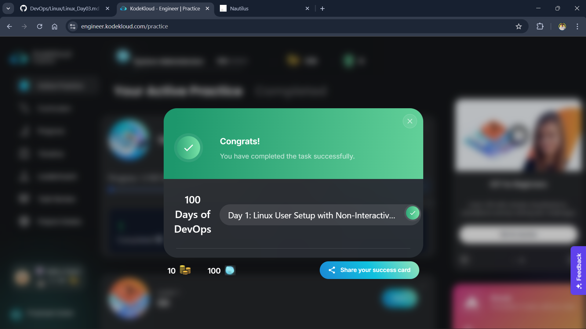

# Day 1: Creating a User with a Non-Interactive Shell

This is my first task in the 100 Days of DevOps challenge! The goal was to create a new user for a backup agent tool on `App Server 1`. The key requirement was that this user needed a **non-interactive shell**.

It was a great introduction to user management in Linux, which is a fundamental skill for any DevOps role.



## Table of Contents
- [The Task](#the-task)
- [My Solution & Command Breakdown](#my-solution--command-breakdown)
- [Why Did I Do This? (The "What & Why")](#why-did-i-do-this-the-what--why)
- [Deep Dive: What is a Non-Interactive Shell?](#deep-dive-what-is-a-non-interactive-shell)
- [Exploring the Directories and Files](#exploring-the-directories-and-files)

---

### The Task
<a name="the-task"></a>
The system admin team at xFusionCorp Industries needed a user named `james` created on one of their app servers. This user account would be used by a backup agent, so for security reasons, it shouldn't be possible for a human to log in and get a command prompt with it.

---

### My Solution & Command Breakdown
<a name="my-solution--command-breakdown"></a>
After connecting to `App Server 1` using SSH, I ran a single command to accomplish the entire task.

#### 1. The Creation Command
This command creates the user and sets their shell at the same time.

```bash
sudo useradd james -s /sbin/nologin
```

**Command Breakdown:**
* `sudo`: This stands for "Super User Do." I used it to run the command with administrative (or root) privileges. Creating users is a protected action, so I needed to elevate my permissions.
* `useradd`: This is the main Linux command for adding a new user account.
* `james`: This is the username I was asked to create.
* `-s`: This is a flag or an "option." It stands for "shell" and tells the `useradd` command that I'm about to specify which login shell the new user should have.
* `/sbin/nologin`: This is the path to a special shell program that prevents a user from logging in. More on this below!

#### 2. The Verification Command
In Linux, no news is often good news. The command ran without any output, but I wanted to be sure it worked. I used `grep` to check the system's user file.

```bash
grep 'james' /etc/passwd
```
This command gave me the following output, which confirmed my success:
`james:x:1002:1002::/home/james:/sbin/nologin`

**Command Breakdown:**
* `grep`: This is a powerful command-line tool for searching plain-text data for lines that match a regular expression or a simple string.
* `'james'`: This is the search string. I was telling `grep` to find any line containing the word "james".
* `/etc/passwd`: This is the file I wanted to search in. It's a system file that contains the list of all user accounts.

---

### Why Did I Do This? (The "What & Why")
<a name="why-did-i-do-this-the-what--why"></a>
At first, I just followed the instructions, but then I realized *why* this is so important in DevOps and system administration.

This task is all about the **Principle of Least Privilege**. A user account should only have the permissions it absolutely needs to do its job, and nothing more.

-   **Security**: The backup agent doesn't need a human to log in and run commands. It just needs an identity to own files and run its automated processes. By assigning a non-interactive shell, I completely removed the possibility of this account being used to gain interactive access to the server, whether by an attacker or by mistake.
-   **Automation**: In DevOps, we create many "service accounts" like this for tools (e.g., Jenkins, Docker, monitoring agents). These accounts are for programs to interact with the system, not people. This is a standard and secure way to set them up.

---

### Deep Dive: What is a Non-Interactive Shell?
<a name="deep-dive-what-is-a-non-interactive-shell"></a>
To understand a non-interactive shell, I first had to understand what a normal, **interactive shell** is.

When I log into a Linux server with my own account, the system starts a program called a shell, usually `/bin/bash`. This program is interactive: it gives me a command prompt (`$`), waits for my input, runs my commands, and shows me the output.

A **non-interactive shell** is the opposite. `/sbin/nologin` is a special program that, when set as a user's shell, does the following:
1.  A user (or program) tries to log in as `james`.
2.  The system looks at the `/etc/passwd` file and sees that the shell for `james` is `/sbin/nologin`.
3.  The system runs `/sbin/nologin`.
4.  The `/sbin/nologin` program prints a polite message like "This account is currently not available." and immediately terminates the session.

It never gives a command prompt. It's like having a door that a robot can use a keycard on to drop off a package, but if a person tries to use the same keycard, a gate immediately blocks them from entering.

---

### Exploring the Directories and Files
<a name="exploring-the-directories-and-files"></a>
This task involved a few important files and directories in the Linux file system.

* `/etc/passwd`: This is a plain-text database of all the users on the system. The line I saw with `grep` contains all the basic info about the `james` user, with each piece of information separated by a colon (`:`).
* `/home/james`: The `useradd` command also created a home directory for the `james` user. This is a dedicated space where the user can store its files. The backup agent will likely write logs or configuration files here.
* `/sbin/`: This directory stands for "System Binaries." It contains essential programs needed to boot and run the system. The fact that `nologin` is in `/sbin` (and not `/bin` or `/usr/bin`) tells me that it's considered a core, system-level utility.


<br>
<br>

