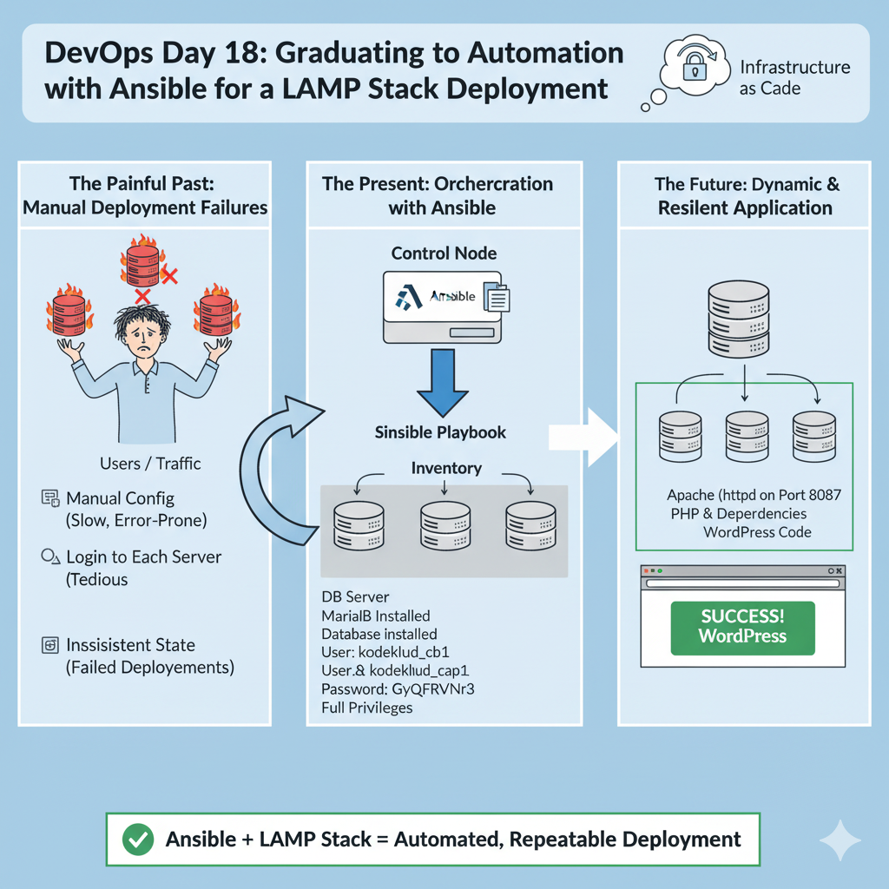

# DevOps Day 18: Graduating to Automation with Ansible for a LAMP Stack Deployment



Today's task was the ultimate test of everything I've learned, and after multiple challenging failures with manual configuration, I finally succeeded by embracing automation. The objective was to deploy a classic LAMP stack for a WordPress site across a multi-server environment. My previous attempts involved logging into each server and configuring them one by one, a process that was slow, error-prone, and ultimately unsuccessful due to the sheer complexity of the interacting parts.

For my final, successful attempt, I used **Ansible**. This document is a very detailed, first-person account of that success. I will break down not only the final Ansible solution that worked but also reflect on the painful manual failures that made me appreciate the power and reliability of Infrastructure as Code. This is the story of how I stopped fighting fires on individual servers and started conducting an orchestra of automation from a single control node.

## Table of Contents
- [The Task](#the-task)
- [My Solution: The Ansible Automation Approach](#my-solution-the-ansible-automation-approach)
- [Post-Mortem: Why My Manual Attempts Failed](#post-mortem-why-my-manual-attempts-failed)
- [Why Did I Do This? (The "What & Why" of Ansible)](#why-did-i-do-this-the-what--why-of-ansible)
- [Deep Dive: A Line-by-Line Explanation of My Ansible Playbook](#deep-dive-a-line-by-line-explanation-of-my-ansible-playbook)
- [Exploring the Commands Used](#exploring-the-commands-used)

---

### The Task
<a name="the-task"></a>
My objective was to deploy the full infrastructure for a WordPress website. The specific requirements for my successful attempt were:
1.  **DB Server:** Install MariaDB, create the database `kodekloud_db1`, create the user `kodekloud_cap` with password `GyQkFRVNr3`, and grant it full privileges.
2.  **App Servers (x3):** Install Apache (`httpd`), PHP, and its dependencies. Configure Apache to run on port `8087`.
3.  The final site needed to be accessible via the Load Balancer, displaying a specific success message.

---

### My Solution: The Ansible Automation Approach
<a name="my-solution-the-ansible-automation-approach"></a>
Instead of manually configuring four different servers, I did all my work from the jump host. The solution had three core components.

#### 1. The Inventory (`inventory.ini`)
This was my "address book." I created this file to tell Ansible which servers to manage and how to connect to them.
```ini
[app_servers]
stapp01 ansible_host=172.16.238.10 ansible_user=tony ansible_ssh_pass=Ir0nM@n ansible_become_pass=Ir0nM@n
stapp02 ansible_host=172.16.238.11 ansible_user=steve ansible_ssh_pass=Am3ric@ ansible_become_pass=Am3ric@
stapp03 ansible_host=172.16.238.12 ansible_user=banner ansible_ssh_pass=BigGr33n ansible_become_pass=BigGr33n

[db_server]
stdb01 ansible_host=172.16.239.10 ansible_user=peter ansible_ssh_pass=Sp!dy ansible_become_pass=Sp!dy
```

#### 2. The Playbook (`playbook.yaml`)
This was my "to-do list." I wrote this YAML file with the exact sequence of tasks for Ansible to execute. This is the **exact code that worked for me**.
```yaml
---
- name: Configure DB Server
  hosts: db_server
  become: yes
  tasks:
    - name: Install MariaDB dependencies
      yum:
        name:
          - mariadb-server
          - python3-PyMySQL
        state: present

    - name: Start and enable MariaDB service
      service:
        name: mariadb
        state: started
        enabled: yes

    - name: Create database
      community.mysql.mysql_db:
        name: kodekloud_db1
        state: present
        login_unix_socket: /var/lib/mysql/mysql.sock

    - name: Create user with privileges
      community.mysql.mysql_user:
        name: kodekloud_cap
        password: GyQkFRVNr3
        priv: "kodekloud_db1.*:ALL"
        host: '%'
        state: present
        login_unix_socket: /var/lib/mysql/mysql.sock

    - name: Install firewalld
      yum:
        name: firewalld
        state: present

    - name: Start and enable firewalld
      service:
        name: firewalld
        state: started
        enabled: yes

    - name: Ensure firewall allows MySQL connections
      firewalld:
        service: mysql
        state: enabled
        permanent: yes
        immediate: yes

- name: Configure App Servers
  hosts: app_servers
  become: yes
  tasks:
    - name: Install required packages
      yum:
        name:
          - httpd
          - php
          - php-mysqlnd
        state: present

    - name: Configure Apache to listen on the correct port
      lineinfile:
        path: /etc/httpd/conf/httpd.conf
        regexp: '^Listen '
        line: 'Listen 8087'
      notify: restart httpd

    - name: Install firewalld
      yum:
        name: firewalld
        state: present

    - name: Start and enable firewalld
      service:
        name: firewalld
        state: started
        enabled: yes

    - name: Ensure firewall allows the correct port
      firewalld:
        port: 8087/tcp
        state: enabled
        permanent: yes
        immediate: yes

    - name: Create the test PHP page
      copy:
        content: |
          <?php
          $link = mysqli_connect('stdb01', 'kodekloud_cap', 'GyQkFRVNr3', 'kodekloud_db1');
          if (!$link) {
              die('Could not connect: ' . mysqli_connect_error());
          }
          echo 'App is able to connect to the database using user kodekloud_cap';
          mysqli_close($link);
          ?>
        dest: /var/www/html/index.php
        mode: 0644

    - name: Start and enable httpd service
      service:
        name: httpd
        state: started
        enabled: yes

  handlers:
    - name: restart httpd
      service:
        name: httpd
        state: restarted
```

#### 3. The Execution
From the jump host, I ran a single command to set everything in motion.
```bash
# Install Ansible first
sudo dnf install ansible -y

# Run the playbook
ANSIBLE_HOST_KEY_CHECKING=False ansible-playbook -i inventory.ini playbook.yaml
```
After the playbook finished, I manually configured the LBR server as a final step, and the task was finally solved.

---

### Post-Mortem: Why My Manual Attempts Failed
<a name="post-mortem-why-my-manual-attempts-failed"></a>
My previous failures were a perfect lesson in the fragility of manual configuration at scale. I hit a cascade of issues:
1.  **Port Conflicts:** On both the app servers and the LBR, I found that other services (`sendmail`, `haproxy`) were using the ports I needed. I had to diagnose this with `netstat` and manually stop the conflicting services.
2.  **Firewalls:** I forgot to open the firewall on the DB server initially, which blocked the entire application. Then, I used the wrong firewall tool (`iptables` vs. `firewalld`).
3.  **SELinux:** I spent a long time chasing a red herring with SELinux, trying to set booleans and then discovering it was disabled on some servers. This cost me a lot of time.
4.  **Inconsistency:** Juggling four different servers, it was easy to forget a command on one of them, leading to an inconsistent environment that was impossible to debug. The Ansible playbook solved this by guaranteeing every server received the exact same configuration.

---

### Why Did I Do This? (The "What & Why" of Ansible)
<a name="why-did-i-do-this-the-what--why-of-ansible"></a>
-   **Ansible**: It's a configuration management and automation engine. I learned that its purpose is to let me describe the **desired state** of my system in a simple language (YAML), and Ansible handles all the complex steps to get there.
-   **Agentless Architecture**: The best part was that I didn't need to install any special "agent" software on my app or DB servers. Ansible just uses SSH to connect and run its commands, which is incredibly simple and secure.
-   **Idempotence**: This is a key Ansible concept. It means I can run the same playbook a hundred times, and it will only make changes the first time to bring the system to the desired state. On subsequent runs, it will check the state, see that everything is already correct, and make no changes. This makes it safe to re-run playbooks.
-   **Playbooks**: This is the "recipe" for my infrastructure. It's written in YAML, which is easy to read. It's a collection of "plays," and each play targets a group of hosts and contains a list of "tasks."

---

### Deep Dive: A Line-by-Line Explanation of My Ansible Playbook
<a name="deep-dive-a-line-by-line-explanation-of-my-ansible-playbook"></a>
This playbook was the key to my success. Here's what each part does.

```yaml
---
# A playbook always starts with three dashes.

# This is the first "play" in my playbook.
- name: Configure DB Server
  # 'hosts:' tells Ansible which group from my inventory file to run this on.
  hosts: db_server
  # 'become: yes' is the equivalent of 'sudo'. It tells Ansible to elevate privileges for the tasks.
  become: yes
  # 'tasks:' is the list of actions to perform.
  tasks:
    # Each task starts with '- name:', which is a human-readable description.
    - name: Install MariaDB dependencies
      # 'yum:' is an Ansible "module." This module knows how to install packages.
      yum:
        # I can provide a list of package names.
        name:
          - mariadb-server
          - python3-PyMySQL # Needed by Ansible's mysql modules
        # 'state: present' ensures the packages are installed.
        state: present

    - name: Start and enable MariaDB service
      # The 'service:' module manages system services.
      service:
        name: mariadb
        state: started   # Ensures the service is running.
        enabled: yes     # Ensures it starts on boot.

    - name: Create database
      # 'community.mysql.mysql_db:' is a module from the Ansible community for managing MySQL/MariaDB.
      community.mysql.mysql_db:
        name: kodekloud_db1
        state: present   # Ensures the database exists.
        login_unix_socket: /var/lib/mysql/mysql.sock # Tells Ansible how to connect as root.

    - name: Create user with privileges
      # The 'mysql_user:' module manages database users.
      community.mysql.mysql_user:
        name: kodekloud_cap
        password: GyQkFRVNr3
        # 'priv:' is a powerful shortcut to grant privileges.
        priv: "kodekloud_db1.*:ALL" 
        host: '%'  # Allows the user to connect from any host.
        state: present
        login_unix_socket: /var/lib/mysql/mysql.sock

    - name: Install firewalld
      yum:
        name: firewalld
        state: present

    - name: Start and enable firewalld
      service:
        name: firewalld
        state: started
        enabled: yes

    - name: Ensure firewall allows MySQL connections
      # The 'firewalld:' module manages firewall rules.
      firewalld:
        service: mysql   # A predefined service name for port 3306.
        state: enabled
        permanent: yes # Makes the rule survive reboots.
        immediate: yes # Applies the rule right away.

# This is the second "play" for the app servers.
- name: Configure App Servers
  hosts: app_servers
  become: yes
  tasks:
    - name: Install required packages
      yum:
        name:
          - httpd
          - php
          - php-mysqlnd # The PHP extension for connecting to MySQL.
        state: present

    - name: Configure Apache to listen on the correct port
      # The 'lineinfile:' module is perfect for changing a single line in a file.
      lineinfile:
        path: /etc/httpd/conf/httpd.conf
        regexp: '^Listen ' # A regular expression to find the line.
        line: 'Listen 8087'
      # 'notify:' triggers a "handler" if this task makes a change.
      notify: restart httpd

    - name: Ensure firewall allows the correct port
      firewalld:
        port: 8087/tcp
        state: enabled
        permanent: yes
        immediate: yes

    - name: Create the test PHP page
      # The 'copy:' module is used to create files.
      copy:
        # The 'content:' parameter lets me define the file's content directly in the playbook.
        content: |
          <?php
          $link = mysqli_connect('stdb01', 'kodekloud_cap', 'GyQkFRVNr3', 'kodekloud_db1');
          if (!$link) {
              die('Could not connect: ' . mysqli_connect_error());
          }
          echo 'App is able to connect to the database using user kodekloud_cap';
          mysqli_close($link);
          ?>
        dest: /var/www/html/index.php # The destination path on the app servers.
        mode: 0644 # Sets the file permissions.

    - name: Start and enable httpd service
      service:
        name: httpd
        state: started
        enabled: yes

  # 'handlers:' are special tasks that only run when "notified" by another task.
  handlers:
    - name: restart httpd
      service:
        name: httpd
        state: restarted
```

---

### Exploring the Commands Used
<a name="exploring-the-commands-used"></a>
-   `sudo dnf install ansible -y`: The command I used to install the Ansible software on my jump host (control node).
-   `vi [filename]`: The command to create and edit my `inventory.ini` and `playbook.yaml` text files.
-   `ANSIBLE_HOST_KEY_CHECKING=False ansible-playbook -i inventory.ini playbook.yaml`: This is the command that unleashes the automation.
    -   `ANSIBLE_HOST_KEY_CHECKING=False`: This is an environment variable that I set just for this command. It tells Ansible's underlying SSH client to not stop and ask "Are you sure you want to continue connecting?" for new hosts. This is essential for automation.
    -   `ansible-playbook`: The main Ansible command to execute a playbook.
    -   `-i inventory.ini`: The `-i` flag specifies my inventory file, or "address book."
    -   `playbook.yaml`: The name of my playbook file, or "to-do list."
 